# Feature: dry-reusable-ui-components

## 1. End-to-End System Flow

The **DRY (Don't Repeat Yourself) Reusable UI Component System** enforces a clean, 3-tier component architecture across the entire application:

```mermaid
flowchart TD
    subgraph Tier1["Tier 1: Base Atomic Primitives (`src/components/common/`)"]
        Button["Button\n(Polymorphic button/a, variants, sizes, loading)"]
        Badge["Badge\n(Status colors, tag-pill, filter-chip, section)"]
        Card["Card + Card.Header + Card.Body + Card.Footer\n(Glass panel, semantic HTML, bottom anchored footer)"]
        Input["Input\n(Adornments, auto-clear, change callbacks)"]
        Modal["Modal + Modal.Header + Modal.Body + Modal.Footer\n(Portal dialog, scroll-lock, Esc/backdrop dismiss)"]
    end

    subgraph Tier2["Tier 2: Specialized UI Extensions (`src/components/ui/`)"]
        Section["Section + Section.Header\n(Encapsulates section tag, container, title, badge, subtitle, extra)"]
        InputSearch["InputSearch\n(Extends Input: search icon + clear action)"]
        ButtonFloating["ButtonFloating\n(Extends Button: FAB styling + glow)"]
    end

    subgraph Tier3["Tier 3: Composite Components (`src/components/composite/`)"]
        TechTagList["TechTagList\n(Brand-colored interactive tag badges)"]
        EmptyState["EmptyState\n(Glass card + icon + message + CTA button)"]
        ButtonFloatingScrollTop["ButtonFloatingScrollTop\n(Scroll-to-top detection + ButtonFloating)"]
        ButtonPrint["ButtonPrint\n(CV Download logic: 'floating' FAB or 'default' Sidebar Button)"]
        BadgeFilterChip["BadgeFilterChip\n(Active filter chip with key-value and dismiss)"]
        BadgeSchedule["BadgeSchedule\n(Publication weekday schedule color indicator)"]
        ModalCaseStudy["ModalCaseStudy\n(Complete project case study architecture dialog)"]
        ModalArticle["ModalArticle + ModalArticle.TocSidebar\n(Complete blog reader dialog with TOC parser and sidebar)"]
    end

    subgraph Domain["Application Views & Pages"]
        Hero["Hero / Header"]
        About["About (Section + Card compound)"]
        Skills["Skills (Section + Card compound)"]
        Experience["Experience (Section + Card compound + TechTagList)"]
        Education["Education & Certifications (Section + Card compound)"]
        Contact["Contact (Section + Card compound)"]
        Projects["Projects (Section + Card compound + ModalCaseStudy)"]
        BlogSection["Blog Section (Section + Card compound + ModalArticle)"]
        BlogPage["Blog Page (Card compound + ModalArticle + InputSearch + BadgeFilterChip + BadgeSchedule + EmptyState)"]
        App["App Root Layout (ButtonFloatingScrollTop + ButtonPrint)"]
        DrawerMenu["DrawerMenu / Sidebar (ButtonPrint default variant)"]
    end

    Tier1 --> Tier2
    Tier1 --> Tier3
    Tier2 --> Tier3
    Tier1 --> Domain
    Tier2 --> Domain
    Tier3 --> Domain
```

---

## 2. Component Hierarchy Summary

| Tier / Directory | Component | Type / Responsibility |
| :--- | :--- | :--- |
| **Tier 1 (Common)** | [`Button`](file:///Users/tanhn/Projects/ga2631.github.io/src/components/common/Button.tsx) | Base polymorphic button & anchor primitive |
| **Tier 1 (Common)** | [`Badge`](file:///Users/tanhn/Projects/ga2631.github.io/src/components/common/Badge.tsx) | Base badge & tag primitive |
| **Tier 1 (Common)** | [`Card`](file:///Users/tanhn/Projects/ga2631.github.io/src/components/common/Card.tsx) | Base glass card container with Header, Body, Footer subcomponents |
| **Tier 1 (Common)** | [`Input`](file:///Users/tanhn/Projects/ga2631.github.io/src/components/common/Input.tsx) | Base text input primitive with adornments and clear trigger |
| **Tier 1 (Common)** | [`Modal`](file:///Users/tanhn/Projects/ga2631.github.io/src/components/common/Modal.tsx) | Base modal dialog with portal and focus trap |
| **Tier 2 (UI)** | [`Section`](file:///Users/tanhn/Projects/ga2631.github.io/src/components/ui/Section.tsx) | Standard section wrapper (`<section>`, `.container`, `SectionHeader`) |
| **Tier 2 (UI)** | [`InputSearch`](file:///Users/tanhn/Projects/ga2631.github.io/src/components/ui/InputSearch.tsx) | Specialized search input extending `Input` |
| **Tier 2 (UI)** | [`ButtonFloating`](file:///Users/tanhn/Projects/ga2631.github.io/src/components/ui/ButtonFloating.tsx) | Specialized FAB button extending `Button` |
| **Tier 3 (Composite)** | [`TechTagList`](file:///Users/tanhn/Projects/ga2631.github.io/src/components/composite/TechTagList.tsx) | Brand-colored interactive tech badge list |
| **Tier 3 (Composite)** | [`EmptyState`](file:///Users/tanhn/Projects/ga2631.github.io/src/components/composite/EmptyState.tsx) | Complete empty-state container with glass card & CTA |
| **Tier 3 (Composite)** | [`ButtonFloatingScrollTop`](file:///Users/tanhn/Projects/ga2631.github.io/src/components/composite/ButtonFloatingScrollTop.tsx) | Scroll position listener + scroll-to-top FAB action |
| **Tier 3 (Composite)** | [`ButtonPrint`](file:///Users/tanhn/Projects/ga2631.github.io/src/components/composite/ButtonPrint.tsx) | CV export action supporting `floating` FAB and `default` button modes |
| **Tier 3 (Composite)** | [`BadgeFilterChip`](file:///Users/tanhn/Projects/ga2631.github.io/src/components/composite/BadgeFilterChip.tsx) | Complete active filter chip with key-value and dismiss |
| **Tier 3 (Composite)** | [`BadgeSchedule`](file:///Users/tanhn/Projects/ga2631.github.io/src/components/composite/BadgeSchedule.tsx) | Complete schedule indicator with day code color-theming |
| **Tier 3 (Composite)** | [`ModalCaseStudy`](file:///Users/tanhn/Projects/ga2631.github.io/src/components/composite/ModalCaseStudy.tsx) | Complete architecture case study modal dialog |
| **Tier 3 (Composite)** | [`ModalArticle`](file:///Users/tanhn/Projects/ga2631.github.io/src/components/composite/ModalArticle.tsx) | Complete blog article reader modal dialog with TOC sidebar & parser |
