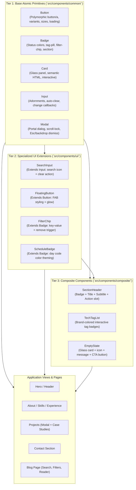

# Feature: dry-reusable-ui-components

## 1. End-to-End System Flow

The **DRY (Don't Repeat Yourself) Reusable UI Component System** establishes a 3-tier atomic design architecture across the application, eliminating code duplication and standardizing UI behaviors:

### Execution & Interaction Flow
1. **View Mounting & Rendering:** Domain components (e.g. `Projects.tsx`, `BlogPage.tsx`, `Hero.tsx`) declare layouts using standardized composite and base components rather than bespoke HTML tag hierarchies.
2. **Polymorphic Action Handling:** When a user interacts with interactive elements (e.g., clicking a link vs a button), `Button` automatically detects `href` / `as="a"` props to render semantic anchor tags with secure targets, or standard `<button>` tags with keyboard accessibility and loading spinner indicators.
3. **Filter & Search Flow:** Search queries in `BlogPage` utilize `SearchInput` (which encapsulates `Input`), automatically rendering clear buttons and syncing state updates via `onValueChange` and `onClear`. Active filter chips are rendered via `FilterChip` (encapsulating `Badge`), delegating removal events up to page state.
4. **Modal Lifecycle & Focus Trapping:** Architecture deep dives and blog article views leverage `Modal`, which portals content to `document.body`, locks background scroll (`document.body.style.overflow = 'hidden'`), listens for `Escape` key events, and captures backdrop dismissals while preserving content click propagation.

---

## 2. Database & Schema Changes

`N/A` (Pure frontend component architecture and design system refactoring; no database schemas or ETL models were altered).

---

## 3. Technical Optimizations

1. **Polymorphic Component Rendering:**
   - Standardized `Button` renders either `<button>` or `<a>` based on the presence of `href` or `as="a"`, eliminating duplicate styling rules and divergent markup across navigational links and action triggers.
2. **Centralized DOM Scroll-Locking & Event Listeners:**
   - Scroll-locking logic and `Escape` key event handling previously duplicated across `Projects.tsx` and `BlogPage.tsx` are now encapsulated in `Modal.tsx` with proper React lifecycle cleanup to avoid memory leaks.
3. **Zero-Regression Class & ARIA Preservation:**
   - Preserved all existing CSS class hooks (`.glass-panel`, `.tab-btn`, `.blog-modal-backdrop`, `.interactive-card`, etc.) and ARIA attributes (`aria-modal`, `aria-label`, `aria-busy`), allowing existing integration tests and accessibility tooling to function without regressions.
4. **Atomic Tree-Shaking & Barrel Exports:**
   - Organized into clean barrel exports (`src/components/common/index.ts`, `src/components/ui/index.ts`, `src/components/composite/index.ts`), allowing fast modular imports and optimal bundler chunking.
5. **Modular Test Architecture:**
   - Replaced monolithic test files with isolated, unit-level test specifications for all 12 primitives across all 3 tiers in `tests/unit/common/`, `tests/unit/ui/`, and `tests/unit/composite/`.

---

## 4. Impacted Files

| File Path | Tier / Layer | Responsibility |
| :--- | :--- | :--- |
| `src/components/common/Button.tsx` | Tier 1 (Common) | Polymorphic button & anchor primitive with loading states, sizes, and variants |
| `src/components/common/Badge.tsx` | Tier 1 (Common) | Status, count, tag-pill, filter-chip, and section badge primitive |
| `src/components/common/Card.tsx` | Tier 1 (Common) | Glassmorphic panel container with semantic tags, hover, header, and footer |
| `src/components/common/Input.tsx` | Tier 1 (Common) | Base input primitive supporting start/end adornments, clearable action, and change events |
| `src/components/common/Modal.tsx` | Tier 1 (Common) | Portal modal dialog managing scroll lock, escape listener, backdrop, and sticky header |
| `src/components/common/index.ts` | Tier 1 (Common) | Barrel export for Tier 1 base components |
| `src/components/ui/SearchInput.tsx` | Tier 2 (UI) | Specialized search input extending `Input` with search icon and clear handler |
| `src/components/ui/FloatingButton.tsx` | Tier 2 (UI) | Specialized FAB button extending `Button` with glowing backdrop effects |
| `src/components/ui/FilterChip.tsx` | Tier 2 (UI) | Active filter pill extending `Badge` with key-value pairs and dismiss callback |
| `src/components/ui/ScheduleBadge.tsx` | Tier 2 (UI) | Schedule indicator extending `Badge` with weekday theme colors |
| `src/components/ui/index.ts` | Tier 2 (UI) | Barrel export for Tier 2 UI components |
| `src/components/composite/SectionHeader.tsx` | Tier 3 (Composite) | Composite section title bar with badge, heading, subtitle, and extra slot |
| `src/components/composite/TechTagList.tsx` | Tier 3 (Composite) | Composite tech badge list with brand colors and hashtag prefixes |
| `src/components/composite/EmptyState.tsx` | Tier 3 (Composite) | Composite empty result container with glass card, icon, description, and CTA |
| `src/components/composite/index.ts` | Tier 3 (Composite) | Barrel export for Tier 3 composite components |
| `src/components/About.tsx` | Domain View | Refactored to use `SectionHeader` and `Card` |
| `src/components/Experience.tsx` | Domain View | Refactored to use `SectionHeader`, `Card`, `Badge`, and `TechTagList` |
| `src/components/Skills.tsx` | Domain View | Refactored to use `SectionHeader`, `Card`, and `Button` |
| `src/components/EducationCertifications.tsx` | Domain View | Refactored to use `SectionHeader`, `Card`, `Badge`, and `Button` |
| `src/components/Contact.tsx` | Domain View | Refactored to use `SectionHeader`, `Card`, `Button`, and `Badge` |
| `src/components/Hero.tsx` | Domain View | Refactored to use `Card` and `Button` |
| `src/components/FloatingActions.tsx` | Domain View | Refactored to use `FloatingButton` |
| `src/components/Header.tsx` | Domain View | Refactored to use `Button` |
| `src/components/Projects.tsx` | Domain View | Refactored to use `SectionHeader`, `Button`, `Badge`, `Card`, and `Modal` |
| `src/pages/BlogPage.tsx` | Domain View | Refactored to use `SearchInput`, `FilterChip`, `ScheduleBadge`, `Badge`, `Button`, `Card`, `EmptyState`, and `Modal` |
| `tests/unit/common/button.test.tsx` | Test Suite | Unit tests for `Button` (polymorphism, loading, variants, sizes, callbacks) |
| `tests/unit/common/badge.test.tsx` | Test Suite | Unit tests for `Badge` (color variants, count, tag-pill, filter-chip) |
| `tests/unit/common/card.test.tsx` | Test Suite | Unit tests for `Card` (glass panel, semantic elements, slots, click events) |
| `tests/unit/common/input.test.tsx` | Test Suite | Unit tests for `Input` (adornments, clearable behavior, change callbacks) |
| `tests/unit/common/modal.test.tsx` | Test Suite | Unit tests for `Modal` (portal mount, scroll lock, Esc key, backdrop click) |
| `tests/unit/ui/search-input.test.tsx` | Test Suite | Unit tests for `SearchInput` (search icon, clear button, change handlers) |
| `tests/unit/ui/floating-button.test.tsx` | Test Suite | Unit tests for `FloatingButton` (variants, glow element, click events) |
| `tests/unit/ui/filter-chip.test.tsx` | Test Suite | Unit tests for `FilterChip` (key-value rendering, dismiss callback) |
| `tests/unit/ui/schedule-badge.test.tsx` | Test Suite | Unit tests for `ScheduleBadge` (weekday code class styling) |
| `tests/unit/composite/section-header.test.tsx` | Test Suite | Unit tests for `SectionHeader` (badge, title, subtitle, alignment, extra slot) |
| `tests/unit/composite/tech-tag-list.test.tsx` | Test Suite | Unit tests for `TechTagList` (rendering, tag click, hashtag prefix) |
| `tests/unit/composite/empty-state.test.tsx` | Test Suite | Unit tests for `EmptyState` (glass card, icon, description, CTA button) |
