# Feature: dry-reusable-ui-components

## 1. End-to-End System Flow

The **DRY (Don't Repeat Yourself) Reusable UI Component System** enforces a clean, 3-tier component architecture across the entire application, eliminating code duplication and standardizing UI behaviors:

```mermaid
flowchart TD
    subgraph Tier1["Tier 1: Base Atomic Primitives (`src/components/common/`)"]
        Button["Button\n(Polymorphic button/a, variants, sizes, loading)"]
        Badge["Badge\n(Status colors, tag-pill, filter-chip, section)"]
        Card["Card + Card.Header + Card.Body + Card.Footer\n(Glass panel, semantic HTML, bottom anchored footer)"]
        Input["Input\n(Adornments, auto-clear, change callbacks)"]
        Modal["Modal + Modal.Header + Modal.Body + Modal.Footer\n(Portal dialog, scroll-lock, Esc/backdrop dismiss)"]
    end

    subgraph Tier2["Tier 2: Specialized UI Extensions (`src/components/ui/`)"]
        Section["Section + Section.Header\n(Encapsulates section tag, container, title, badge, subtitle, extra)"]
        ArticleReaderModal["ArticleReaderModal\n(Extends Modal: TOC sidebar, sticky header, progress)"]
        CaseStudyModal["CaseStudyModal\n(Extends Modal: architecture objectives, challenges, solutions, tech)"]
        SearchInput["SearchInput\n(Extends Input: search icon + clear action)"]
        FloatingButton["FloatingButton\n(Extends Button: FAB styling + glow)"]
        FilterChip["FilterChip\n(Extends Badge: key-value + remove trigger)"]
        ScheduleBadge["ScheduleBadge\n(Extends Badge: day code color theming)"]
    end

    subgraph Tier3["Tier 3: Composite Components (`src/components/composite/`)"]
        TechTagList["TechTagList\n(Brand-colored interactive tag badges)"]
        EmptyState["EmptyState\n(Glass card + icon + message + CTA button)"]
    end

    subgraph Domain["Application Views & Pages"]
        Hero["Hero / Header"]
        About["About (Section + Card compound)"]
        Skills["Skills (Section + Card compound)"]
        Experience["Experience (Section + Card compound + TechTagList)"]
        Education["Education & Certifications (Section + Card compound)"]
        Contact["Contact (Section + Card compound)"]
        Projects["Projects (Section + Card compound + CaseStudyModal)"]
        BlogSection["Blog Section (Section + Card compound + ArticleReaderModal)"]
        BlogPage["Blog Page (Card compound + ArticleReaderModal + SearchInput)"]
    end

    Tier1 --> Tier2
    Tier1 --> Tier3
    Tier2 --> Tier3
    Tier1 --> Domain
    Tier2 --> Domain
    Tier3 --> Domain
```

### Execution & Interaction Flow
1. **Section Standardizing:** All portfolio sections (`Experience`, `Projects`, `About`, `Skills`, `EducationCertifications`, `Contact`, `BlogSection`) use `<Section id="..." badge="..." title="..." subtitle="..." extra="...">`, automatically rendering the `<section>` tag, `.container`, and `SectionHeader`.
2. **Compound Card Layouts:** All cards use compound subcomponents (`Card.Header`, `Card.Body`, `Card.Footer`). Footers are anchored with `margin-top: auto` so that action buttons and tech tags remain aligned at the bottom when cards stretch in CSS grid or flexbox layouts.
3. **Specialized Modal Lifecycles:**
   - Architecture case studies open via `<CaseStudyModal>`, rendering categorized meta badges, objectives, challenges & solutions, and tech tags.
   - Blog articles open via `<ArticleReaderModal>`, rendering sticky headers with dynamic title display, reading time, summary callouts, and interactive Table of Contents sidebars.
4. **Polymorphic Action Handling:** `<Button>` renders either `<button>` or `<a>` with automatic loading spinner support and accessible ARIA attributes.
5. **Auto-Clear Search & Filter Chips:** `<SearchInput>` and `<FilterChip>` handle query changes, clear triggers, and filter dismissals.

---

## 2. Database & Schema Changes

`N/A` (Pure frontend component architecture and design system refactoring; no database schemas or ETL models were altered).

---

## 3. Technical Optimizations

1. **Compound Component Pattern (`Card.*`, `Modal.*`, `Section.*`):**
   - Standardized subcomponents provide clean slot isolation while retaining backward-compatible props.
2. **Bottom-Anchored Card Footers:**
   - Card footers automatically apply `margin-top: auto`, ensuring consistent vertical alignment across uneven grid cells.
3. **Dedicated Specialized Modals (`CaseStudyModal`, `ArticleReaderModal`):**
   - Extracted large modal markup and TOC scroll-spy logic into dedicated Tier 2 UI components, eliminating duplicate code between `Projects.tsx`, `BlogSection.tsx`, and `BlogPage.tsx`.
4. **Unified Section Architecture:**
   - Merged section headers, containers, and anchor IDs into a single `<Section>` primitive, reducing boilerplate across 7 page sections.
5. **Zero-Regression Class & ARIA Preservation:**
   - Preserved all existing CSS classes (`.glass-panel`, `.tab-btn`, `.timeline-card`, `.project-card-compact`, `.blog-modal-backdrop`, `.section`, `.container`) and ARIA attributes for 100% test compatibility.
6. **100% Modular Unit Test Coverage:**
   - Every atomic primitive, specialized UI component, and composite component has an independent unit test file in `tests/unit/common/`, `tests/unit/ui/`, or `tests/unit/composite/`.

---

## 4. Impacted Files

| File Path | Tier / Layer | Responsibility |
| :--- | :--- | :--- |
| `src/components/common/Card.tsx` | Tier 1 (Common) | Standardized Card with `Card.Header`, `Card.Body`, and `Card.Footer` subcomponents |
| `src/components/common/Modal.tsx` | Tier 1 (Common) | Standardized Modal with `Modal.Header`, `Modal.Body`, and `Modal.Footer` subcomponents |
| `src/components/common/Button.tsx` | Tier 1 (Common) | Polymorphic button & anchor primitive with loading states, sizes, and variants |
| `src/components/common/Badge.tsx` | Tier 1 (Common) | Status, count, tag-pill, filter-chip, and section badge primitive |
| `src/components/common/Input.tsx` | Tier 1 (Common) | Base input primitive supporting start/end adornments and clearable action |
| `src/components/common/index.ts` | Tier 1 (Common) | Barrel export for Tier 1 base components |
| `src/components/ui/Section.tsx` | Tier 2 (UI) | Unified section component encapsulating `<section>`, `.container`, and `SectionHeader` |
| `src/components/ui/CaseStudyModal.tsx` | Tier 2 (UI) | Specialized modal extending `Modal` for project architecture case studies |
| `src/components/ui/ArticleReaderModal.tsx` | Tier 2 (UI) | Specialized modal extending `Modal` for blog article reading with TOC |
| `src/components/ui/SearchInput.tsx` | Tier 2 (UI) | Specialized search input extending `Input` with search icon and clear handler |
| `src/components/ui/FloatingButton.tsx` | Tier 2 (UI) | Specialized FAB button extending `Button` with glowing backdrop effects |
| `src/components/ui/FilterChip.tsx` | Tier 2 (UI) | Active filter pill extending `Badge` with key-value pairs and dismiss callback |
| `src/components/ui/ScheduleBadge.tsx` | Tier 2 (UI) | Schedule indicator extending `Badge` with weekday theme colors |
| `src/components/ui/index.ts` | Tier 2 (UI) | Barrel export for Tier 2 UI components |
| `src/components/composite/SectionHeader.tsx` | Tier 3 (Composite) | Re-exports `SectionHeader` from `ui/Section` for backward compatibility |
| `src/components/composite/TechTagList.tsx` | Tier 3 (Composite) | Composite tech badge list with brand colors and hashtag prefixes |
| `src/components/composite/EmptyState.tsx` | Tier 3 (Composite) | Composite empty result container with glass card, icon, description, and CTA |
| `src/components/composite/index.ts` | Tier 3 (Composite) | Barrel export for Tier 3 composite components |
| `src/components/Experience.tsx` | Domain View | Refactored with `Section` and `Card.Header`, `Card.Body`, `Card.Footer` |
| `src/components/Projects.tsx` | Domain View | Refactored with `Section`, `Card` compound, and `CaseStudyModal` |
| `src/components/About.tsx` | Domain View | Refactored with `Section` and `Card.Header`, `Card.Body` |
| `src/components/Skills.tsx` | Domain View | Refactored with `Section` and `Card.Header`, `Card.Body` |
| `src/components/EducationCertifications.tsx` | Domain View | Refactored with `Section` and `Card.Header`, `Card.Body`, `Card.Footer` |
| `src/components/Contact.tsx` | Domain View | Refactored with `Section` and `Card.Header`, `Card.Body`, `Card.Footer` |
| `src/components/BlogSection.tsx` | Domain View | Refactored with `Section`, `Card` compound, and `ArticleReaderModal` |
| `src/pages/BlogPage.tsx` | Domain View | Refactored with `Card` compound and `ArticleReaderModal` |
| `tests/unit/common/card.test.tsx` | Test Suite | Unit tests for `Card`, `Card.Header`, `Card.Body`, `Card.Footer` |
| `tests/unit/common/modal.test.tsx` | Test Suite | Unit tests for `Modal`, `Modal.Header`, `Modal.Body`, `Modal.Footer` |
| `tests/unit/ui/section.test.tsx` | Test Suite | Unit tests for `Section` and `Section.Header` |
| `tests/unit/ui/case-study-modal.test.tsx` | Test Suite | Unit tests for `CaseStudyModal` |
| `tests/unit/ui/article-reader-modal.test.tsx` | Test Suite | Unit tests for `ArticleReaderModal` |
