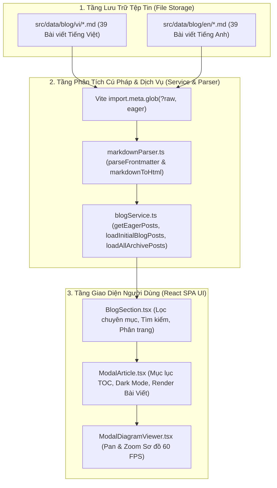

# Feature: Markdown Blog Storage & Retrieval Engine

## 1. End-to-End System Flow

Hệ thống blog đã được tái cấu trúc toàn diện từ mô hình lưu trữ JSON escaped (`09.json` phình to) sang **hệ thống tệp tin Markdown (.md) độc lập với YAML Frontmatter**. Luồng dữ liệu vận hành từ tầng lưu trữ đến giao diện người dùng như sau:



1. **Khởi tạo dữ liệu:** Vite sử dụng `import.meta.glob('/src/data/blog/{vi,en}/*.md', { query: '?raw', eager: true })` để nạp toàn bộ mã nguồn Markdown dạng chuỗi thô (raw string) một cách đồng bộ khi khởi động.
2. **Bóc tách Metadata & Biên dịch HTML:** `markdownParser.ts` bóc tách phần YAML Frontmatter (`id`, `slug`, `title`, `summary`, `category`, `publishedAt`, `date`, `readTime`, `tags`) và biên dịch thân bài viết sang HTML chuẩn (hỗ trợ GFM tables, syntax highlight, Mermaid fences).
3. **Phục vụ UI & Tương tác:** `blogService.ts` cung cấp dữ liệu bài viết chuẩn `BlogPost` cho `BlogSection.tsx` (danh sách, phân trang, lọc theo 5 chuyên mục) và `ModalArticle.tsx` (mục lục tự động TOC, chuyển đổi theme, render sơ đồ Mermaid tương tác).

---

## 2. Database & Schema Changes

### Cấu trúc Thư mục & Quy chuẩn Đặt tên Tệp Tin Mới:
- **Cấu trúc đặt tên:** `YYYY-MM-DD-<id>-<slug>.md` (Trong đó tiền tố `YYYY-MM-DD` là ngày đăng `publishedAt`/`date`, `<id>` là ID bài viết dạng số/chuỗi số và `<slug>` là slug bài viết).
- **Tiếng Việt:** `src/data/blog/vi/YYYY-MM-DD-<id>-<slug>.md` (ví dụ: `2026-09-14-24-3-tier-dry-frontend-architecture-business-service-layer.md`)
- **Tiếng Anh:** `src/data/blog/en/YYYY-MM-DD-<id>-<slug>.md` (ví dụ: `2026-09-14-24-3-tier-dry-frontend-architecture-business-service-layer.md`)
- Loại bỏ hoàn toàn các thư mục lồng nhau và các file JSON cồng kềnh `src/data/blog/{vi,en}/2026/09.json`.

### Chuẩn Schema YAML Frontmatter:
```yaml
---
id: "55"
slug: "demystifying-data-engineering-competency-map-modern-data-stack-roadmap"
title: "Toàn cảnh Nghề Data Engineer: Bản đồ Năng lực, Vòng đời Dữ liệu & Kiến trúc Modern Data Stack"
summary: "Hướng dẫn toàn diện về nghề Kỹ sư Dữ liệu (Data Engineer)..."
category: "tech-radar-career-insights"
publishedAt: "18/09/2026"
date: "2026-09-18"
readTime: "12 phút đọc"
tags:
  - "Data Engineering"
  - "Big Data"
  - "Data Pipeline"
  - "Modern Data Stack"
---
```
*(Ghi chú: Trường `author` đã được loại bỏ hoàn toàn khỏi Frontmatter).*

---

## 3. Technical Optimizations

1. **Zero-Dependency Markdown Parser:** Xây dựng `markdownParser.ts` thuần túy với TypeScript/RegExp, không phụ thuộc vào các thư viện nặng nề bên ngoài, giảm tải bundle size tối đa cho client.
2. **Mermaid Code Block Preservation:** Bảo toàn cấu trúc sơ đồ ```` ```mermaid ```` sang `<pre class="mermaid"><code>` chuẩn để kết hợp hoàn hảo với engine Mermaid động và cơ chế Pan/Zoom 60 FPS hiện có.
3. **Zero-Dependency Syntax Highlighting Engine:** Tích hợp bộ phân tích màu sắc mã nguồn (Syntax Highlighter) đa ngôn ngữ (`SQL`, `C++`, `Python`, `TypeScript`, `JavaScript`, `JSON`, `Bash`, `HTML/CSS`) trực tiếp trong `markdownParser.ts`. Đóng gói mã nguồn trong khung giao diện macOS hiện đại (terminal dots, language tag badge, token styling sắc nét).
4. **Tự động hóa Kiểm thử Tính Toàn vẹn & Thống kê (Automated Verification & Exact Statistics):**
   - Viết script `scripts/verify-markdown-articles.mjs` kiểm tra 100% các file Markdown về Frontmatter, cấu trúc, không trùng ID/Slug và độ dài nội dung hợp lệ.
   - Thống kê chính xác số lượng bài viết theo từng Chuyên đề (5 categories) và Thẻ / Từ khoá (137 unique tags), loại bỏ giới hạn làm tròn `20+` trước đây để hiển thị số lượng bài viết thực tế (40 bài viết cho mỗi ngôn ngữ).
5. **Trải nghiệm Phát triển (DX):** Viết bài trực tiếp bằng Markdown tự nhiên, dễ đọc, không cần escape chuỗi JSON, hỗ trợ Git diff rõ ràng theo từng bài viết.

---

## 4. Impacted Files

| File | Trạng thái | Vai trò & Trách nhiệm |
| :--- | :--- | :--- |
| `src/utils/markdownParser.ts` | **NEW** | Module bóc tách Frontmatter và biên dịch Markdown body sang HTML chuẩn. |
| `scripts/migrate-json-to-md.mjs` | **NEW** | Script tự động chuyển đổi toàn bộ bài viết từ JSON sang Markdown. |
| `scripts/verify-markdown-articles.mjs` | **NEW** | Script kiểm tra tính toàn vẹn 100% và xuất bảng thống kê chi tiết cho bài viết. |
| `src/data/blog/vi/*.md` (40 files) | **NEW** | Toàn bộ 40 bài viết tiếng Việt định dạng `YYYY-MM-DD-<id>-<slug>.md`. |
| `src/data/blog/en/*.md` (40 files) | **NEW** | Toàn bộ 40 bài viết tiếng Anh định dạng `YYYY-MM-DD-<id>-<slug>.md`. |
| `src/services/blogService.ts` | **MODIFIED** | Nạp và phân tích dữ liệu trực tiếp từ các file `.md` qua Vite eager glob. |
| `src/data/blog/blogCategories.ts` | **MODIFIED** | Tinh gọn định nghĩa chuyên mục, loại bỏ cấu trúc phần chuẩn cũ. |
| `src/components/composite/BlogTopic.tsx` | **MODIFIED** | Hiển thị chính xác số lượng bài viết cho từng chuyên đề, bỏ giới hạn `20+`. |
| `src/components/composite/BlogTagsKeyword.tsx` | **MODIFIED** | Hiển thị chính xác số lượng bài viết theo từng thẻ/từ khoá và tổng số bài viết. |
| `src/pages/Blog.tsx` | **MODIFIED** | Tính toán thống kê chuyên mục, thẻ bài viết và cập nhật badge bộ lọc di động. |
| `tests/unit/data/mermaid-syntax.test.ts` | **MODIFIED** | Cập nhật kiểm thử cú pháp Mermaid diagrams từ nguồn Markdown. |
| `src/data/blog/blogTemplates.ts` | **DELETED** | Loại bỏ file định nghĩa cấu trúc đề mục JSON cũ không còn sử dụng. |
| `src/data/blog/vi/2026/09.json` | **DELETED** | Loại bỏ file JSON cũ sau khi đã di trú toàn bộ dữ liệu an toàn. |
| `src/data/blog/en/2026/09.json` | **DELETED** | Loại bỏ file JSON cũ sau khi đã di trú toàn bộ dữ liệu an toàn. |
| `docs/features/markdown-blog-storage.md` | **NEW** | Tài liệu kỹ thuật chi tiết theo quy chuẩn dự án. |
