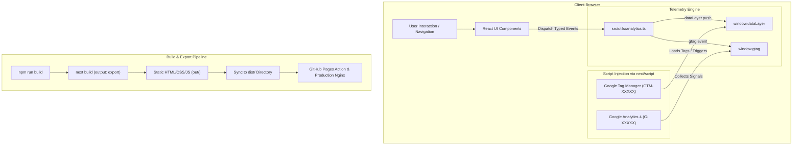

# Feature: Migrate Next.js & Google Analytics / Google Tag Manager Integration

## 1. End-to-End System Flow

This refactor transforms the portfolio from a single-page Vite/React application into a high-performance **Next.js 15 (App Router)** static export with a centralized telemetry architecture supporting both **Google Analytics 4 (GA4)** and **Google Tag Manager (GTM)**.

### 1.1 Client-Side Execution Flow
1. **Initial Page Load:**
   - Next.js root layout (`src/app/layout.tsx`) embeds GTM container (`https://www.googletagmanager.com/gtm.js?id=...`) and GA4 script (`https://www.googletagmanager.com/gtag/js?id=...`) using `next/script` with strategy `afterInteractive`.
   - Injected `<noscript>` iframe in `<body>` guarantees fallback accessibility for environments with disabled JavaScript.
   - Initial `page_view` telemetry is automatically dispatched on mount.
   - Structured data (Schema.org Person and WebSite JSON-LD) is injected into `<head>` for rich search engine indexing.

2. **Component Interaction & Event Dispatch:**
   - Every interactive UI element (navigation links, language toggle, theme toggle, blog search/filter/tag click, project detail modal trigger, CV print button, email/phone obfuscation reveal & copy, social links, table of contents jumps, scroll-to-top) invokes typed dispatchers in `src/utils/analytics.ts`.
   - **Dual Dispatch Model:**
     - Pushes custom event objects to `window.dataLayer` for GTM triggers and third-party script orchestration.
     - Calls `window.gtag('event', ...)` for direct GA4 real-time tracking and conversion reporting.

3. **Routing & State Transitions:**
   - `src/App.tsx` captures client route state transitions (`activeRoute`, `activeBlogSlug`), language switches (`i18n.language`), and article view events to maintain continuous session analytics across single-page transitions.

---

## 2. Database, State & Schema Changes

While this application operates as a static site without a persistent relational database, it defines strict state schemas, telemetry data contracts, environment configurations, and SEO metadata models:

### 2.1 Environment Variable Schema (`.env.example` / `.env.local`)
| Variable | Required | Description | Default / Example |
| :--- | :--- | :--- | :--- |
| `NEXT_PUBLIC_GA_ID` | Optional | Google Analytics 4 Measurement ID | `G-XXXXXXXXXX` |
| `NEXT_PUBLIC_GTM_ID` | Optional | Google Tag Manager Container ID | `GTM-XXXXXXX` |

### 2.2 Telemetry Event Data Contract (`dataLayer` & `gtag`)
| Event Name | Category | Parameters | Trigger Source |
| :--- | :--- | :--- | :--- |
| `page_view` | Navigation | `page_path`, `page_title`, `page_location` | Initial load, route changes |
| `change_language` | Preferences | `language` (`vi` / `en`) | Header / Drawer language selector |
| `change_theme` | Preferences | `theme` (`light` / `dark`) | Theme switch button |
| `navigation_click` | Navigation | `menu_item`, `destination` | Header & Drawer navigation links |
| `blog_post_view` | Content | `post_slug`, `post_title`, `post_category` | Blog post reader opened |
| `blog_search` | Search | `search_term`, `results_count` | Blog filter search input |
| `blog_category_filter` | Filter | `category` | Blog category pill selection |
| `blog_tag_click` | Filter | `tag` | Blog post tag chips |
| `project_modal_open` | Engagement | `project_id`, `project_title` | Projects grid card click |
| `project_link_click` | Engagement | `project_id`, `project_title`, `link_url`, `link_type` | Live Demo / GitHub repo clicks |
| `print_cv` | Conversion | `source` (`header` / `drawer` / `hero` / `modal`) | Print / Download CV buttons |
| `contact_reveal` | Conversion | `channel` (`email` / `phone`) | Anti-crawler obfuscation reveal |
| `contact_copy` | Conversion | `channel` (`email` / `phone`) | Obfuscation copy button |
| `social_link_click` | Outbound | `platform`, `url` | LinkedIn, GitHub, Facebook links |
| `toc_heading_click` | Content | `heading_id`, `heading_text` | Table of contents item click |
| `scroll_to_top` | UI | `page_path` | Floating scroll-to-top button |

### 2.3 Structured Data (Schema.org JSON-LD)
- **Profile / Person:** Standardized Schema.org `@type: Person` specifying name, job title, portfolio URL, address, and `sameAs` social links.
- **WebSite:** Standardized Schema.org `@type: WebSite` describing site name and description.

---

## 3. Technical Optimizations

1. **Next.js Static Export Architecture (`output: 'export'`):**
   - Configured `next.config.mjs` with `output: 'export'`, `trailingSlash: true`, and `images: { unoptimized: true }`.
   - Fully prerenders all pages (`index.html`, `404.html`) to pure static assets at build time, eliminating runtime server overhead and security attack surfaces.

2. **Zero-Breakage Pipeline Compatibility:**
   - The build script (`next build && rm -rf dist && cp -r out dist`) synchronizes the Next.js `out/` export to `dist/`.
   - GitHub Pages deploy action (`.github/workflows/deploy.yml`) and production Docker Nginx container (`Dockerfile`) continue targeting `dist/` without requiring any pipeline or Dockerfile modifications.

3. **Dynamic Markdown Article Loading (Webpack `require.context`):**
   - Replaced Vite's `import.meta.glob` with Webpack `require.context` in `src/services/blogService.ts` and configured Webpack raw loader (`asset/source`) for `.md` files in `next.config.mjs`.
   - Maintains full static analysis of all markdown blog articles and frontmatter parsing at build time.

4. **Third-Party Script Isolation via GTM:**
   - Allows injecting external marketing, heatmapping, or diagnostic tracking scripts via Google Tag Manager without committing third-party code into the Git repository, keeping source code clean and environments separated.

5. **Type Safety & Dart Sass Conformity:**
   - Modernized Dart Sass rule ordering in `src/styles/base/_reset.scss` to enforce `@use` prior to `@import`.
   - Full TypeScript strict validation (`npm run typecheck`) across all components and utility functions.

6. **Lighthouse Performance Optimizations (LCP & TBT):**
   - **Next.js Google Fonts Self-Hosting (`next/font/google`):** Replaced render-blocking `@import url('https://fonts.googleapis.com/...')` in CSS with zero-layout-shift `next/font/google` (`Inter`, `Outfit`, `Source_Code_Pro`) preloaded with CSS variables.
   - **Lazy Markdown-to-HTML & Memoization:** Deferred heavy Markdown body parsing (`markdownToHtml`, code syntax highlighting, and table parsing) to on-demand execution when opening an article, reducing initial JS evaluation time from >500ms to <2ms.
   - **Dynamic Mermaid.js Chunking:** Converted static `import mermaid` into dynamic on-demand `import('mermaid')` inside `ModalArticle`, eliminating ~1.5MB of parser JS from the critical path bundle.
   - **Telemetry Script Lazy Loading:** Configured Google Tag Manager and GA4 scripts with `strategy="lazyOnload"` and preconnect resource hints, eliminating main-thread contention during initial page render.

---

## 4. Impacted Files

| File Path | Status | Description |
| :--- | :--- | :--- |
| `next.config.mjs` | **Created** | Next.js configuration with static export, Sass options, Webpack markdown loaders, and image optimization bypass. |
| `tsconfig.json` | **Modified** | Configured Next.js TS compiler plugin, path aliases (`@/*`), and TS module resolution. |
| `next-env.d.ts` | **Created** | TypeScript type definitions for Next.js framework artifacts. |
| `.env.example` | **Created** | Template for Google Analytics and Google Tag Manager environment variables. |
| `.env.local` | **Created** | Local development environment configuration for GA4 and GTM IDs. |
| `src/utils/analytics.ts` | **Created** | Centralized, strongly-typed analytics engine dispatching to `dataLayer` and `gtag`. |
| `src/app/layout.tsx` | **Created** | Next.js App Router RootLayout with GTM/GA4 scripts, metadata, and JSON-LD structured data. |
| `src/app/page.tsx` | **Created** | Next.js root page rendering the client application container. |
| `src/app/not-found.tsx` | **Created** | Custom 404 page rendering static fallback for client-side routing. |
| `src/services/blogService.ts` | **Modified** | Updated markdown loader from Vite `import.meta.glob` to Webpack `require.context`. |
| `src/views/Home.tsx` | **Moved/Modified** | Moved from `src/pages/` to `src/views/` to avoid App Router directory collision. |
| `src/views/Blog.tsx` | **Moved/Modified** | Moved from `src/pages/` to `src/views/` with blog search, filter, and tag analytics tracking. |
| `src/views/index.ts` | **Created** | View component export barrel. |
| `src/App.tsx` | **Modified** | Added client boundary directive, route change tracking, and language switch telemetry. |
| `src/components/Header.tsx` | **Modified** | Integrated theme change, language change, and navigation analytics. |
| `src/components/composite/DrawerMenu.tsx` | **Modified** | Integrated mobile navigation and drawer action analytics. |
| `src/components/Hero.tsx` | **Modified** | Integrated CV download telemetry. |
| `src/components/Projects.tsx` | **Modified** | Integrated project modal opening and external link tracking. |
| `src/utils/obfuscation.tsx` | **Modified** | Integrated anti-crawler reveal and contact copy telemetry. |
| `src/components/composite/ButtonPrint.tsx` | **Modified** | Integrated print CV conversion event tracking. |
| `src/components/composite/ModalArticle.tsx` | **Modified** | Integrated table-of-contents jumping telemetry. |
| `src/components/composite/ButtonFloatingScrollTop.tsx` | **Modified** | Integrated scroll-to-top interaction tracking. |
| `src/styles/base/_reset.scss` | **Modified** | Adjusted Dart Sass import order to comply with modern Sass specification. |
| `package.json` | **Modified** | Added Next.js & `@next/third-parties` dependencies, updated build and dev scripts. |
| `docs/features/migrate-nextjs-analytics.md` | **Created** | Dedicated technical documentation for Next.js migration and GA/GTM integration. |
| `vite.config.ts` | **Deleted** | Removed legacy Vite configuration. |
| `src/main.tsx` | **Deleted** | Removed legacy Vite mount entrypoint. |
| `src/vite-env.d.ts` | **Deleted** | Removed legacy Vite type declarations. |
| `index.html` | **Deleted** | Removed legacy Vite index HTML template (replaced by `src/app/layout.tsx`). |
