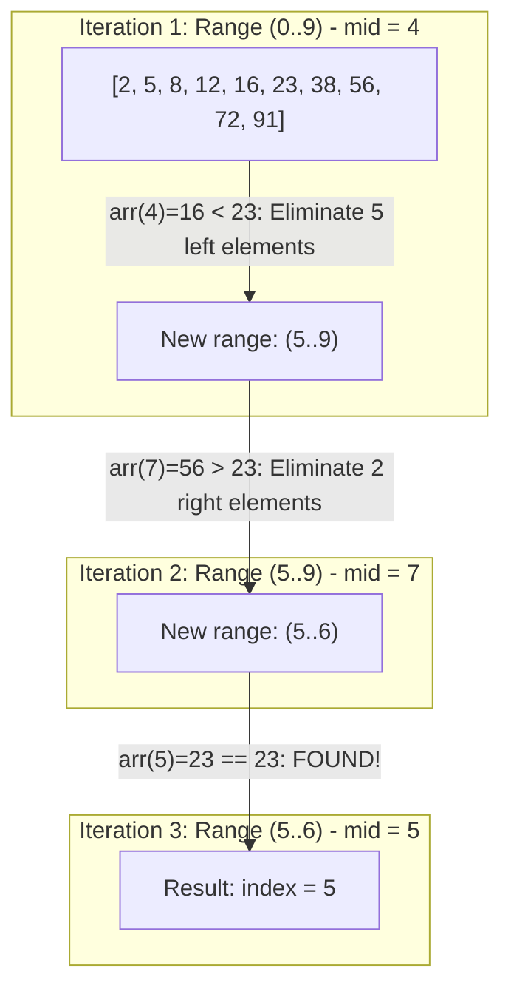

## Problem Description

When data volume swells to millions of records (`N = 10⁷`), linear searching in `O(N)` time will paralyze the system. The prompt is: Given an integer array of `N` elements **sorted in ascending order**, find the index of a `target` value in the shortest possible time.

Binary Search applies the Divide and Conquer model to reduce search time from linear `O(N)` to the logarithmic scale `O(log₂ N)`.

## Initial Approach Idea

Naive approach:

- Use a sequential loop from the beginning of the array `for (int i = 0; i < n; ++i)`.
- _Wasteful:_ Completely ignores the invaluable property that the array _is already sorted_, leading to iterating through millions of elements uselessly.

## Optimization Mindset & Algorithmic Structure

The Divide and Conquer mindset and core techniques of Binary Search:

1. **Eliminate 50% of the Space after each step:** Compare `arr[mid]` with `target`:

- If `arr[mid] == target`: Found immediately.
- If `arr[mid] < target`: The entire left half is definitely smaller than target &rarr; Narrow search to the right half `[mid + 1, right]`.
- If `arr[mid] > target`: The entire right half is definitely larger &rarr; Narrow to the left half `[left, mid - 1]`.

2. **Preventing the Integer Overflow Trap:** The formula `mid = (left + right) / 2` can overflow a signed 32-bit integer when `left + right > 2^31 - 1`. _Standard technique:_ Always write `mid = left + (right - left) / 2`.
3. **Extending to Boundary Search (Lower Bound):** Finding the first element `>= target`, the foundation for B-Tree database indexes.

## Source Code Implementation & Dry Run

Illustrating the search space halved after each iteration with `target = 23`:



**Complete C++ Source Code:**

```c++
#include <iostream>
#include <vector>

// 1. Iterative Binary Search: O(1) Auxiliary Space
int binarySearch(const std::vector<int>& arr, int target) {
    int left = 0;
    int right = static_cast<int>(arr.size()) - 1;

    while (left <= right) {
        // Prevent 32-bit Integer Overflow
        int mid = left + (right - left) / 2;

        if (arr[mid] == target) {
            return mid; // Found the element at index mid
        } else if (arr[mid] < target) {
            left = mid + 1; // Narrow search space to the right half
        } else {
            right = mid - 1; // Narrow search space to the left half
        }
    }
    return -1; // Not found
}

// 2. Lower Bound Search: Find the first element >= target
int lowerBound(const std::vector<int>& arr, int target) {
    int left = 0;
    int right = static_cast<int>(arr.size());
    while (left < right) {
        int mid = left + (right - left) / 2;
        if (arr[mid] >= target) {
            right = mid;
        } else {
            left = mid + 1;
        }
    }
    return left;
}

int main() {
    std::vector<int> data = {2, 5, 8, 12, 16, 23, 38, 56, 72, 91};
    int target = 23;
    int idx = binarySearch(data, target);
    std::cout << "Position of " << target << ": " << idx << std::endl;
    return 0;
}
```

**Detailed Execution Flow Analysis (Dry Run Trace):**

- _Input data:_ `data = {2, 5, 8, 12, 16, 23, 38, 56, 72, 91}`, `N = 10`, `target = 23`.
- _Iteration 1:_ `left = 0`, `right = 9` &rarr; `mid = 0 + (9 - 0) / 2 = 4`. Value `data[4] = 16 < 23` &rarr; `left = mid + 1 = 5`. Eliminate 5 elements on the left half.
- _Iteration 2:_ `left = 5`, `right = 9` &rarr; `mid = 5 + (9 - 5) / 2 = 7`. Value `data[7] = 56 > 23` &rarr; `right = mid - 1 = 6`. Eliminate 2 elements on the right half.
- _Iteration 3:_ `left = 5`, `right = 6` &rarr; `mid = 5 + (6 - 5) / 2 = 5`. Value `data[5] = 23 == 23` &rarr; Exact match! Returns index `5` after just 3 comparisons.

## Complexity Evaluation & Practical Applications

**Performance Evaluation per Standard Framework:**

1. **Worst-Case Time Complexity (`O`):** `O(log₂ N)` - With `N = 1,000,000`, Binary Search takes a maximum of **20 comparisons** (compared to 1,000,000 for Linear Search &rarr; **50,000x** speedup).
2. **Best-Case Time Complexity (`Ω`):** `Ω(1)` when target is exactly in the middle of the array on the first split.
3. **Average-Case Time Complexity (`Θ`):** `Θ(log₂ N)`.
4. **Auxiliary Space Complexity:** `O(1)` for the Iterative version (the loop consumes no Call Stack frames).

**Practical Applications:** Database indexing (B-Tree / LSM-Tree Indexing), `std::lower_bound` in C++ STL, `git bisect` command to trace bug-inducing commits, and Binary Search on Answer techniques.
