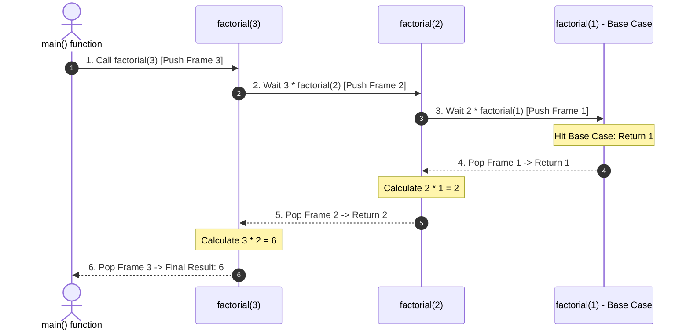

## Problem Description

Many complex problems (binary tree traversal, file directory parsing, Backtracking, Divide and Conquer algorithms) are very difficult to solve using flat sequential loops. The prompt is: How to solve a large problem by breaking it down into subproblems of _the same form but smaller scale_?

Recursion is a programming technique where a function calls itself to solve smaller subproblems until it hits a base stopping point.

## Initial Approach Idea

Naive recursion pitfalls:

- Missing Base Case or unreachable base case &rarr; The function calls itself endlessly leading to a **Call Stack Overflow Crash**.
- Recursion solving Overlapping Subproblems like naive Fibonacci calculation inflates complexity exponentially to `O(2ᴺ)`.

## Optimization Mindset & Algorithmic Structure

Core principles and Recursion Optimization Techniques:

1. **Two Invariant Components of a Recursive Function:**

- _Base Case:_ The stopping point that requires no recursion, returning a result directly and immediately.
- _Recursive Step:_ Calling the function again with parameter `N` reduced towards the Base Case.

2. **Call Stack Allocation Mechanism:** Each time a function is called, the OS allocates a Stack Frame (containing parameters, local variables, return address). Upon hitting the Base Case, the frames are consecutively recovered (Unwound/Popped).
3. **Tail Call Optimization (TCO):** If the recursive call is the _very last operation_ of the function (no pending computations left), modern C++ compilers can reuse the current Stack Frame immediately &rarr; Reducing Call Stack footprint from `O(N)` to `O(1)`.

## Source Code Implementation & Dry Run

Illustrating the Push and Pop process of the Call Stack when calculating `factorial(3)`:



**Standardized C++ Source Code:**

```c++
#include <iostream>

// 1. Traditional Recursion: Consumes O(N) Call Stack Frames
long long factorial(int n) {
    if (n <= 1) return 1; // Base Case
    return n * factorial(n - 1); // Multiplication is deferred pending recursive return
}

// 2. Tail Recursive: Optimizes to O(1) Auxiliary Space
long long factorialTail(int n, long long accumulator = 1) {
    if (n <= 1) return accumulator; // Base Case
    // Recursive call is the last operation, accumulate results directly
    return factorialTail(n - 1, n * accumulator);
}

// 3. Fast Exponentiation: O(log N) Time
double fastPower(double base, int exp) {
    if (exp == 0) return 1.0; // Base Case
    if (exp < 0) return 1.0 / fastPower(base, -exp);
    double half = fastPower(base, exp / 2);
    if (exp % 2 == 0) {
        return half * half;
    } else {
        return half * half * base;
    }
}

int main() {
    int n = 5;
    std::cout << n << "! (Tail Recursion) = " << factorialTail(n) << std::endl;
    std::cout << "2^10 (Fast Power) = " << fastPower(2.0, 10) << std::endl;
    return 0;
}
```

**Execution Flow Analysis (Dry Run Trace):**

- _Calculate `factorialTail(3, 1)`:_
- `N = 3, 	ext{acc} = 1`: Call `factorialTail(2, 3 * 1 = 3)`.
- `N = 2, 	ext{acc} = 3`: Call `factorialTail(1, 2 * 3 = 6)`.
- `N = 1, 	ext{acc} = 6`: Hits Base Case (`N <= 1`) &rarr; Returns `6` directly without needing to accumulate multiplications upon unwinding.
- _Calculate `fastPower(2, 10)`:_ Halves the problem `2^5 -> 2^2 -> 2^1 -> 2^0` &rarr; Only takes exactly 4 recursive steps instead of 10 loops.

## Complexity Evaluation & Practical Applications

**Performance Evaluation per Standard Framework:**

1. **Time Complexity:** Depends on the recurrence relation (Master Theorem), e.g., `O(N)` for Factorial, `O(log₂ N)` for Fast Exponentiation, `O(N log N)` for QuickSort/MergeSort.
2. **Auxiliary Space Complexity:** `O(D)` where `D` is the maximum depth of the Call Stack. With Tail Call Optimization, auxiliary space is reduced to `O(1)`.
3. **Stack Safety:** Must ensure recursion depth does not exceed the safe limit of the Call Stack (typically 10^4 to 10^5 frames depending on OS).

**Practical Applications:** Binary Tree Traversal, AST parsing in compilers, Divide and Conquer algorithms (MergeSort/QuickSort), and Backtracking algorithms (N-Queens, Sudoku Solver).
