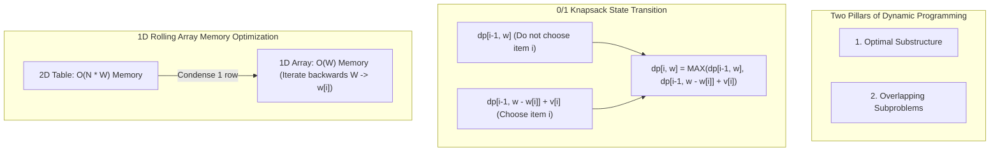

## Problem Description

In computer science, many optimization problems have a search space that explodes exponentially if solved using Brute Force. A classic problem prompt: **The 0/1 Knapsack Problem**.

Given a knapsack with a maximum weight capacity `W` and a set of `N` items, where each item `i` has a weight `w[i]` and a utility value `v[i]` (for `i = 0, 1, ..., N - 1`). Select a subset of the items such that the total weight does not exceed `W` and the total value obtained is maximized. Each item can be selected at most once (chosen or not chosen, represented by binary values 0 or 1).

If we use brute force to iterate through all `2ᴺ` possible subsets, the time complexity will be `O(2ᴺ)` - an impossible figure when `N >= 40` (exceeding 1 trillion calculations). **Dynamic Programming (DP)**, invented by mathematician Richard Bellman in the 1950s, is the key to breaking this exponential explosion, bringing the time complexity down to pseudo-polynomial time `O(N x W)`.

## Initial Approach Idea

The initial intuitive approach is to use plain Recursion. At each item `i`, we have two decision branches:

1. **Do not choose item `i`:** The optimal value equals the optimal value of the subproblem with the previous `i - 1` items and the remaining capacity `w`.
2. **Choose item `i` (if `w[i] <= w`):** The optimal value equals the value of item `v[i]` plus the optimal value of the subproblem with `i - 1` items and remaining capacity `w - w[i]`.

Mathematical recurrence relation:

```
knapsack(i, w) = max(
    knapsack(i - 1, w),
    v[i] + knapsack(i - 1, w - w[i]) // condition: w[i] <= w
)
```

The recursion tree executing this way encounters a severe issue: _Continuous Overlapping Subproblems_. The exact same state `(i, w)` is recalculated millions of times across independent recursive branches, bottlenecking the Call Stack and causing execution time to skyrocket exponentially `O(2ᴺ)`.

## Optimization Mindset & Algorithmic Structure

To successfully apply Dynamic Programming, the problem must satisfy **two prerequisites**:

1. **Optimal Substructure:** The optimal solution to the overall problem of size `(N, W)` can be constructed directly from the optimal solutions to lower-level subproblems `(N - 1, W)` and `(N - 1, W - w[N-1])`.
2. **Overlapping Subproblems:** The state space contains a finite number of subproblems that are reused multiple times. By storing the result of each subproblem immediately after its first computation, we completely eliminate redundant calculation branches.

There are 2 schools of thought for implementing Dynamic Programming:

- **Top-Down with Memoization:** Retains the natural recursive structure but looks up a memory table `memo[i][w]` before computing. If the state already has a result, it returns immediately at `O(1)` cost.
- **Bottom-Up with Tabulation:** Initializes a 2D table `dp[N+1][W+1]`, sequentially calculating from the base problem `i = 0` (no items) and `w = 0` (capacity 0), gradually building up to the final result `dp[N][W]`.

**Space Optimization:** Observe that at step `i`, we only need information from row `i - 1`. Therefore, we can condense the `(N + 1) x (W + 1)` 2D table into a 1D array of size `W + 1`. Note: Iterate the capacity variable `w` backwards from `W` down to `w[i]` to avoid overwriting data from the previous step in the same iteration pass.

## Source Code Implementation & Dry Run

State transition diagram in Dynamic Programming and the overlapping subproblems tree:



**Complete C++ source code (Bottom-Up Tabulation with 1D Memory Optimization):**

```c++
#include <iostream>
#include <vector>
#include <algorithm>

// 1. 2D Dynamic Programming: Retains state table for answer backtracking
int knapsack2D(int W, const std::vector<int>& weights, const std::vector<int>& values, int n) {
    std::vector<std::vector<int>> dp(n + 1, std::vector<int>(W + 1, 0));

    for (int i = 1; i <= n; ++i) {
        int currentWeight = weights[i - 1];
        int currentValue = values[i - 1];
        for (int w = 0; w <= W; ++w) {
            if (currentWeight <= w) {
                dp[i][w] = std::max(dp[i - 1][w], currentValue + dp[i - 1][w - currentWeight]);
            } else {
                dp[i][w] = dp[i - 1][w];
            }
        }
    }
    return dp[n][W];
}

// 2. 1D Memory Optimized DP: O(W) Space
int knapsackOptimized(int W, const std::vector<int>& weights, const std::vector<int>& values, int n) {
    std::vector<int> dp(W + 1, 0);

    for (int i = 0; i < n; ++i) {
        int currentWeight = weights[i];
        int currentValue = values[i];
        // Iterate backwards from W to currentWeight to preserve state i - 1 data
        for (int w = W; w >= currentWeight; --w) {
            dp[w] = std::max(dp[w], currentValue + dp[w - currentWeight]);
        }
    }
    return dp[W];
}

int main() {
    int W = 5; // Maximum knapsack capacity
    std::vector<int> weights = {2, 3, 4, 5};
    std::vector<int> values = {3, 4, 5, 8};
    int n = static_cast<int>(weights.size());

    int maxVal2D = knapsack2D(W, weights, values, n);
    int maxVal1D = knapsackOptimized(W, weights, values, n);

    std::cout << "Max Value (2D Table): " << maxVal2D << std::endl;
    std::cout << "Max Value (1D Optimized): " << maxVal1D << std::endl;

    return 0;
}
```

**Detailed Execution Flow Analysis (Dry Run Trace):**

- _Input data:_ `W = 5`, `weights = {2, 3, 4, 5}`, `values = {3, 4, 5, 8}`, `N = 4`.
- _Initialization:_ Array `dp = [0, 0, 0, 0, 0, 0]` (size `W + 1 = 6`).
- _Item 1 (w=2, v=3):_ Iterate `w` from 5 down to 2:
  - `w = 5: dp[5] = max(0, 3 + dp[3]) = 3`
  - `w = 4: dp[4] = max(0, 3 + dp[2]) = 3`
  - `w = 3: dp[3] = max(0, 3 + dp[1]) = 3`
  - `w = 2: dp[2] = max(0, 3 + dp[0]) = 3` &rarr; `dp = [0, 0, 3, 3, 3, 3]`
- _Item 2 (w=3, v=4):_ Iterate `w` from 5 down to 3:
  - `w = 5: dp[5] = max(3, 4 + dp[2]) = max(3, 4 + 3) = 7` (Choose item 1 and 2: total weight 5)
  - `w = 4: dp[4] = max(3, 4 + dp[1]) = max(3, 4 + 0) = 4`
  - `w = 3: dp[3] = max(3, 4 + dp[0]) = max(3, 4 + 0) = 4` &rarr; `dp = [0, 0, 3, 4, 4, 7]`
- _Item 3 (w=4, v=5):_ Iterate `w` from 5 down to 4:
  - `w = 5: dp[5] = max(7, 5 + dp[1]) = 7`
  - `w = 4: dp[4] = max(4, 5 + dp[0]) = 5` &rarr; `dp = [0, 0, 3, 4, 5, 7]`
- _Item 4 (w=5, v=8):_ Iterate `w = 5`:
  - `w = 5: dp[5] = max(7, 8 + dp[0]) = 8` &rarr; Final optimal result is `8` (Choose item 4 with `w=5, v=8`).

## Complexity Evaluation & Practical Applications

Summary performance metrics according to the standard RAM Model framework:

- **Time Complexity:** `Θ(N x W)` in all cases (Best, Average, Worst). Must iterate through `N` items, each item updating `W` states in the tabulation array.
- **Space Complexity:**
  - Traditional 2D Table: `O(N x W)` Heap memory to store the entire matrix (mandatory if you need to backtrack the exact list of chosen items).
  - 1D Array Optimization: `O(W)` auxiliary memory, saving up to 95% of memory when `N` is large.
- **Practical Applications:**
  - **Cloud Resource Allocation:** Selecting a Virtual Machine (VM) combination that optimizes cost within vCPU/RAM budget limits.
  - **Graph Algorithms:** Serves as the foundation for Bellman-Ford and Floyd-Warshall shortest path algorithms.
  - **Bioinformatics:** DNA/Protein sequence alignment using Needleman-Wunsch and Smith-Waterman algorithms.
  - **Natural Language Processing (NLP):** Viterbi algorithm in Hidden Markov Models (HMM) and neural network word decoding.
