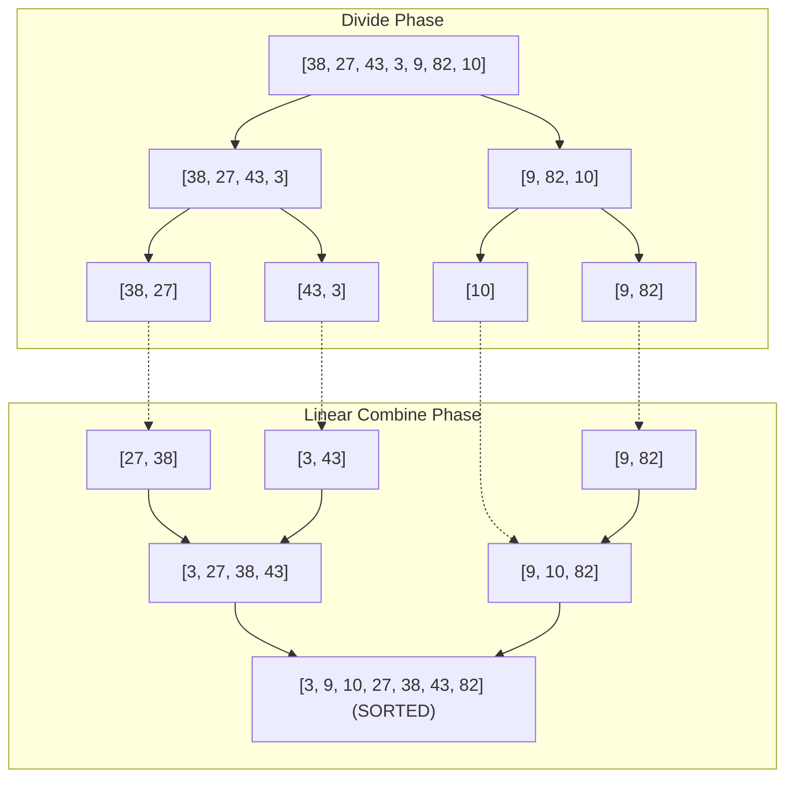

## Problem Description

When dealing with massive data scales (millions to billions of elements), processing the entire data block directly often leads to quadratic `O(N²)` or exponential algorithms. The **Divide and Conquer (D&C)** strategy is one of the most powerful algorithm design paradigms, based on the philosophy of decomposing a large problem into independent sub-problems of the same structure but smaller scale.

A classic problem for this strategy is **Large-Scale Sorting**: Given an array of `N` unordered elements, sort the array in non-decreasing order such that the execution time in all scenarios is upper-bounded by `O(N \log N)` and ensures _Stability_ - preserving the original relative order of elements with equivalent values.

## Initial Approach

Basic sorting algorithms like Bubble Sort, Selection Sort, or Insertion Sort only manipulate adjacent elements, resulting in a time cost of `O(N²)`. When `N = 10⁶`, `N² = 10¹²` operations, consuming thousands of seconds of processing time on modern CPUs.

If we merely divide the array without an effective combination strategy, the processing time won't improve. In 1945, John von Neumann proposed the **MergeSort** algorithm: Divide the array into 2 equal halves, recursively sort each half, and then merge the two sorted sequences into a complete sequence with a linear cost of `O(N)`.

## Optimization Mindset & Algorithm Structure

The Divide and Conquer strategy always follows **3 standard phases**:

1. **Divide:** Decompose the original problem of size `N` into `a` independent sub-problems, each of size `N / b`. In MergeSort, `a = 2, b = 2` (dividing the array into 2 symmetric halves).
2. **Conquer:** Recursively solve each sub-problem. When the problem scale reduces to the base case (an array of 0 or 1 element), the problem is automatically considered solved with a cost of `O(1)`.
3. **Combine:** Merge the solutions of the sub-problems into a complete solution for the original problem. In MergeSort, the `merge()` procedure uses 2 pointers scanning in parallel across 2 sorted sub-arrays to merge them into a buffer in `O(N)` time.

**Evaluation Tool: Master Theorem:**

Most Divide and Conquer recurrence relations take the form: `T(N) = a \times T(N / b) + f(N)`, where `f(N) = O(Nᵈ)` is the cost of the Divide and Combine phases.

- **Case 1 (Cost concentrated at leaves):** If `d < \log_b(a)` &rarr; `T(N) = \Theta(N^{\log_b(a)})`.
- **Case 2 (Cost evenly distributed across all levels):** If `d = \log_b(a)` &rarr; `T(N) = \Theta(N^d \log N)`. For MergeSort: `a = 2, b = 2, d = 1` &rarr; `\log_2(2) = 1 = d` &rarr; `T(N) = \Theta(N \log N)`.
- **Case 3 (Cost concentrated at root):** If `d > \log_b(a)` &rarr; `T(N) = \Theta(f(N))`.

## Source Code Implementation & Dry Run

Recursive decomposition tree (Divide) and merging process (Combine) of MergeSort:



**Complete C++ Source Code (Standard MergeSort with a buffer array):**

```c++
#include <iostream>
#include <vector>

// Merge 2 sorted sub-arrays: arr[left..mid] and arr[mid+1..right]
void merge(std::vector<int>& arr, std::vector<int>& temp, int left, int mid, int right) {
    int i = left;      // Pointer traversing the left sub-array
    int j = mid + 1;   // Pointer traversing the right sub-array
    int k = left;      // Pointer writing data to the temporary array

    while (i <= mid && j <= right) {
        // Use <= to ensure stability (Stable Sort)
        if (arr[i] <= arr[j]) {
            temp[k++] = arr[i++];
        } else {
            temp[k++] = arr[j++];
        }
    }

    // Copy the remaining elements of the left sub-array
    while (i <= mid) {
        temp[k++] = arr[i++];
    }

    // Copy the remaining elements of the right sub-array
    while (j <= right) {
        temp[k++] = arr[j++];
    }

    // Transfer the sorted data from the temporary array back to the original array
    for (int idx = left; idx <= right; ++idx) {
        arr[idx] = temp[idx];
    }
}

// Recursive divide and conquer function
void mergeSortInternal(std::vector<int>& arr, std::vector<int>& temp, int left, int right) {
    if (left >= right) {
        return; // Base case: Array has 0 or 1 element
    }

    int mid = left + (right - left) / 2; // Prevent 32-bit integer overflow

    // 1. Divide and Conquer
    mergeSortInternal(arr, temp, left, mid);
    mergeSortInternal(arr, temp, mid + 1, right);

    // 2. Combine
    merge(arr, temp, left, mid, right);
}

// User-friendly Wrapper Interface
void mergeSort(std::vector<int>& arr) {
    if (arr.empty()) return;
    std::vector<int> temp(arr.size());
    mergeSortInternal(arr, temp, 0, static_cast<int>(arr.size()) - 1);
}

int main() {
    std::vector<int> data = {38, 27, 43, 3, 9, 82, 10};
    mergeSort(data);

    std::cout << "Array after MergeSort: ";
    for (int x : data) std::cout << x << " ";
    std::cout << std::endl;

    return 0;
}
```

**Detailed Execution Trace (Dry Run):**

- _Input:_ `data = {38, 27, 43, 3, 9, 82, 10}` (`N = 7`).
- _Divide level 1:_ `left=0, right=6, mid=3` &rarr; Left half `[0..3] = {38, 27, 43, 3}`, Right half `[4..6] = {9, 82, 10}`.
- _Process left half:_
  - Divide `[0..3]` into `[0..1]={38, 27}` and `[2..3]={43, 3}`.
  - Merge `{38}` and `{27}` &rarr; `{27, 38}`.
  - Merge `{43}` and `{3}` &rarr; `{3, 43}`.
  - Merge `{27, 38}` and `{3, 43}`: Compare 2 pointers &rarr; `{3, 27, 38, 43}`.
- _Process right half:_
  - Divide `[4..6]` into `[4..5]={9, 82}` and `[6..6]={10}`.
  - Merge `{9}` and `{82}` &rarr; `{9, 82}`.
  - Merge `{9, 82}` and `{10}` &rarr; `{9, 10, 82}`.
- _Root level merge:_ `merge({3, 27, 38, 43}, {9, 10, 82})`:
  - 3 &lt; 9 &rarr; `[3]`; 27 &gt; 9 &rarr; `[3, 9]`; 27 &gt; 10 &rarr; `[3, 9, 10]`; 27 &lt; 82 &rarr; `[3, 9, 10, 27]`; 38 &lt; 82 &rarr; `[3, 9, 10, 27, 38]`; 43 &lt; 82 &rarr; `[3, 9, 10, 27, 38, 43]`; Copy remaining element 82 &rarr; Complete sorted array in exactly `O(N \log N)`.

## Complexity Evaluation & Practical Applications

Performance metric summary according to the standard RAM Model:

- **Time Complexity:** `\Theta(N \log N)` consistently across Best, Average, and Worst Cases. The algorithm never degrades to `O(N²)` like QuickSort when encountering poorly distributed data.
- **Space Complexity:** `O(N)` auxiliary space for the `temp` buffer array and `O(\log N)` Call Stack space for recursive frames.
- **Stability:** Absolutely guaranteed (Stable Sort) thanks to the comparison condition `arr[i] <= arr[j]` in the `merge` loop.
- **Practical Applications:**
  - **External Sorting:** Sorting Terabyte-sized data files that exceed physical RAM capacity (the principle of the Shuffle/Sort phase in Apache Spark and Hadoop MapReduce).
  - **Fast Fourier Transform (FFT):** Signal spectrum analysis in digital telecommunications and MP3 audio compression.
  - **Strassen's Algorithm:** Fast matrix multiplication in computer graphics and deep learning neural networks.
  - **Computational Geometry:** Finding the Closest Pair of Points in 2D/3D space with an `O(N \log N)` cost.
