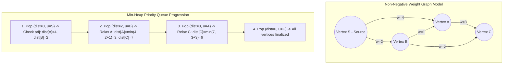

## Problem Description

The Single-Source Shortest Path (SSSP) problem is a core issue in graph theory and network routing engineering. The premise:

Given a directed or undirected graph `G = (V, E)` consisting of `V` vertices and `E` edges, each edge `(u, v)` is assigned a non-negative weight `w(u, v) \geq 0` (representing geographical distance, network packet latency, or fuel cost). Given a source vertex `s \in V`, find the shortest path length from `s` to all other vertices in the graph, and simultaneously reconstruct the specific travel journey.

Dijkstra's algorithm, invented by legendary computer scientist Edsger W. Dijkstra in 1956, is the most optimal and widely used solution for this problem when the graph contains no negative weights.

## Initial Approach

A naive initial approach is to use Breadth-First Search (BFS). However, traditional BFS only works correctly when all edges have a _uniform weight of 1_. When the graph has variable weights, the first vertex visited is not necessarily the one with the shortest distance.

The original Dijkstra algorithm iterates over a linear array: At each step, it scans all `V` vertices to find the one with the smallest distance that hasn't been finalized yet. The complexity of this version is `O(V²)`. For sparse graphs (`E \approx V`), array traversal wastes unnecessary resources and operates very slowly on transport networks with millions of vertices.

## Optimization Mindset & Algorithm Structure

Dijkstra's algorithm operates based on the **Greedy Paradigm** and the **Edge Relaxation** mechanism:

1. **Distance Array & Visited Set:** Maintain a `dist[v]` array storing the current shortest distance from the source `s` to `v`. Initially `dist[s] = 0`, all other vertices are assigned `\infty` (infinity).
2. **Greedy Strategy:** At each step, select the vertex `u` with the smallest `dist[u]` among unfinalized vertices. Because the graph has non-negative weights, `dist[u]` at this point is guaranteed to be the absolute shortest distance and cannot be further optimized (Invariance).
3. **Relaxation Mechanism:** For every adjacent vertex `v` of `u`, if traveling through `u` shortens the distance to `v`, update it:

```c++
if (dist[u] + w(u, v) < dist[v]) {
    dist[v] = dist[u] + w(u, v);
    parent[v] = u; // Save the path trace
}
```

4. **Min-Heap Data Structure Optimization:** Instead of traversing an `O(V)` array to find the minimum vertex, we use a Priority Queue (`std::priority_queue` with `std::greater`) to extract the smallest vertex in `O(\log V)`. Every relaxed edge is pushed into the heap at most once, reducing total execution time to `O((V + E) \log V)`.

**Important Note:** Dijkstra _does not work correctly_ on graphs with negative-weight edges because the greedy assumption is broken (traveling through a negative edge in the future could reduce the distance to an already finalized vertex).

## Source Code Implementation & Dry Run

State transition diagram and Relaxation mechanism in Dijkstra with Min-Heap:



**Complete C++ Source Code (Dijkstra with std::priority_queue and Path Reconstruction):**

```c++
#include <iostream>
#include <vector>
#include <queue>
#include <utility>
#include <algorithm>

const long long INF = 1e18; // Represents infinity

struct Edge {
    int to;
    long long weight;
};

// State pair in Min-Heap: {distance, vertex}
using State = std::pair<long long, int>;

void dijkstra(int startNode, int numVertices,
              const std::vector<std::vector<Edge>>& graph,
              std::vector<long long>& dist,
              std::vector<int>& parent) {
    dist.assign(numVertices, INF);
    parent.assign(numVertices, -1);

    // Min-heap prioritizes elements with the smallest distance at the top
    std::priority_queue<State, std::vector<State>, std::greater<State>> pq;

    dist[startNode] = 0;
    pq.push({0, startNode});

    while (!pq.empty()) {
        auto [d, u] = pq.top();
        pq.pop();

        // Ignore stale records in Lazy Deletion
        if (d > dist[u]) {
            continue;
        }

        // Relax all adjacent edges from vertex u
        for (const auto& edge : graph[u]) {
            int v = edge.to;
            long long w = edge.weight;

            if (dist[u] + w < dist[v]) {
                dist[v] = dist[u] + w;
                parent[v] = u; // Record parent vertex for path reconstruction
                pq.push({dist[v], v});
            }
        }
    }
}

// Function to reconstruct the path from source vertex to target vertex
std::vector<int> reconstructPath(int target, const std::vector<int>& parent) {
    std::vector<int> path;
    for (int curr = target; curr != -1; curr = parent[curr]) {
        path.push_back(curr);
    }
    std::reverse(path.begin(), path.end());
    return path;
}

int main() {
    int V = 5; // Graph with 5 vertices: 0, 1, 2, 3, 4
    std::vector<std::vector<Edge>> graph(V);

    // Add directed edges (u, v, w)
    graph[0].push_back({1, 4});
    graph[0].push_back({2, 2});
    graph[2].push_back({1, 1});
    graph[2].push_back({3, 5});
    graph[1].push_back({3, 3});
    graph[1].push_back({4, 6});
    graph[3].push_back({4, 1});

    std::vector<long long> dist;
    std::vector<int> parent;
    dijkstra(0, V, graph, dist, parent);

    std::cout << "--- SHORTEST PATH RESULTS FROM VERTEX 0 ---" << std::endl;
    for (int i = 0; i < V; ++i) {
        std::cout << "Distance to vertex " << i << ": " << dist[i] << " | Path: ";
        auto path = reconstructPath(i, parent);
        for (size_t j = 0; j < path.size(); ++j) {
            std::cout << path[j] << (j + 1 < path.size() ? " -> " : "");
        }
        std::cout << std::endl;
    }

    return 0;
}
```

**Detailed Execution Trace (Dry Run):**

- _Initialization:_ `dist = [0, \infty, \infty, \infty, \infty]`, `pq = {(0, 0)}`.
- _Step 1:_ Pop `(0, 0)`. Check adjacent vertices of 0:
  - Edge `(0->1, w=4)`: `dist[1] = 4, parent[1] = 0` &rarr; Push `(4, 1)`.
  - Edge `(0->2, w=2)`: `dist[2] = 2, parent[2] = 0` &rarr; Push `(2, 2)`.
- _Step 2:_ Pop `(2, 2)` (smallest in heap). Check adjacent vertices of 2:
  - Edge `(2->1, w=1)`: `dist[0] + 2 + 1 = 3 < dist[1]=4` &rarr; Successful relaxation! `dist[1] = 3, parent[1] = 2` &rarr; Push `(3, 1)`.
  - Edge `(2->3, w=5)`: `dist[3] = 2 + 5 = 7, parent[3] = 2` &rarr; Push `(7, 3)`.
- _Step 3:_ Pop `(3, 1)`. Check adjacent vertices of 1:
  - Edge `(1->3, w=3)`: `3 + 3 = 6 < dist[3]=7` &rarr; Relaxation! `dist[3] = 6, parent[3] = 1` &rarr; Push `(6, 3)`.
  - Edge `(1->4, w=6)`: `3 + 6 = 9 < dist[4]=\infty` &rarr; `dist[4] = 9, parent[4] = 1` &rarr; Push `(9, 4)`.
- _Step 4:_ Pop `(4, 1)` &rarr; Discarded due to `d = 4 > dist[1] = 3` (Lazy Deletion).
- _Step 5:_ Pop `(6, 3)`. Check adjacent vertices of 3:
  - Edge `(3->4, w=1)`: `6 + 1 = 7 < dist[4]=9` &rarr; Relaxation! `dist[4] = 7, parent[4] = 3` &rarr; Push `(7, 4)`.
- _Steps 6 & 7:_ Pop `(7, 4)`, then old states are discarded &rarr; The path to vertex 4 finalizes the optimal value `7` with the journey `0 -> 2 -> 1 -> 3 -> 4`.

## Complexity Evaluation & Practical Applications

Performance metric summary according to the standard RAM Model:

- **Time Complexity:** `O((V + E) \log V)` when using a Binary Heap (or theoretically `O(E + V \log V)` with a Fibonacci Heap). Each vertex is extracted from the heap once (`V \log V`) and each edge is relaxed at most once (`E \log V`).
- **Space Complexity:** `O(V + E)` to store the Adjacency List along with `dist`, `parent` arrays, and the priority queue `pq`.
- **Practical Applications:**
  - **Digital Mapping Systems (GPS Navigation):** The heart of routing algorithms in Google Maps, OSRM, Apple Maps (often combined with A\* Heuristics or Contraction Hierarchies).
  - **Internet Routing Protocols:** OSPF (Open Shortest Path First) and IS-IS in telecommunication core network architectures.
  - **Game Development (Game AI Pathfinding):** Finding optimal movement paths for characters avoiding obstacles in real-time.
  - **Social Graphs:** Measuring influence and connection distances (Six Degrees of Separation) between users.
