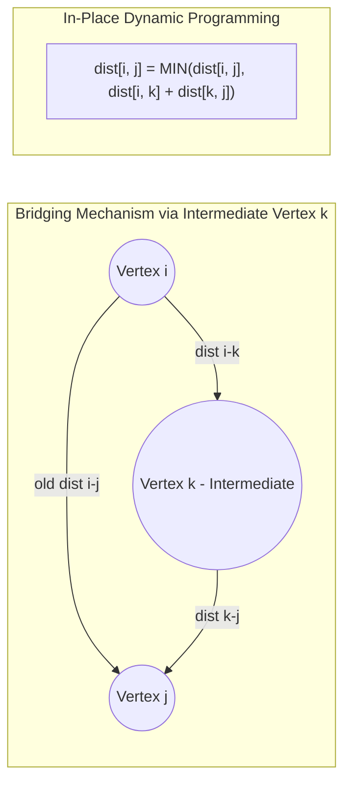

## Problem Description

In many real-world systems such as interprovincial transport networks, telecom switching systems, or open-world RPG games, the system needs to query the shortest distance between **any pair of vertices `(u, v)`** in `O(1)` instant time after a single precomputation phase.

The challenge: **Find the All-Pairs Shortest Path (APSP)**. Given a directed graph `G = (V, E)` that may contain negative weights but no negative cycles. Construct a distance matrix `dist[V][V]` such that `dist[i][j]` represents the shortest path length from vertex `i` to vertex `j` for all `0 \leq i, j < V`.

The Floyd-Warshall algorithm (published by Robert Floyd and Stephen Warshall in 1962) is the classic, most elegant solution featuring an extremely concise structure of 3 nested loops.

## Initial Approach

We could solve the APSP problem by running Single-Source Shortest Path (SSSP) algorithms repeatedly `V` times, with each vertex as the source:

- **Run Dijkstra `V` times:** Time cost `O(V \times (V + E) \log V)`. However, Dijkstra cannot handle negative weights.
- **Run Bellman-Ford `V` times:** Time cost `O(V \times V \times E) = O(V^2 E)`. For dense graphs (`E \approx V^2`), complexity shoots up to `O(V^4)` - far too heavy and complex to implement.

Floyd-Warshall solves this problem in just `O(V^3)` using In-Place Matrix Dynamic Programming (DP), requiring no complex data structures like Heaps or adjacency lists.

## Optimization Mindset & Algorithm Structure

The DP mindset of Floyd-Warshall defines states based on **the set of allowable intermediate vertices**:

1. **DP State Definition:** Let `dp[k][i][j]` be the shortest path length from vertex `i` to vertex `j`, provided that all intermediate vertices on the route can only be chosen from the set `{0, 1, 2, ..., k}`.
2. **State Transition Relation:** When expanding the allowable intermediate vertex set from `k - 1` to `k`, we have two choices:

- _Do not go through intermediate vertex `k`:_ The distance remains `dp[k - 1][i][j]`.
- _Go through intermediate vertex `k`:_ The path splits into two segments `i \rightarrow k` and `k \rightarrow j`, with a total cost of `dp[k - 1][i][k] + dp[k - 1][k][j]`.

```
dp[k][i][j] = min(
    dp[k - 1][i][j],
    dp[k - 1][i][k] + dp[k - 1][k][j]
)
```

3. **In-Place 2D Matrix Memory Optimization:** Because the values in row `k` and column `k` remain unchanged when vertex `k` itself is used as an intermediate, we can drop the `k` dimension and update directly on the 2D matrix `dist[i][j]`. _Golden rule:_ The `k` variable loop MUST be placed on the **outermost** level.
4. **Negative Cycle Detection:** After completing all `V` steps, check the main diagonal: If there is any vertex `i` where `dist[i][i] < 0`, it proves that vertex `i` belongs to a negative cycle.

## Source Code Implementation & Dry Run

State transition matrix diagram through intermediate vertex `k`:



**Complete C++ Source Code (Floyd-Warshall with Next Matrix for Path Reconstruction):**

```c++
#include <iostream>
#include <vector>
#include <algorithm>

const long long INF = 1e15; // Safe large value to avoid overflow when adding

void floydWarshall(int V, std::vector<std::vector<long long>>& dist,
                   std::vector<std::vector<int>>& nextNode) {
    // Initialize the nextNode matrix for path reconstruction tracking
    for (int i = 0; i < V; ++i) {
        for (int j = 0; j < V; ++j) {
            if (i == j) {
                dist[i][j] = 0;
                nextNode[i][j] = j;
            } else if (dist[i][j] != INF) {
                nextNode[i][j] = j;
            } else {
                nextNode[i][j] = -1;
            }
        }
    }

    // 3 nested loops: k (intermediate vertex) MUST be the outermost loop
    for (int k = 0; k < V; ++k) {
        for (int i = 0; i < V; ++i) {
            for (int j = 0; j < V; ++j) {
                if (dist[i][k] != INF && dist[k][j] != INF) {
                    if (dist[i][k] + dist[k][j] < dist[i][j]) {
                        dist[i][j] = dist[i][k] + dist[k][j];
                        nextNode[i][j] = nextNode[i][k]; // Inherit next step vertex
                    }
                }
            }
        }
    }
}

// Check for negative cycles via the main diagonal
bool hasNegativeCycle(int V, const std::vector<std::vector<long long>>& dist) {
    for (int i = 0; i < V; ++i) {
        if (dist[i][i] < 0) return true;
    }
    return false;
}

// Reconstruct the shortest path from u to v
std::vector<int> getPath(int u, int v, const std::vector<std::vector<int>>& nextNode) {
    if (nextNode[u][v] == -1) return {};
    std::vector<int> path = {u};
    while (u != v) {
        u = nextNode[u][v];
        path.push_back(u);
    }
    return path;
}

int main() {
    int V = 4;
    std::vector<std::vector<long long>> dist(V, std::vector<long long>(V, INF));
    std::vector<std::vector<int>> nextNode(V, std::vector<int>(V, -1));

    // Initialize directed graph with 4 vertices
    dist[0][1] = 5;
    dist[0][3] = 10;
    dist[1][2] = 3;
    dist[2][3] = 1;

    floydWarshall(V, dist, nextNode);

    if (hasNegativeCycle(V, dist)) {
        std::cout << "Negative Cycle Detected in the graph!" << std::endl;
    } else {
        std::cout << "--- ALL-PAIRS SHORTEST PATH DISTANCE MATRIX ---" << std::endl;
        for (int i = 0; i < V; ++i) {
            for (int j = 0; j < V; ++j) {
                if (dist[i][j] == INF) std::cout << "INF\t";
                else std::cout << dist[i][j] << "\t";
            }
            std::cout << std::endl;
        }

        std::cout << "\nPath from vertex 0 to 3: ";
        auto path = getPath(0, 3, nextNode);
        for (size_t i = 0; i < path.size(); ++i) {
            std::cout << path[i] << (i + 1 < path.size() ? " -> " : "");
        }
        std::cout << " (Cost: " << dist[0][3] << ")" << std::endl;
    }

    return 0;
}
```

**Detailed Execution Trace (Dry Run):**

- _Initial state:_ `dist[0][1]=5, dist[0][3]=10, dist[1][2]=3, dist[2][3]=1`.
- _When `k = 0`:_ Using vertex 0 as intermediate, no pairs improve.
- _When `k = 1`:_ Using vertex 1 as intermediate &rarr; Evaluate pair `(0, 2)`: `dist[0][1] + dist[1][2] = 5 + 3 = 8 < \infty` &rarr; Update `dist[0][2] = 8`.
- _When `k = 2`:_ Using vertex 2 as intermediate &rarr; Evaluate pair `(0, 3)`: `dist[0][2] + dist[2][3] = 8 + 1 = 9 < dist[0][3]=10` &rarr; Update `dist[0][3] = 9`! Journey shifts from direct `0->3 (w=10)` to taking a detour `0 -> 1 -> 2 -> 3 (w=9)`.
- _When `k = 3`:_ Using vertex 3 as intermediate, the matrix stabilizes completely.

## Complexity Evaluation & Practical Applications

Performance metric summary according to the standard RAM Model:

- **Time Complexity:** `\Theta(V^3)` in all cases due to the 3 fixed loops `V \times V \times V`. Independent of the number of edges `E`.
- **Space Complexity:** `O(V^2)` to store 2 matrices of size `V \times V` (`dist` distance matrix and `nextNode` trace matrix). Extremely CPU cache-friendly (Cache Locality) due to contiguous sequential array access.
- **Practical Applications:**
  - **Transitive Closure:** Warshall's algorithm checks connectivity and reachability between all pairs of vertices in directed graphs (used in dependency analysis for Compilers).
  - **Logistics and Multimodal Routing Systems:** Fixed distance lookup tables between thousands of global post offices or airports.
  - **Social Network Theory:** Calculating Closeness Centrality and Betweenness Centrality for network nodes.
