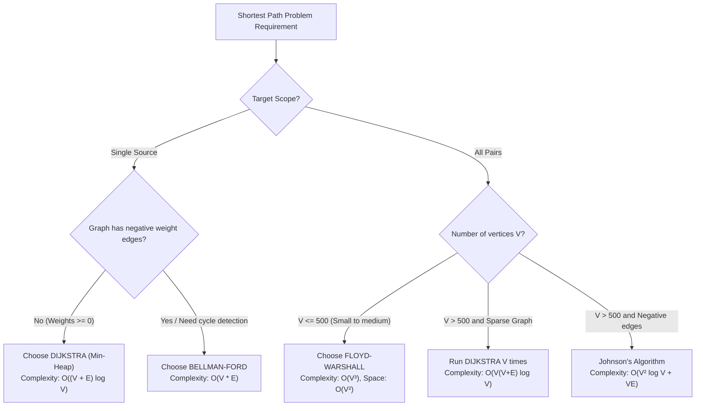

## Problem Description

In software engineering, choosing the wrong shortest path algorithm can lead to severe consequences: programs running thousands of times slower (Time Limit Exceeded), memory overflows (Out of Memory), or complete logic failures when hitting edge cases (like negative weights causing infinite loops).

The three classic pillars for the shortest path problem include:

1. **Dijkstra:** A high-speed Greedy algorithm for non-negative weighted graphs.
2. **Bellman-Ford:** An edge-relaxing Dynamic Programming algorithm that safely handles negative weights and detects negative cycles.
3. **Floyd-Warshall:** A Matrix Dynamic Programming algorithm to find the shortest path between all pairs of vertices (All-Pairs).

This article establishes a precise, quantitative comparison framework and provides a visual Decision Tree to help system architecture engineers make optimal choices.

## Initial Approach

Common mistakes when selecting algorithms in real-world projects:

- **Abusing Dijkstra on graphs with negative weights:** Leads to silently incorrect results without any exceptions or library warnings thrown.
- **Using Bellman-Ford on massive traffic maps:** For road networks with millions of nodes, Bellman-Ford takes hours to process, while Dijkstra with a Min-Heap solves it in a few milliseconds.
- **Running Dijkstra V times on a dense graph instead of Floyd-Warshall:** Faces much higher overhead for priority queue management and memory fragmentation compared to the sequential `O(V³)` matrix traversal which has high hardware optimization.

## Optimization Mindset & Algorithm Structure

**Comparative Architecture Matrix:**

<table style="width:100%; border-collapse: collapse; margin-bottom: 20px;">
  <thead>
    <tr style="border-bottom: 2px solid #e2e8f0; text-align: left;">
      <th style="padding: 8px;">Evaluation Criteria</th>
      <th style="padding: 8px;">Dijkstra</th>
      <th style="padding: 8px;">Bellman-Ford</th>
      <th style="padding: 8px;">Floyd-Warshall</th>
    </tr>
  </thead>
  <tbody>
    <tr style="border-bottom: 1px solid #edf2f7;">
      <td style="padding: 8px"><b>Problem Scope</b></td>
      <td style="padding: 8px">Single-Source</td>
      <td style="padding: 8px">Single-Source</td>
      <td style="padding: 8px">All-Pairs</td>
    </tr>
    <tr style="border-bottom: 1px solid #edf2f7;">
      <td style="padding: 8px"><b>Time Complexity</b></td>
      <td style="padding: 8px"><code>O((V + E) \log V)</code></td>
      <td style="padding: 8px"><code>O(V*E)</code> (Best: <code>O(E)</code>)</td>
      <td style="padding: 8px"><code>Θ(V³)</code></td>
    </tr>
    <tr style="border-bottom: 1px solid #edf2f7;">
      <td style="padding: 8px"><b>Space Complexity</b></td>
      <td style="padding: 8px"><code>O(V + E)</code></td>
      <td style="padding: 8px"><code>O(V + E)</code></td>
      <td style="padding: 8px"><code>O(V²)</code></td>
    </tr>
    <tr style="border-bottom: 1px solid #edf2f7;">
      <td style="padding: 8px"><b>Negative Edge Weights</b></td>
      <td style="padding: 8px">NOT supported</td>
      <td style="padding: 8px">Safely SUPPORTED</td>
      <td style="padding: 8px">Safely SUPPORTED</td>
    </tr>
    <tr style="border-bottom: 1px solid #edf2f7;">
      <td style="padding: 8px"><b>Negative Cycle Detection</b></td>
      <td style="padding: 8px">NOT supported</td>
      <td style="padding: 8px">YES (at pass V)</td>
      <td style="padding: 8px">YES (<code>dist[i][i] < 0</code>)</td>
    </tr>
    <tr style="border-bottom: 1px solid #edf2f7;">
      <td style="padding: 8px"><b>Data Structure</b></td>
      <td style="padding: 8px">Min-Heap + Adjacency List</td>
      <td style="padding: 8px">Edge List</td>
      <td style="padding: 8px">2D Matrix (Adjacency Matrix)</td>
    </tr>
    <tr>
      <td style="padding: 8px"><b>Protocols / Applications</b></td>
      <td style="padding: 8px">OSPF, Google Maps, GPS</td>
      <td style="padding: 8px">RIP, Currency Arbitrage</td>
      <td style="padding: 8px">Transitive Closure, Logistics</td>
    </tr>
  </tbody>
</table>

## Source Code Implementation & Dry Run

Decision Tree to help engineers choose the standard algorithm based on the problem:



**Integrated C++ Benchmark Suite (Measurement and validation of 3 algorithms on the same graph):**

```c++
#include <iostream>
#include <vector>
#include <queue>
#include <chrono>

const long long INF = 1e15;

// Common Edge Structure
struct Edge {
    int from, to;
    long long weight;
};

// 1. Dijkstra Benchmark Wrapper
long long benchmarkDijkstra(int V, int start, int end, const std::vector<std::vector<std::pair<int, long long>>>& adj) {
    std::vector<long long> dist(V, INF);
    using State = std::pair<long long, int>;
    std::priority_queue<State, std::vector<State>, std::greater<State>> pq;

    dist[start] = 0;
    pq.push({0, start});

    while (!pq.empty()) {
        auto [d, u] = pq.top();
        pq.pop();
        if (d > dist[u]) continue;
        if (u == end) break; // Early exit when target is found

        for (const auto& edge : adj[u]) {
            int v = edge.first;
            long long w = edge.second;
            if (dist[u] + w < dist[v]) {
                dist[v] = dist[u] + w;
                pq.push({dist[v], v});
            }
        }
    }
    return dist[end];
}

// 2. Bellman-Ford Benchmark Wrapper
long long benchmarkBellmanFord(int V, int start, int end, const std::vector<Edge>& edges) {
    std::vector<long long> dist(V, INF);
    dist[start] = 0;

    for (int i = 1; i <= V - 1; ++i) {
        bool updated = false;
        for (const auto& e : edges) {
            if (dist[e.from] != INF && dist[e.from] + e.weight < dist[e.to]) {
                dist[e.to] = dist[e.from] + e.weight;
                updated = true;
            }
        }
        if (!updated) break;
    }
    return dist[end];
}

// 3. Floyd-Warshall Benchmark Wrapper
long long benchmarkFloydWarshall(int V, int start, int end, std::vector<std::vector<long long>> dist) {
    for (int k = 0; k < V; ++k) {
        for (int i = 0; i < V; ++i) {
            for (int j = 0; j < V; ++j) {
                if (dist[i][k] != INF && dist[k][j] != INF) {
                    dist[i][j] = std::min(dist[i][j], dist[i][k] + dist[k][j]);
                }
            }
        }
    }
    return dist[start][end];
}

int main() {
    int V = 5;
    std::vector<Edge> edgeList = {
        {0, 1, 4}, {0, 2, 2}, {1, 2, 1}, {1, 3, 5},
        {2, 3, 8}, {2, 4, 10}, {3, 4, 2}
    };

    std::vector<std::vector<std::pair<int, long long>>> adj(V);
    std::vector<std::vector<long long>> matrix(V, std::vector<long long>(V, INF));
    for (int i = 0; i < V; ++i) matrix[i][i] = 0;

    for (const auto& e : edgeList) {
        adj[e.from].push_back({e.to, e.weight});
        matrix[e.from][e.to] = e.weight;
    }

    std::cout << "--- PATH DISTANCE FROM 0 TO 4 RESULTS ---" << std::endl;
    std::cout << "1. Dijkstra:       Distance = " << benchmarkDijkstra(V, 0, 4, adj) << std::endl;
    std::cout << "2. Bellman-Ford:   Distance = " << benchmarkBellmanFord(V, 0, 4, edgeList) << std::endl;
    std::cout << "3. Floyd-Warshall: Distance = " << benchmarkFloydWarshall(V, 0, 4, matrix) << std::endl;

    return 0;
}
```

## Complexity Evaluation & Practical Applications

Summary application strategy for software engineers:

1. **When to choose Dijkstra?** When needing the shortest path from a single starting point on a large graph (roads, computer networks, social graphs) and 100% ensuring weights are `\geq 0`. This is the highest-performing algorithm in practice.
2. **When to choose Bellman-Ford?** When the graph might have negative costs (currency trading, energy grids) or when a simple distributed algorithm is needed (Distance Vector in RIP routing) where each router only exchanges information with its neighbors.
3. **When to choose Floyd-Warshall?** When the number of vertices is moderate (`V \leq 500`) and the system requires instant shortest path lookups between all pairs in `O(1)` time without recomputation.
