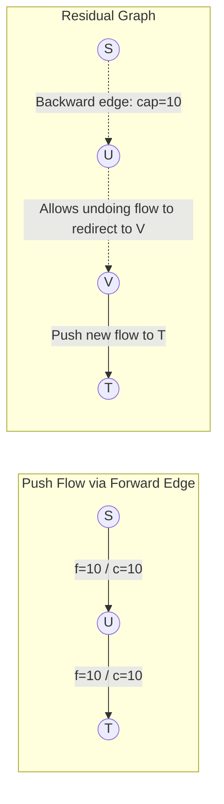

## Problem Description

In oil and gas distribution systems, electrical transmission grids, Internet bandwidth infrastructure, or flight scheduling, the core problem is: _How can we transport the maximum volume of physical material or information from a source to a destination without overloading any pipeline/link?_

The challenge is the **Maximum Flow Problem**. Given a flow network `G = (V, E)` which is a directed graph where each edge `(u, v)` has a maximum `c(u, v) >= 0`. We are given two special vertices: the **Source `s`** and the **Sink `t`**.

Determine a flow function `f(u, v)` that satisfies two invariant conditions:

1. **Capacity Constraint:** `0 <= f(u, v) <= c(u, v)` for every edge `(u, v)`.
2. **Conservation of Flow:** The total flow entering any intermediate vertex must exactly equal the total flow exiting that vertex (for all vertices except `s` and `t`).

Goal: Maximize the total flow from source `s` to sink `t`: `|f| = sum f(s, v)`.

## Initial Approach

A naive initial approach is to use a Greedy algorithm: Find any path from `s` to `t` using DFS/BFS, push the maximum possible flow through this path, reduce the capacities of the traversed edges, and repeat until no more paths from `s` to `t` exist.

This purely greedy strategy **fails** because once flow is pushed down a suboptimal path, it occupies capacity and permanently blocks other optimal paths without an opportunity to correct the mistake.

Lester Ford Jr. and Delbert Fulkerson introduced a breakthrough solution in 1956: The **Backward Edge** on a **Residual Graph**, allowing the algorithm to "undo" or "reroute" flow that was previously sent incorrectly.

## Optimization Mindset & Algorithm Structure

The Ford-Fulkerson method operates on three solid theoretical pillars:

1. **Residual Graph (`G_f`):** For each edge `(u, v)` with capacity `c` and current flow `f`:
   - _Forward Edge:_ Has a residual capacity of `c(u, v) - f(u, v)` (representing the ability to push more flow).
   - _Backward Edge:_ Has a residual capacity of `f(u, v)` (representing the ability to cancel flow already sent through `(u, v)` to redirect it elsewhere).

2. **Augmenting Path:** A simple path from source `s` to sink `t` on the residual graph where all edges on the path have a residual capacity `> 0`. The amount of flow that can be added (Bottleneck) is the minimum residual capacity along that path.

3. **Max-Flow Min-Cut Theorem:** The maximum flow value from `s` to `t` is exactly equal to the total capacity of the minimum cut (Min-Cut) that partitions the graph into 2 sets of vertices containing `s` and `t` respectively.

4. **Edmonds-Karp Optimization (1972):** Instead of using DFS, which can loop infinitely with irrational capacities or run very slowly in `O(E * |f*|)`, Edmonds and Karp proposed always using **BFS** to find the shortest augmenting path (fewest edges). This guarantees the algorithm runs in a strictly polynomial time of `O(V * E²)`.

## Source Code Implementation & Dry Run

Diagram of the backward edge mechanism and flow augmentation on the residual graph:



**Complete C++ Source Code (Edmonds-Karp Algorithm using BFS):**

```c++
#include <iostream>
#include <vector>
#include <queue>
#include <algorithm>

const long long INF = 1e18;

// Edmonds-Karp Algorithm for Maximum Flow
class EdmondsKarp {
private:
    int n; // Number of vertices
    std::vector<std::vector<long long>> capacity;
    std::vector<std::vector<int>> adj;

    // Find the shortest augmenting path from s to t using BFS
    long long bfs(int s, int t, std::vector<int>& parent) {
        std::fill(parent.begin(), parent.end(), -1);
        parent[s] = -2; // Mark source vertex as visited

        // Queue stores pair {current vertex, minimum bottleneck flow to this vertex}
        std::queue<std::pair<int, long long>> q;
        q.push({s, INF});

        while (!q.empty()) {
            auto [u, flow] = q.front();
            q.pop();

            for (int v : adj[u]) {
                if (parent[v] == -1 && capacity[u][v] > 0) {
                    parent[v] = u;
                    long long newFlow = std::min(flow, capacity[u][v]);
                    if (v == t) {
                        return newFlow; // Found path to sink t
                    }
                    q.push({v, newFlow});
                }
            }
        }
        return 0; // No augmenting path left
    }

public:
    EdmondsKarp(int vertices) : n(vertices) {
        capacity.assign(n, std::vector<long long>(n, 0));
        adj.resize(n);
    }

    void addEdge(int from, int to, long long cap) {
        capacity[from][to] += cap; // Support multiple edges
        adj[from].push_back(to);
        adj[to].push_back(from); // Add backward edge to adjacency list
    }

    long long maxFlow(int s, int t) {
        long long totalFlow = 0;
        std::vector<int> parent(n);
        long long newFlow = 0;

        // Repeatedly find augmenting paths until BFS returns 0
        while ((newFlow = bfs(s, t, parent)) > 0) {
            totalFlow += newFlow;
            int curr = t;
            // Update residual capacities along the path
            while (curr != s) {
                int prev = parent[curr];
                capacity[prev][curr] -= newFlow; // Decrease forward edge capacity
                capacity[curr][prev] += newFlow; // Increase backward edge capacity
                curr = prev;
            }
        }
        return totalFlow;
    }
};

int main() {
    int V = 6; // Graph with 6 vertices: 0 (Source S), 5 (Sink T)
    EdmondsKarp ek(V);

    ek.addEdge(0, 1, 16);
    ek.addEdge(0, 2, 13);
    ek.addEdge(1, 2, 10);
    ek.addEdge(1, 3, 12);
    ek.addEdge(2, 1, 4);
    ek.addEdge(2, 4, 14);
    ek.addEdge(3, 2, 9);
    ek.addEdge(3, 5, 20);
    ek.addEdge(4, 3, 7);
    ek.addEdge(4, 5, 4);

    long long flow = ek.maxFlow(0, 5);
    std::cout << "--- EDMONDS-KARP MAX FLOW RESULT ---" << std::endl;
    std::cout << "Maximum flow from 0 to 5: " << flow << std::endl;

    return 0;
}
```

**Detailed Execution Trace (Dry Run):**

- _Flow Network:_ `S = 0, T = 5`.
- _Augmenting Path 1:_ BFS finds `0 -> 1 -> 3 -> 5` with `bottleneck = min(16, 12, 20) = 12` &rarr; Flow increases to `12`. Subtract forward capacity, increase backward capacity.
- _Augmenting Path 2:_ BFS finds `0 -> 2 -> 4 -> 5` with `bottleneck = min(13, 14, 4) = 4` &rarr; Flow increases to `12 + 4 = 16`.
- _Augmenting Path 3:_ BFS finds `0 -> 2 -> 4 -> 3 -> 5` with `bottleneck = min(9, 10, 7, 8) = 7` &rarr; Flow increases to `16 + 7 = 23`.
- _Termination:_ BFS can no longer find any path with capacity > 0 from 0 to 5 &rarr; Maximum flow finalizes at `23`.

## Complexity Evaluation & Practical Applications

Performance metric summary according to the standard RAM Model:

- **Time Complexity:**
  - Original Ford-Fulkerson (DFS): `O(E * |f*|)` where `|f*|` is the maximum flow value.
  - Edmonds-Karp (BFS): `O(V * E²)`. Each path search takes `O(E)`, and the total number of augmentations is upper-bounded by `O(V * E)`.
- **Space Complexity:** `O(V²)` for the capacity matrix or `O(V + E)` if using a symmetric edge list.
- **Practical Applications:**
  - **Oil Pipeline and Water Transmission Networks:** Calculating the maximum water supply flow for municipal irrigation systems.
  - **Graph Cut Image Segmentation in Computer Vision:** Separating the foreground and background in medical image processing.
  - **Airline Crew Scheduling:** Optimally matching pilots, flight attendants, and flights under aviation safety constraints.
