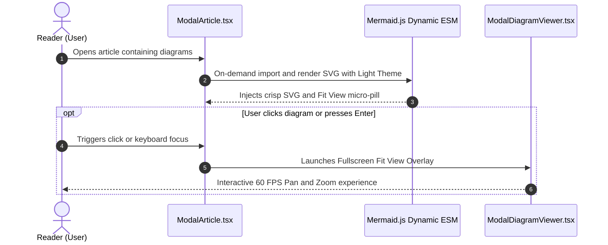

## Problem Statement & Objectives

Embedding dynamic architectural and sequence diagrams into technical blogs and documentation portals creates an engaging reading experience. However, integrating `mermaid` into a React/TypeScript Single Page Application (SPA) presents four significant engineering hurdles:

1. **Bundle Size Bloat:** Mermaid bundles heavy layout and parsing engines (Dagre, Cytoscape, KaTeX, D3) totaling over 1.4MB. Static top-level imports severely degrade First Contentful Paint (FCP).
2. **Dark Mode Contrast Invisibility:** In dark theme, default SVG text fills and line strokes blend into dark card backgrounds, rendering diagrams illegible.
3. **Mobile Viewport Constraints:** Complex microservice topologies or multi-actor sequence diagrams either shrink into unreadable sizes or overflow horizontally.
4. **Artificial Box Isolation:** Wrapping diagrams in heavy card borders and shadows makes illustrations feel disjointed from the surrounding narrative.

## Initial Naive Approach

Common naive integration patterns in React applications:

- Static import `import mermaid from 'mermaid'` with synchronous execution on initial mount.
- Wrapping rendered diagrams in bordered card containers with heavy box shadows.
- Using default presets (`theme: 'default'`) without synchronizing with custom Design Tokens.

**Why this fails in practice:** Diagrams cannot dynamically update when toggling themes during reading sessions. Mobile users cannot pan or zoom into high-density flows, and rigid card borders disrupt typography rhythm.

## Optimization Thinking & Algorithm Design

To deliver an uncompromised reader experience, I engineered an end-to-end integration architecture:

1. **Dynamic On-Demand ESM Loading:** Load the Mermaid bundle only when an article actually contains `pre.mermaid` code blocks, backed by a resilient fallback mechanism.
2. **Theme Synchronization & Native Mermaid Styling:** Utilize `theme: 'base'` with complete Ruby/Crimson design variables while fully preserving native Mermaid `style`/`classDef` syntax, eliminating destructive external CSS overrides so diagrams have full aesthetic freedom.
3. **Viewport Fit View Modal:** An interactive, compact micro-pill button triggers full-viewport expansion (95vw x 86vh) equipped with 60 FPS GPU-accelerated Pan and Zoom (40% - 350%).
4. **Seamless Text-Flow Integration:** Eliminate heavy box borders and backgrounds, allowing vector diagrams to breathe naturally between paragraphs.

## Code Implementation & Execution Trace

Implementation workflow across React components and SCSS:

**Key Engineering Takeaways:**

- **CSS Child Selector Scoping (`> svg`):** Prevents diagram container sizing rules from overriding micro-icons inside button pills.
- **Unified Light Theme Theming:** Initializes Mermaid in Light Theme mode with tailored `themeVariables`, eliminating theme switching runtime overhead.

## Complexity Evaluation & Real-world Applications

**Performance & Production Impact:**

- **GPU Hardware Acceleration:** Pan and Zoom operations in the diagram viewer utilize `transform: translate3d(...) scale(...)` on the browser's GPU compositing layer, maintaining a steady **60 FPS**.
- **Bundle Optimization:** Dynamic code-splitting eliminates **1.4MB+ of JavaScript** on pages without diagrams.
- **Versatile Applications:** This pattern sets the benchmark for enterprise documentation systems, API developer portals, and interactive technical blogs.
