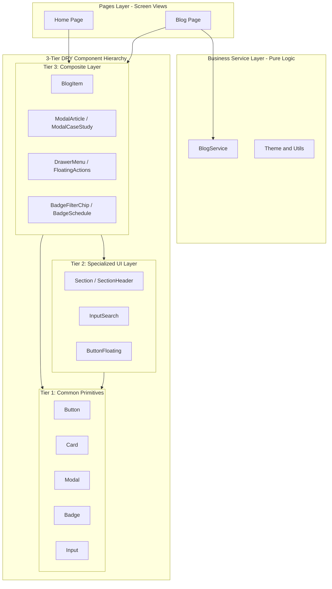

## 1. Context & Problem Statement

As Single Page Applications (SPAs) scale in feature set, a common architectural anti-pattern is the 'God Component'-a state where presentation, UI state, routing, and data hydration/fetching logic are tightly entangled.

In the legacy codebase, components like `BlogSection` and `App.tsx` shouldered excessive responsibilities: managing theme/routes, parsing raw HTML headings, filtering articles, and rendering cards directly. This violated the Single Responsibility Principle, introduced WET duplication, and resulted in bloated, fragile unit tests.

## 2. System Requirements

To resolve these structural bottlenecks, the target architecture had to fulfill four fundamental engineering requirements:

1. **Strict Separation of Concerns:** Distinct boundaries between Common Primitives, Specialized UI Extensions, Composite Component Widgets, Pure Business Services, and Page Views.
2. **Systematic DRY Compliance:** Eliminate repeated layout, buttons, and modal logic through pure Component Composition.
3. **Decoupled Business Service Layer:** Month/year archive glob loaders, article hydration, and assembling structured HTML dictionaries must reside in pure TypeScript services independent of React component lifecycles.
4. **100% Type Safety & High Testability:** Clear interfaces for every entity, enabling isolated unit testing without cumbersome DOM mocking.

## 3. Architecture Design

I established a 3-Tier DRY UI component hierarchy coupled with an independent Business Service Layer as illustrated below:

**Architectural Responsibilities by Layer:**

- **Tier 1 - Common Primitives (`src/components/common`):** Foundational atoms (`Button`, `Card`, `Badge`, `Input`, `Modal`) that are purely stateless or contain minimal UI-state, strictly following design tokens and semantic HTML elements.
- **Tier 2 - Specialized UI (`src/components/ui`):** Extended from Tier 1 with specialized styling and behaviors (e.g. `InputSearch` with built-in search icon and clear trigger, `ButtonFloating` with glow and ripple effects).
- **Tier 3 - Composite Components (`src/components/composite`):** Composed widgets combining Tier 1 & Tier 2 elements into fully functional business blocks. E.g. `BlogItem` packaging `Card` + `Badge` + `TechTagList` + read button; `ModalArticle` packaging `Modal` + `TocSidebar` scrollspy.
- **Business Services (`src/services`):** Houses pure business logic (dynamic glob loaders, date parsing, section assemblers), freeing UI components to focus solely on presentation.
- **Pages Layer (`src/pages`):** Encapsulates complete screens (`Home.tsx`, `Blog.tsx`), reducing `App.tsx` into a lean Root Router.

## 4. Trade-offs Analysis

**Architectural Trade-offs & Benefits:**

- **Gained Benefits:**
  <ul>
    *High Reusability:* Global styling or behavior updates for buttons, cards, or modals only happen in a single place within `common/`.
- _Maintainability & Extensibility:_ Adding new pages or blog tracks requires zero modifications to existing components.
- _Testability:_ 100% isolated unit test coverage per layer.

</li><li>**Trade-off Costs:**

- _Increased File Count:_ Requires rigorous directory discipline and maintained barrel exports (`index.ts`).
- _Team Discipline:_ Strict prohibition of upward imports (a lower tier component must never import from an upper tier).

</li></ul>

## 5. Real-World Lessons & Best Practices

**Key Practical Takeaways & Best Practices:**

- **Favor Composition over Inheritance:** Use Compound Component patterns (e.g. `Card.Header`, `Card.Body`, `Card.Footer`) instead of overwhelming prop lists.
- **Consistent Naming Conventions:** Adopting prefix-based inheritance names like `ModalCaseStudy`, `BadgeSchedule`, `ButtonFloatingScrollTop` makes component origin and tier instantly obvious.
- **Eliminate Layout Coupling in Reusable Styles:** Avoid hardcoding display layout properties (inline flex styles) on base cards so consumer containers retain full layout autonomy (Grid or Flexbox).
