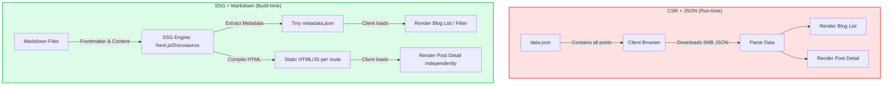

## Context & The Problem

When I started building my personal CV and Blog project, my goal was to create a lightweight, serverless system that could be hosted directly on GitHub Pages.

The first version was designed with a traditional Single Page Application (SPA) mindset: All posts were stored in a single `data.json` file. The frontend (React) would fetch this JSON file at run-time, parse the data, and render the UI.

However, with the goal of daily blogging, this model quickly revealed a **fatal flaw**:

1. **Data Bloat:** When the number of posts reaches the hundreds, the `data.json` file will bloat to several Megabytes.
2. **Bandwidth Bottleneck:** To read a single new post, the user's browser is forced to download the _entire_ post history.
3. **Terrible Developer Experience (DX):** Writing long-form content, inserting code snippets, or formatting text inside a JSON string is a nightmare of escaping characters (`\n`, `\"`).

The only scalable solution was to completely change how data is stored and delivered.

## System Requirements

The new architecture needed to satisfy the strict constraints of a personal project:

- **Zero-backend:** No Database Server to save costs and maintenance effort.
- **Optimized TTI (Time to Interactive):** Whichever post the user visits, only load the data required for that specific post.
- **Feature Parity:** Must still support Filtering and Searching by Tags and Categories.
- **Friendly DX:** Support smooth writing in an IDE, accurate syntax highlighting, and technical diagrams.

## Architecture Design

To solve this, I decided to transition from a **Client-side Rendering (CSR) + JSON** model to a **Static Site Generation (SSG) + Markdown** model.

The core of this shift lies in moving the "data processing phase" from **Run-time** (when the user opens the web) to **Build-time** (when the code is pushed to GitHub).

**How the new data flow works:**

1. **Storage:** Each post is a separate `.md` or `.mdx` file. Metadata (Title, Date, Tags) is stored at the top of the file (Frontmatter YAML).
2. **Build-time:** When code is pushed to GitHub, the SSG Engine scans the entire posts directory. It extracts the Frontmatter to generate a tiny metadata file (just a few KBs) for the list page. The Markdown content is compiled into individual static HTML pages.
3. **Delivery:** When a user visits `/blog/my-post`, GitHub Pages simply returns the exact HTML file for that post. Response time is measured in milliseconds.

## Trade-off Analysis

Every architectural decision is a trade-off. While solving the "JSON bloat" issue, the new model introduces some characteristics worth considering:

<table style="width:100%; border-collapse: collapse; margin-bottom: 20px;">
  <thead>
    <tr style="border-bottom: 2px solid #e2e8f0; text-align: left;">
      <th style="padding: 8px;">Criteria</th>
      <th style="padding: 8px;">Old Model (JSON)</th>
      <th style="padding: 8px;">New Model (Markdown + SSG)</th>
    </tr>
  </thead>
  <tbody>
    <tr style="border-bottom: 1px solid #edf2f7;">
      <td style="padding: 8px; font-weight: bold;">Detail Page Load Speed</td>
      <td style="padding: 8px;">Slow (Must parse huge data chunk)</td>
      <td style="padding: 8px;">Blazing fast (Pre-rendered HTML)</td>
    </tr>
    <tr style="border-bottom: 1px solid #edf2f7;">
      <td style="padding: 8px; font-weight: bold;">Content Maintenance Cost</td>
      <td style="padding: 8px;">Very hard (Fixing JSON syntax errors)</td>
      <td style="padding: 8px;">Very easy (Git Version Control, IDE support)</td>
    </tr>
    <tr style="border-bottom: 1px solid #edf2f7;">
      <td style="padding: 8px; font-weight: bold;">Build Time (CI/CD)</td>
      <td style="padding: 8px;">Fast (Just copying static files)</td>
      <td style="padding: 8px;">Increases with post count (MD to HTML compilation)</td>
    </tr>
    <tr>
      <td style="padding: 8px; font-weight: bold;">Dynamic Features (Comments)</td>
      <td style="padding: 8px;">Can build custom via API</td>
      <td style="padding: 8px;">Relies on 3rd parties (Giscus, Utterances)</td>
    </tr>
  </tbody>
</table>

For a personal blog, an extra 1-2 minutes of build time on GitHub Actions is a very cheap price to pay for absolute frontend performance and a seamless writing experience.

## Practical Lessons & Best Practices

Through this migration, here are the best practices I've gathered to maintain a long-term SSG system:

1. **Standardize Frontmatter Early:** Defining a strict schema for metadata (e.g., enforcing `date` format `YYYY-MM-DD`, `tags` as an array) will prevent build-time errors.
2. **Never Load Content into the List Page:** When processing data at build-time, only extract Frontmatter fields to create filters. Do not include the body text in the metadata array, or you'll repeat the "JSON bloat" mistake in the SSG version.
3. **Leverage MDX:** In the React ecosystem, using MDX (`.mdx`) allows you to embed React Components (like Mermaid charts, interactive buttons, data tables) directly inside Markdown, blurring the line between static content and dynamic apps.
4. **Automate with GitHub Actions:** Set up a workflow so that every commit to the `main` branch triggers an `npm run build` and deploys the `dist` folder directly to the `gh-pages` branch. You just write, let the machines handle the rest.

A good architecture is not the most complex one, but the one that best fits the project's resources and context at the given time.
