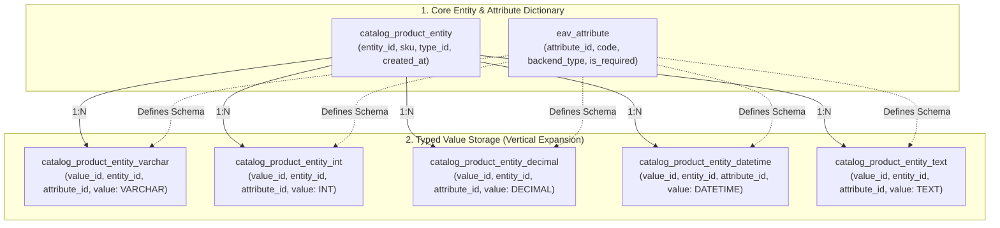
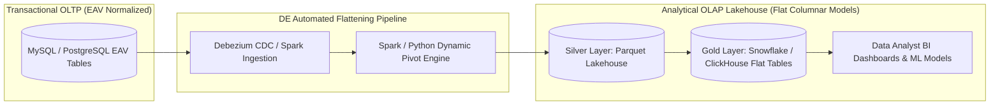

## Business Context & Data Requirements

In traditional relational database design (RDBMS), Third Normal Form (3NF) principles dictate flat, structured tables with predefined columns (e.g., a `users` table with `id`, `email`, and `created_at`). However, software and data engineers inevitably encounter an intractable enterprise problem: **Heterogeneous, Highly Dynamic, and Sparse Attribute Catalogs**.

Consider these prevalent production scenarios:

1. **Multi-Category E-Commerce Platforms:** Managing millions of products across 500+ distinct categories. Laptops require _RAM, CPU, Battery Capacity, Screen Resolution_; Athletic Shoes require _Shoe Size, Sole Material, Color, Closure Type_; Groceries require _Expiration Date, Storage Temperature, Country of Origin_; Books require _ISBN, Author, Page Count, Edition_.
2. **Electronic Health Records (EHR) & Clinical Systems:** Modern healthcare catalogs contain over 10,000 potential clinical tests, symptoms, and lab observations. Yet any single patient admission records only 5 to 20 specific metrics.
3. **CRM & Multi-Tenant SaaS Platforms:** Enabling thousands of enterprise tenants to create custom runtime business fields dynamically without requiring developer intervention or database migration scripts.

**The Catastrophic Pitfalls of Conventional Approaches:**

- **Ultra-Wide Sparse Tables (Hundreds of NULL Columns):** Creating a massive table with 300+ columns across all categories causes 90-95% of row values to be `NULL` (Sparse Matrix phenomenon). This wastes disk space, hits physical row size limitations (e.g., MySQL InnoDB 65,535 bytes per row limit), and incurs severe I/O degradation during full table scans.
- **Schema Migration Gridlock (DDL Locks):** Adding new product categories or custom attributes triggers heavy `ALTER TABLE ADD COLUMN` statements on multimillion-row production tables. This induces table metadata locks, replication lag, and grave risks of production downtime in core transactional (OLTP) workflows.

To provide infinite schema flexibility while remaining within a robust relational DBMS, the **Entity-Attribute-Value (EAV)** data modeling paradigm was forged.

## Data Modeling & Schema Design

The core concept of the **EAV (Entity - Attribute - Value)** model is transforming database growth from _horizontal expansion (adding columns)_ to _vertical expansion (adding rows)_. Data is decomposed into three atomic primitives:

1. **Entity:** The object being described (e.g., Product ID `101`, Patient ID `8055`). The Entity table maintains only shared immutable metadata (e.g., `sku`, `status`, `created_at`).
2. **Attribute:** The metadata dictionary defining property identifiers and data types (e.g., `ram_gb`, `screen_size`, `shoe_color`).
3. **Value:** The specific recorded measurement or property associated with an entity.

**Typed EAV Architecture (Production-Grade Storage):**

To preserve data integrity, enforce type safety, and prevent storing numbers/dates as strings, robust EAV implementations (such as Magento / Adobe Commerce) partition values into dedicated, typed storage tables (Integer, Varchar, Decimal, Datetime, Text):



**Architectural Matrix: Flat Relational vs EAV vs PostgreSQL JSONB vs Document NoSQL:**

<table style="width:100%; border-collapse: collapse; margin-bottom: 20px;">
  <thead>
    <tr style="border-bottom: 2px solid #e2e8f0; text-align: left;">
      <th style="padding: 8px;">Evaluation Dimension</th>
      <th style="padding: 8px;">Flat Relational Table</th>
      <th style="padding: 8px;">EAV Data Model</th>
      <th style="padding: 8px;">PostgreSQL JSONB</th>
      <th style="padding: 8px;">Document NoSQL (MongoDB)</th>
    </tr>
  </thead>
  <tbody>
    <tr style="border-bottom: 1px solid #edf2f7;">
      <td style="padding: 8px"><b>Schema Flexibility</b></td>
      <td style="padding: 8px">Poor (Requires DDL ALTER TABLE)</td>
      <td style="padding: 8px">Very High (Insert rows in Attribute table)</td>
      <td style="padding: 8px">Very High (Semi-structured binary JSON)</td>
      <td style="padding: 8px">Absolute (Dynamic JSON Documents)</td>
    </tr>
    <tr style="border-bottom: 1px solid #edf2f7;">
      <td style="padding: 8px"><b>Write Performance</b></td>
      <td style="padding: 8px">Ultra-fast (Single atomic INSERT)</td>
      <td style="padding: 8px">Slow (1 Entity requires 10-30 INSERTs across tables)</td>
      <td style="padding: 8px">Fast (Single INSERT containing JSON payload)</td>
      <td style="padding: 8px">Ultra-fast (Atomic Document Write)</td>
    </tr>
    <tr style="border-bottom: 1px solid #edf2f7;">
      <td style="padding: 8px"><b>Single-Entity Point Read</b></td>
      <td style="padding: 8px">Instant (Direct primary key index scan)</td>
      <td style="padding: 8px">Slow (Requires 10-20 table JOINs)</td>
      <td style="padding: 8px">Very Fast (Single row read & JSON deserialization)</td>
      <td style="padding: 8px">Ultra-fast (Read complete document by _id)</td>
    </tr>
    <tr style="border-bottom: 1px solid #edf2f7;">
      <td style="padding: 8px"><b>SQL Query Complexity</b></td>
      <td style="padding: 8px">Simple & intuitive</td>
      <td style="padding: 8px">Extremely Complex (Multiple JOINs or PIVOTs)</td>
      <td style="padding: 8px">Moderate (Uses operators `->>`, `@>`)</td>
      <td style="padding: 8px">Clean via Native Mongo Query API</td>
    </tr>
    <tr style="border-bottom: 1px solid #edf2f7;">
      <td style="padding: 8px"><b>Analytical (OLAP) Suitability</b></td>
      <td style="padding: 8px">Optimal (Standard columnar layout)</td>
      <td style="padding: 8px">Catastrophic (Infeasible for high-volume BI)</td>
      <td style="padding: 8px">Good (Accelerated by GIN indexing)</td>
      <td style="padding: 8px">Moderate (Requires Aggregation Pipelines)</td>
    </tr>
  </tbody>
</table>

## Pipeline Construction & Processing Logic

To understand why EAV is notorious in analytical engineering and how Data Engineers resolve this impedance mismatch, let us inspect both the SQL query bottlenecks and the automated ETL Flattening Engine.

**1. The 'JOIN Explosion' Pathology in SQL:**

To reconstruct a single laptop record with SKU, Name, Price, RAM, and SSD storage:

```sql
-- Pattern 1: Multiple Cascading LEFT JOINs (Query plan explodes when fetching dozens of attributes)
SELECT
    e.entity_id,
    e.sku,
    v_name.value AS product_name,
    v_price.value AS price,
    v_ram.value AS ram_gb,
    v_ssd.value AS ssd_gb
FROM catalog_product_entity e
LEFT JOIN catalog_product_entity_varchar v_name
    ON e.entity_id = v_name.entity_id AND v_name.attribute_id = 71 -- Name
LEFT JOIN catalog_product_entity_decimal v_price
    ON e.entity_id = v_price.entity_id AND v_price.attribute_id = 72 -- Price
LEFT JOIN catalog_product_entity_int v_ram
    ON e.entity_id = v_ram.entity_id AND v_ram.attribute_id = 105 -- RAM
LEFT JOIN catalog_product_entity_int v_ssd
    ON e.entity_id = v_ssd.entity_id AND v_ssd.attribute_id = 106 -- SSD
WHERE e.entity_id = 101;

-- Pattern 2: Conditional Aggregation / PIVOT (Reduces JOINs but incurs heavy aggregation cost)
SELECT
    e.entity_id,
    e.sku,
    MAX(CASE WHEN a.code = 'name' THEN v_str.value END) AS product_name,
    MAX(CASE WHEN a.code = 'price' THEN v_dec.value END) AS price,
    MAX(CASE WHEN a.code = 'ram_gb' THEN v_int.value END) AS ram_gb,
    MAX(CASE WHEN a.code = 'ssd_gb' THEN v_int.value END) AS ssd_gb
FROM catalog_product_entity e
LEFT JOIN catalog_product_entity_varchar v_str ON e.entity_id = v_str.entity_id
LEFT JOIN catalog_product_entity_decimal v_dec ON e.entity_id = v_dec.entity_id
LEFT JOIN catalog_product_entity_int v_int ON e.entity_id = v_int.entity_id
LEFT JOIN eav_attribute a ON (a.attribute_id = v_str.attribute_id OR a.attribute_id = v_dec.attribute_id OR a.attribute_id = v_int.attribute_id)
GROUP BY e.entity_id, e.sku;
```

**2. Production Data Pipeline: Automated EAV Flattening Engine:**

In production architectures, **analytical tools (PowerBI, Looker) and Data Analysts must never query raw EAV transactional databases**. Data Engineers construct high-throughput CDC/Batch pipelines that dynamically unpivot and flatten vertical EAV records into wide, columnar Star Schemas (Parquet Lakehouse / Snowflake / ClickHouse):



**Production PySpark Pipeline Transforming EAV Tables into Columnar Parquet:**

```python
# PySpark EAV Dynamic Flattening Engine
from pyspark.sql import SparkSession
from pyspark.sql import functions as F

def flatten_eav_to_flat_table(spark: SparkSession):
    # 1. Ingest raw EAV tables
    df_entity = spark.table("raw_catalog_product_entity")
    df_attr = spark.table("raw_eav_attribute")
    df_varchar = spark.table("raw_product_entity_varchar")
    df_int = spark.table("raw_product_entity_int")
    df_decimal = spark.table("raw_product_entity_decimal")

    # 2. Standardize and unify typed value tables into a single unified key-value stream
    df_all_values = (
        df_varchar.select("entity_id", "attribute_id", F.col("value").cast("string"))
        .unionByName(df_int.select("entity_id", "attribute_id", F.col("value").cast("string")))
        .unionByName(df_decimal.select("entity_id", "attribute_id", F.col("value").cast("string")))
    )

    # 3. Join with Attribute Dictionary to map attribute_id to human-readable names
    df_named_values = df_all_values.join(
        df_attr.select("attribute_id", "attribute_code"),
        on="attribute_id",
        how="inner"
    )

    # 4. Perform high-performance distributed dynamic PIVOT from Rows to Columns
    df_flat_attributes = (
        df_named_values
        .groupBy("entity_id")
        .pivot("attribute_code")
        .agg(F.first("value"))
    )

    # 5. Join pivoted attributes back to Core Entity metadata (Gold Dimension Model)
    df_final_product_flat = df_entity.join(
        df_flat_attributes,
        on="entity_id",
        how="left"
    )

    # 6. Write partitioned, highly compressed columnar Parquet for instantaneous BI queries
    df_final_product_flat.write \
        .mode("overwrite") \
        .partitionBy("category_id") \
        .parquet("s3://lakehouse/gold/dim_products_flat/")

print("EAV Flattening Pipeline executed with zero data loss!")
```

## Data Validation & Performance Tuning

To operate EAV databases reliably in OLTP while guaranteeing pristine data quality for downstream analytics, Data Engineers implement the following operational safeguards:

**1. Strict Composite Indexing Strategy:**

- Value table access patterns predominantly query either `WHERE entity_id = ? AND attribute_id = ?` or attribute value lookups `WHERE attribute_id = ? AND value = ?`.
- Mandatory composite indexing schema:

```sql
-- Optimizes entity attribute hydration
CREATE UNIQUE INDEX uq_entity_attr ON catalog_product_entity_varchar (entity_id, attribute_id);

-- Optimizes faceted attribute search (e.g. Color = 'Black')
CREATE INDEX idx_attr_val ON catalog_product_entity_varchar (attribute_id, value);
```

**2. Data Quality & Governance Guardrails:**

- **Attribute-Level Validation:** Enforce strict backend validation rules (Regex, Enums, Range Checks) mapped within the `eav_attribute` dictionary before writes reach typed storage.
- **Orphaned Record Pruning:** Because value tables grow proportionally to \(Entities imes Attributes\), entity deletions must enforce `ON DELETE CASCADE` or automated cleanup scripts to purge orphaned value rows.

**3. Empirical Performance Benchmark Matrix:**

<table style="width:100%; border-collapse: collapse; margin-bottom: 20px;">
  <thead>
    <tr style="border-bottom: 2px solid #e2e8f0; text-align: left;">
      <th style="padding: 8px;">Workload Scenario (5,000,000 Products)</th>
      <th style="padding: 8px">Raw EAV Schema (MySQL 8)</th>
      <th style="padding: 8px">PostgreSQL JSONB (GIN Index)</th>
      <th style="padding: 8px">Flat Parquet Lakehouse (ClickHouse/Spark)</th>
    </tr>
  </thead>
  <tbody>
    <tr style="border-bottom: 1px solid #edf2f7;">
      <td style="padding: 8px"><b>Filter products by 3 dynamic attributes</b></td>
      <td style="padding: 8px">340ms (3 JOINs + Index Scan)</td>
      <td style="padding: 8px">18ms (GIN JSONB index lookup)</td>
      <td style="padding: 8px">4ms (Columnar Scan & MinMax Pruning)</td>
    </tr>
    <tr style="border-bottom: 1px solid #edf2f7;">
      <td style="padding: 8px"><b>Aggregate Average Price (AVG) by Category</b></td>
      <td style="padding: 8px">4,250ms (Full scan on Decimal value table)</td>
      <td style="padding: 8px">520ms (On-the-fly JSON parsing)</td>
      <td style="padding: 8px">8ms (Vectorized Columnar Aggregation)</td>
    </tr>
    <tr style="border-bottom: 1px solid #edf2f7;">
      <td style="padding: 8px"><b>Introduce a brand-new custom attribute</b></td>
      <td style="padding: 8px">0.01ms (1 row INSERT into eav_attribute)</td>
      <td style="padding: 8px">0.00ms (Zero DDL required)</td>
      <td style="padding: 8px">0.05ms (Automated Schema Evolution)</td>
    </tr>
    <tr>
      <td style="padding: 8px"><b>Disk Storage Footprint</b></td>
      <td style="padding: 8px">High (Repeated entity_id, attribute_id, index overhead)</td>
      <td style="padding: 8px">Moderate (Compressed binary JSONB)</td>
      <td style="padding: 8px">Very Low (Snappy/ZSTD Columnar Compression)</td>
    </tr>
  </tbody>
</table>

## Summary & Recommendations

The EAV model is a textbook demonstration of software engineering trade-offs: _Sacrificing relational simplicity and query performance in exchange for complete, runtime schema flexibility_.

**Actionable Architecture Recommendations for System & Data Engineers:**

1. **When SHOULD You Use EAV?**

- When the universe of potential attributes is vast (hundreds or thousands), but any single entity only possesses a tiny, sparse subset.
- When attributes are dynamically defined at runtime by end-users or multi-tenant configurations without prior schema certainty.
- When operating within legacy relational databases lacking robust native document/JSON capabilities.

2. **When SHOULD You AVOID EAV?**

- When attributes are relatively fixed and predictable across entities.
- When workloads are heavily analytical, aggregative, or report-driven (OLAP / BI).
- If you are running modern databases like **PostgreSQL 14+**: Strongly prefer **JSONB with GIN indexing** over building multi-table EAV scaffolding.

3. **Embrace CQRS (Command Query Responsibility Segregation):**

- If EAV is indispensable for your transactional Write Model (OLTP) to enable business flexibility, always decouple it from your Read Model: Deploy an automated CDC/Flattening pipeline to sync structured projections into **Elasticsearch/OpenSearch** (for user-facing catalog search) and **Columnar Lakehouses** (for Data Analysts).

**Closing Takeaway:** _EAV is neither obsolete nor a silver bullet; it is a specialized tool for specialized requirements. Mastering its trade-offs and architecting clean transformation boundaries between OLTP and OLAP separates novice practitioners from veteran Data Engineers!_
