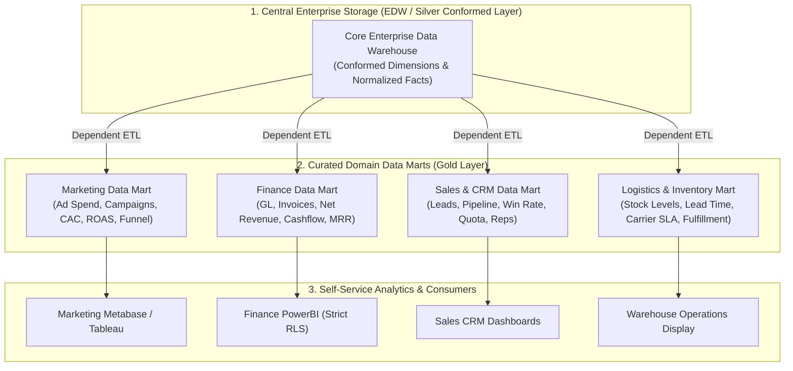

## Business Context & Data Requirements

As enterprise operations expand, a monolithic Enterprise Data Warehouse (EDW) inevitably encounters severe organizational and operational friction:

1. **Centralized Data Team Bottleneck:** Every functional department (Marketing, Finance, Sales, Logistics, HR) queues up change requests to a single core data engineering team. Implementing a single new business KPI takes weeks or months, paralyzing operational agility.
2. **Metric Discrepancy & Semantic Chaos:** Marketing defines Revenue as Gross Merchandise Value (GMV) of placed orders; Sales calculates Revenue based on fulfilled orders; Finance recognizes Revenue strictly when cash settles after processing fees, discounts, and refunds. Executives arrive at quarterly business reviews with irreconcilable figures.
3. **Data Governance & Sensitive Security Silos:** Executive compensation data or branch profit-and-loss margins cannot be openly exposed across the wider enterprise warehouse, demanding strict domain-driven Row-Level Security (RLS) and Role-Based Access Control (RBAC).
4. **Compute Inefficiencies on Massive Tables:** Scanning enterprise-scale fact tables containing billions of rows to satisfy department-specific tactical dashboards consumes unnecessary cloud warehouse credits and slows query latency.

**Core Mission & Value of a Data Mart:**

A **Data Mart** is a specialized, curated subject-oriented database partition designed specifically for a single department, team, or business process. Its primary mission is delivering _clean, analytics-ready, highly performant dimensional models_ that empower domain analysts with sub-second self-service business intelligence.

## Data Modeling & Schema Design

To design an enduring Data Mart architecture, engineers must master the trade-offs across three primary delivery topologies and choose the appropriate table modeling paradigms.

**1. Architectural Typology of Data Marts:**

<table style="width:100%; border-collapse: collapse; margin-bottom: 20px;">
  <thead>
    <tr style="border-bottom: 2px solid #e2e8f0; text-align: left;">
      <th style="padding: 8px;">Mart Topology</th>
      <th style="padding: 8px;">Data Ingestion Source</th>
      <th style="padding: 8px;">Key Advantages</th>
      <th style="padding: 8px;">Risks & Trade-Offs</th>
    </tr>
  </thead>
  <tbody>
    <tr style="border-bottom: 1px solid #edf2f7;">
      <td style="padding: 8px"><b>Dependent Data Mart</b></td>
      <td style="padding: 8px">Ingested directly from the Central Enterprise Data Warehouse (EDW)</td>
      <td style="padding: 8px">Guarantees a Single Source of Truth, absolute metric consistency, strict governance</td>
      <td style="padding: 8px">Requires central EDW readiness; higher initial deployment timeline</td>
    </tr>
    <tr style="border-bottom: 1px solid #edf2f7;">
      <td style="padding: 8px"><b>Independent Data Mart</b></td>
      <td style="padding: 8px">Fed directly from raw source applications (OLTP, CRM, APIs)</td>
      <td style="padding: 8px">Rapid autonomous deployment; solves immediate localized departmental pain points</td>
      <td style="padding: 8px">Creates isolated data silos, metric discrepancies, and unmaintainable spaghetti pipelines</td>
    </tr>
    <tr style="border-bottom: 1px solid #edf2f7;">
      <td style="padding: 8px"><b>Hybrid Data Mart</b></td>
      <td style="padding: 8px">Combines central warehouse dimensions with departmental external ad-hoc sources</td>
      <td style="padding: 8px">Balances corporate standard governance with departmental speed and agility</td>
      <td style="padding: 8px">Requires automated cross-source data reconciliation workflows</td>
    </tr>
  </tbody>
</table>

**2. Architectural Blueprint: Dependent Domain Data Marts (Kimball Bus & Medallion Layout):**



**3. Table Modeling Paradigms: Star Schema vs One Big Table (OBT):**

- **Star Schema:** Fact table surrounded by Conformed Dimension tables (e.g., `dim_date`, `dim_customer`). _Ideal when:_ The Data Mart must support varied ad-hoc multi-dimensional slicing and maintain reusable enterprise dimensions.
- **One Big Table (OBT - Wide Denormalized Table):** Collapses facts and all associated dimension attributes into a single flat table containing 50-200 columns. _Ideal when:_ Powering interactive BI tools (ClickHouse, PowerBI DirectQuery, Apache Superset) where avoiding all runtime JOINs unlocks instantaneous sub-50ms dashboard loads.

## Pipeline Construction & Processing Logic

To demonstrate a production implementation, below is a complete **dbt (data build tool)** model constructing a **Marketing Performance Data Mart** that fuses advertising spend (Google/Facebook Ads) with core transactional conversions to compute Customer Acquisition Cost (CAC), Return on Ad Spend (ROAS), and funnel click-through rates.

**1. dbt Model: Marketing Performance Data Mart (`marts_marketing_roi.sql`):**

```sql
-- models/gold/marts/marketing/marts_marketing_roi.sql
{{
    config(
        materialized='table',
        schema='marketing_mart',
        cluster_by=['campaign_date', 'channel'],
        tags=['marketing', 'daily_marts']
    )
}}

WITH daily_ad_spend AS (
    -- Ad spend aggregated by campaign and channel
    SELECT
        ad_date AS campaign_date,
        channel, -- 'google_ads', 'facebook_ads', 'tiktok_ads'
        campaign_id,
        campaign_name,
        SUM(spend_amount) AS total_spend,
        SUM(impressions) AS total_impressions,
        SUM(clicks) AS total_clicks
    FROM {{ ref('stg_marketing_ad_spend') }}
    GROUP BY ad_date, channel, campaign_id, campaign_name
),

daily_orders_attributed AS (
    -- Revenue and new customer acquisition joined from Core Fact Orders
    SELECT
        CAST(f.order_timestamp AS DATE) AS campaign_date,
        f.utm_channel AS channel,
        f.utm_campaign_id AS campaign_id,
        COUNT(DISTINCT f.order_id) AS attributed_orders,
        COUNT(DISTINCT CASE WHEN c.is_first_order = TRUE THEN f.customer_key END) AS new_customers_acquired,
        SUM(f.net_amount) AS attributed_revenue
    FROM {{ ref('fact_orders') }} f
    INNER JOIN {{ ref('dim_customers') }} c ON f.customer_key = c.customer_key
    WHERE f.order_status = 'COMPLETED'
    GROUP BY CAST(f.order_timestamp AS DATE), f.utm_channel, f.utm_campaign_id
)

SELECT
    -- Deterministic surrogate primary key
    MD5(s.campaign_date || '-' || s.channel || '-' || s.campaign_id) AS marketing_mart_key,
    s.campaign_date,
    s.channel,
    s.campaign_id,
    s.campaign_name,

    -- Ingested raw measures
    s.total_spend,
    s.total_impressions,
    s.total_clicks,
    COALESCE(o.attributed_orders, 0) AS attributed_orders,
    COALESCE(o.new_customers_acquired, 0) AS new_customers_acquired,
    COALESCE(o.attributed_revenue, 0) AS attributed_revenue,

    -- Pre-calculated Semantic Domain KPIs
    ROUND(s.total_clicks / NULLIF(s.total_impressions, 0) * 100, 2) AS ctr_pct, -- Click-Through Rate
    ROUND(s.total_spend / NULLIF(s.total_clicks, 0), 2) AS cpc_amount, -- Cost Per Click
    ROUND(s.total_spend / NULLIF(o.new_customers_acquired, 0), 2) AS cac_amount, -- Customer Acquisition Cost
    ROUND(COALESCE(o.attributed_revenue, 0) / NULLIF(s.total_spend, 0), 2) AS roas_ratio -- Return On Ad Spend
FROM daily_ad_spend s
LEFT JOIN daily_orders_attributed o
    ON s.campaign_date = o.campaign_date
    AND s.channel = o.channel
    AND s.campaign_id = o.campaign_id;
```

**2. Implementing Fine-Grained Row-Level Security (RLS) on Financial Data Marts:**

Ensuring branch managers access only their localized operating regions while executive leadership retains global visibility:

```sql
-- Define Snowflake Row-Level Security Access Policy
CREATE OR REPLACE ROW ACCESS POLICY finance_region_policy
AS (region_name VARCHAR) RETURNS BOOLEAN ->
  CURRENT_ROLE() IN ('FINANCE_CFO_ROLE', 'EXECUTIVE_ADMIN')
  OR (CURRENT_ROLE() = 'NORTH_MANAGER_ROLE' AND region_name = 'NORTH')
  OR (CURRENT_ROLE() = 'SOUTH_MANAGER_ROLE' AND region_name = 'SOUTH');

-- Bind the policy to the Financial Data Mart
ALTER TABLE finance_mart.marts_branch_pnl
ADD ROW ACCESS POLICY finance_region_policy ON (region_code);
```

## Data Validation & Performance Tuning

To operate high-performing Data Marts without metric drift, Data Engineers implement automated reconciliation suites and optimized caching layers:

**1. Automated Cross-Mart Data Reconciliation Tests:**

- Guarding against metric divergence between departmental marts (e.g., Financial revenue must match Sales order net revenue down to the cent):

```sql
-- tests/reconciliation_finance_vs_sales_revenue.sql
-- Fails if any numerical variance exists between Finance and Sales Marts
WITH fin_rev AS (
    SELECT SUM(net_revenue) AS total_fin FROM {{ ref('marts_finance_revenue') }}
    WHERE report_date = CURRENT_DATE() - 1
),
sales_rev AS (
    SELECT SUM(gross_amount - discount_amount) AS total_sales FROM {{ ref('marts_sales_orders') }}
    WHERE order_date = CURRENT_DATE() - 1
)
SELECT
    f.total_fin,
    s.total_sales,
    ABS(f.total_fin - s.total_sales) AS discrepancy
FROM fin_rev f, sales_rev s
WHERE ABS(f.total_fin - s.total_sales) > 0.01; -- Alarm if delta exceeds 1 cent
```

**2. Self-Service Performance Optimization Techniques:**

- **Pre-Aggregated Materialized Views:** Generate roll-up summaries for executive dashboards (monthly and quarterly views), eliminating 99% of raw file scanning.
- **In-Memory Semantic Caching:** Position tools like _Cube.js_ or _dbt Semantic Layer_ in front of Data Marts to serve frequent BI queries directly from Redis/memory caches in under 50ms.

**3. Performance & Operational Evaluation Matrix:**

<table style="width:100%; border-collapse: collapse; margin-bottom: 20px;">
  <thead>
    <tr style="border-bottom: 2px solid #e2e8f0; text-align: left;">
      <th style="padding: 8px;">Architecture Strategy</th>
      <th style="padding: 8px">Dashboard Latency (p95)</th>
      <th style="padding: 8px">Metric Consistency</th>
      <th style="padding: 8px">Self-Service Usability</th>
    </tr>
  </thead>
  <tbody>
    <tr style="border-bottom: 1px solid #edf2f7;">
      <td style="padding: 8px"><b>Direct Queries on Raw Enterprise Warehouse</b></td>
      <td style="padding: 8px">18,400ms (18.4s)</td>
      <td style="padding: 8px">High, but SQL logic is overly complex</td>
      <td style="padding: 8px">Very Low (Requires dedicated Data Engineers)</td>
    </tr>
    <tr style="border-bottom: 1px solid #edf2f7;">
      <td style="padding: 8px"><b>Independent Siloed Data Marts</b></td>
      <td style="padding: 8px">650ms</td>
      <td style="padding: 8px">Very Low (Conflicting metric definitions)</td>
      <td style="padding: 8px">Moderate (Siloed teams work in isolation)</td>
    </tr>
    <tr style="border-bottom: 1px solid #edf2f7;">
      <td style="padding: 8px"><b>Dependent Star / OBT Data Marts</b></td>
      <td style="padding: 8px"><b>45ms</b></td>
      <td style="padding: 8px"><b>100% Absolute</b> (Single Source of Truth)</td>
      <td style="padding: 8px"><b>Very High</b> (Business analysts drag-and-drop easily)</td>
    </tr>
  </tbody>
</table>

## Summary & Recommendations

Data Marts represent the critical transformation bridge between heavy centralized data platforms and agile, domain-specific business execution.

**Actionable Architecture Recommendations for Enterprise Data Teams:**

1. **Strictly Prefer Dependent Data Marts:** Build departmental marts directly from the curated, conformed warehouse core (Silver/EDW). Avoid the shortcut of Independent Data Marts that inevitably produces irreconcilable data silos.
2. **Standardize Metric Definitions in a Semantic Layer:** Do not scatter critical business logic (CAC, LTV, Net Margin) across separate BI dashboards. Codify them upstream inside dbt models or a centralized Semantic Layer.
3. **Embrace a Domain-Driven Ownership (Data Mesh Mindset):** Empower domain data analysts within business departments to own and innovate upon their Data Marts, while the central data engineering team focuses on underlying infrastructure, conformed dimensions, and pipeline SLAs.
4. **Automate Cross-Mart Reconciliation Tests:** Enforce automated daily reconciliation checks to detect and alert on any financial or volume variance before data reaches executive presentation decks.

**Closing Takeaway:** _A stellar Data Mart architecture enables domain analysts to build trustworthy reports in minutes, and empowers corporate leadership to make decisions with absolute confidence in every single metric!_
