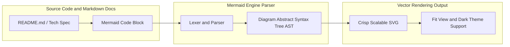
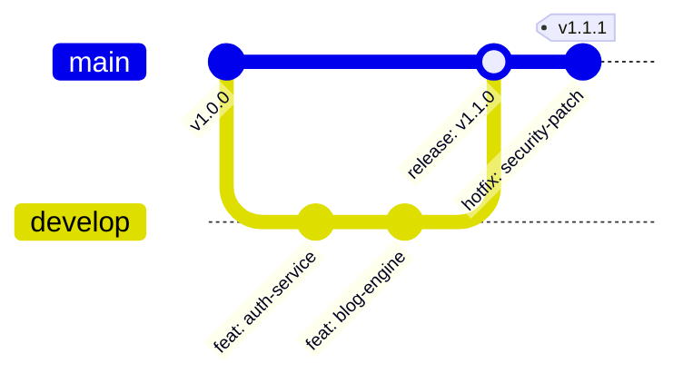

## 1. Article Objectives & Motivation

In modern software engineering, technical documentation and architecture diagrams play a vital role in maintaining team alignment. However, traditional diagramming tools (such as Draw.io, Visio, or Lucidchart) that export static binary image files (.png, .jpg) introduce severe workflow bottlenecks:

- **Documentation Drift:** When code evolves, opening graphic software, editing shapes, exporting files, and committing images is frequently skipped due to high manual friction, leaving docs quickly outdated.
- **Lack of Version Control (No Git Diff):** Binary image files cannot be compared line-by-line in Pull Requests, making architectural reviews cumbersome and error-prone.

The purpose of this article is to introduce the **Diagrams as Code (DaC)** methodology using **Mermaid.js** - transforming diagrams into declarative, plain-text scripts that live right alongside source code, render natively on GitHub/GitLab, and version-control effortlessly.

## 2. Architecture & Core Principles

The core principle of Mermaid.js is using a declarative text syntax to construct an Abstract Syntax Tree (AST), which is then dynamically compiled into crisp, scalable vector graphics (SVG). Here are the most essential diagram families used in software engineering:

1. **Flowchart & Architecture Graph:** Visualizes data flows, infrastructure topologies, or component hierarchies. Supports `TD` (Top-Down), `LR` (Left-Right) orientations and modular `subgraph` clusters.
2. **Sequence Diagram:** Exceptionally powerful for modeling protocol handshakes, inter-service REST/gRPC calls, and lifecycle events. Supports `autonumber`, `actor`, `participant`, branching `alt/else` blocks, and `loop` constructs.
3. **Git Graph:** Programmatically maps branching workflows (GitFlow / Trunk-based development), commit histories, and merge/rebase points.
4. **Class & Entity Relationship Diagram (ERD):** Defines database schemas, foreign keys, cardinality, and object-oriented class relationships.

## 3. Step-by-Step Setup & Implementation

Step-by-step workflow for integrating Mermaid.js into engineering repositories and doc toolchains:

1. **Declare Mermaid fenced code blocks:** Use standard `mermaid` code fences in any Markdown document. Platforms such as GitHub, GitLab, Notion, and Obsidian provide native out-of-the-box rendering.
2. **Model Git branching workflows:**

3. **Automate PDF/PNG generation in CI/CD:** Integrate the `@mermaid-js/mermaid-cli` package (`mmdc` command) into GitHub Actions or GitLab CI to automatically compile diagrams into publication-ready technical manuals.

## 4. Troubleshooting & Common Pitfalls

When authoring complex Mermaid diagrams, watch out for these three common pitfalls:

1. **Special Characters in Text Labels:** If node labels contain nested parentheses `()` or square brackets `[]`, the parser may confuse them with node boundary syntax. _Solution:_ Avoid nested brackets or use hyphens/slashes to separate label details: `NodeA[Node Title - Extra Details]`.
2. **HTML Entity Escaping:** When Markdown preprocessors convert `<` to `<` or `>` to `>`, sanitize and decode HTML entities before passing the string to `mermaid.render()`.
3. **Layout Overflow on High-Density Graphs:** Avoid placing 50+ services on a single flat canvas. Segment the topology using modular `subgraph` groups or divide them across bounded domain contexts.

## 5. Evaluation & Future Scaling

**Evaluation & Future Outlook:**

- **Engineering Productivity ROI:** Reduces diagram maintenance time by over **80%**. Architectural updates are reviewed and tracked directly via standard Git commits and pull requests.
- **Automated Diagram Generation (AST to Diagrams):** Pair OpenAPI/Swagger specs or TypeScript AST parsers to auto-generate class diagrams and API flow charts directly from code without manual drawing.
- **Universal Cross-Platform Vector Fidelity:** SVG output guarantees crisp rendering on Retina/4K displays and enables custom styling via CSS theme variables.
