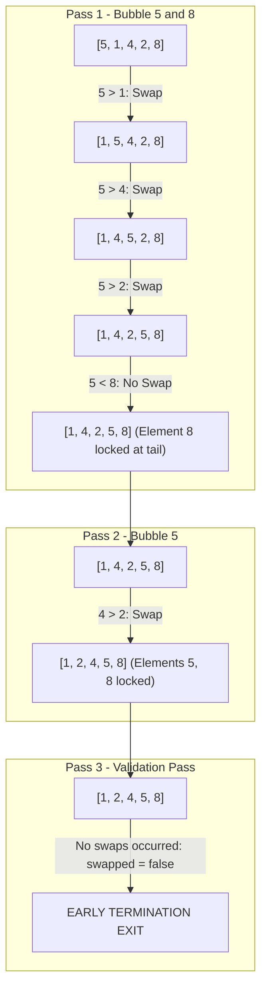

## Problem Statement & Objectives

Sorting collections is one of the most fundamental operations in software engineering. Problem statement: Given an unsorted array of N integers, rearrange the elements in ascending order such that `arr[0] <= arr[1] <= ... <= arr[N-1]`.

Bubble Sort is the foundational comparison-based sorting algorithm every engineer studies to understand adjacent comparison and swapping mechanics.

## Initial Naive Approach

The naive unoptimized approach:

- Run two nested loops across N - 1 iterations. In each iteration, scan through the entire array and compare adjacent pairs `arr[j]` and `arr[j+1]`, swapping them if `arr[j] > arr[j+1]`.
- *Core Flaw:* The algorithm always performs exactly `(N * (N - 1)) / 2` comparisons even if the input array is *already fully sorted*, wasting `O(N²)` CPU cycles.

## Optimization Thinking & Algorithm Design

Optimizing Bubble Sort via two crucial techniques:

1. **Inner Boundary Shrinking:** After pass `i`, the `i` largest elements are guaranteed to be placed at their final sorted positions at the tail. Thus, the inner loop only needs to scan up to index `N - 1 - i`.
2. **Swapped Flag Early-Exit:** Introduce a boolean flag `bool swapped = false` at the start of each pass. If no swaps occurred during a full pass, the array is already sorted &rarr; Terminate immediately via `break`, improving Best-case complexity to linear `Ω(N)`.

## Code Implementation & Execution Trace

Visualizing bubble progression on sample array `[5, 1, 4, 2, 8]` across passes:



**Standard C++ Implementation:**

```c++
#include <iostream>
#include <vector>
#include <utility>

// Optimized Bubble Sort with Swapped Flag
void bubbleSort(std::vector<int>& arr) {
    int n = static_cast<int>(arr.size());
    for (int i = 0; i < n - 1; ++i) {
        bool swapped = false;
        // Shrink scan boundary to n - 1 - i
        for (int j = 0; j < n - 1 - i; ++j) {
            if (arr[j] > arr[j + 1]) {
                std::swap(arr[j], arr[j + 1]);
                swapped = true;
            }
        }
        // Early termination if array is already sorted
        if (!swapped) {
            break;
        }
    }
}

int main() {
    std::vector<int> data = {5, 1, 4, 2, 8};
    bubbleSort(data);
    std::cout << "Sorted array: ";
    for (int x : data) std::cout << x << " ";
    std::cout << std::endl;
    return 0;
}
```

**Execution Trace Breakdown (Dry Run):**

- *Input:* `data = {5, 1, 4, 2, 8}`, `N = 5`.
- *Pass 1 (`i = 0`):* Compare `(5, 1) ->` Swap `{1, 5, 4, 2, 8}`; Compare `(5, 4) ->` Swap `{1, 4, 5, 2, 8}`; Compare `(5, 2) ->` Swap `{1, 4, 2, 5, 8}`; Compare `(5, 8) ->` Keep. Flag `swapped = true`. Value `8` locked at index 4.
- *Pass 2 (`i = 1`):* Scan up to index 2: `(1, 4) ->` Ok; `(4, 2) ->` Swap `{1, 2, 4, 5, 8}`; `(4, 5) ->` Ok. Value `5` locked at index 3.
- *Pass 3 (`i = 2`):* Inspect `(1, 2)` and `(2, 4)`, no swaps occurred &rarr; `swapped = false` &rarr; `break` immediately! Eliminates 40% redundant iterations.

## Complexity Evaluation & Real-world Applications

**Metrics Scorecard (Standard Evaluation Framework):**

1. **Worst-Case Time Complexity (`O`):** `O(N²)` when array is reverse sorted (e.g. `[5, 4, 3, 2, 1]`).
2. **Best-Case Time Complexity (`Ω`):** `Ω(N)` on already sorted input thanks to early-exit flag.
3. **Average-Case Time Complexity (`Θ`):** `Θ(N²)` on random input distributions.
4. **Auxiliary Space Complexity:** `O(1)` - Strictly In-place memory footprint.
5. **Stability:** Stable (preserves relative order of equal keys because swap condition requires strict inequality `arr[j] > arr[j+1]`).

**Real-World Applications:** Rapid presortedness verification in real-time telemetry, resource-constrained microcontrollers, and computer science pedagogy.
