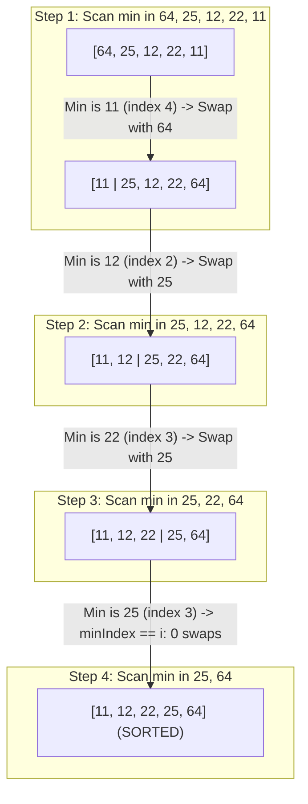

## Problem Statement & Objectives

In embedded systems and hardware environments with Flash or EEPROM memory, physical memory write operations cause wear and consume substantial energy. Problem statement: How can we sort an array of N integers while **strictly minimizing memory write and swap operations**?

Selection Sort addresses this challenge by ensuring that at most `N - 1` swaps (`O(N)` memory writes) occur across the entire sorting lifecycle.

## Initial Naive Approach

The naive approach:

- Swapping immediately whenever an element smaller than `arr[i]` is encountered during the scan.
- *Drawback:* Triggers uncontrolled memory writes (up to `O(N²)` swaps), destroying CPU cache efficiency and degrading hardware memory endurance.

## Optimization Thinking & Algorithm Design

Partitioning and minimum index selection principles:

1. **Virtual Subarray Partitioning:** The array is logically divided into a Sorted Subarray `[0..i-1]` and an Unsorted Subarray `[i..N-1]`.
2. **Index-Only Scanning:** In each pass `i`, record `minIndex = i`. Scan the entire unsorted subarray to find the true global minimum *without performing any intermediate swaps during iteration*.
3. **Single Swap per Pass:** Once the global minimum is identified, perform exactly one `std::swap(arr[i], arr[minIndex])` if `minIndex != i`. Guarantees that total memory writes never exceed `N - 1`.

## Code Implementation & Execution Trace

Visualizing subarray segregation and minimum element selection on `[64, 25, 12, 22, 11]`:



**Standard C++ Implementation:**

```c++
#include <iostream>
#include <vector>
#include <utility>

// Selection Sort: Min-Index Selection with Strictly O(N) Swaps
void selectionSort(std::vector<int>& arr) {
    int n = static_cast<int>(arr.size());
    for (int i = 0; i < n - 1; ++i) {
        int minIndex = i;
        // Scan unsorted subarray [i+1 .. n-1] to locate minimum index
        for (int j = i + 1; j < n; ++j) {
            if (arr[j] < arr[minIndex]) {
                minIndex = j;
            }
        }
        // Perform at most one swap per outer iteration
        if (minIndex != i) {
            std::swap(arr[i], arr[minIndex]);
        }
    }
}

int main() {
    std::vector<int> data = {64, 25, 12, 22, 11};
    selectionSort(data);
    std::cout << "Sorted array: ";
    for (int x : data) std::cout << x << " ";
    std::cout << std::endl;
    return 0;
}
```

**Execution Trace Breakdown (Dry Run):**

- *Initial:* `data = {64, 25, 12, 22, 11}` (`N = 5`).
- *Pass `i = 0`:* Unsorted `[64, 25, 12, 22, 11]`. Scan finds min at `minIndex = 4` (value 11). Swap `arr[0]` with `arr[4]` `->` `{11, 25, 12, 22, 64}`.
- *Pass `i = 1`:* Unsorted `[25, 12, 22, 64]`. Scan finds min at `minIndex = 2` (value 12). Swap `arr[1]` with `arr[2]` `->` `{11, 12, 25, 22, 64}`.
- *Pass `i = 2`:* Unsorted `[25, 22, 64]`. Scan finds min at `minIndex = 3` (value 22). Swap `arr[2]` with `arr[3]` `->` `{11, 12, 22, 25, 64}`.
- *Pass `i = 3`:* Unsorted `[25, 64]`. `minIndex = 3` matches `i` `->` Zero swaps executed. Sorted!

## Complexity Evaluation & Real-world Applications

**Metrics Scorecard (Standard Evaluation Framework):**

1. **Time Complexity:** `O(N²)`, `Ω(N²)`, `Θ(N²)` - Always performs `(N * (N - 1)) / 2` comparisons regardless of initial ordering.
2. **Memory Writes:** `O(N)` - Exactly `<= N - 1` swaps (Superior to Bubble/Insertion sort which may trigger `O(N²)` writes).
3. **Auxiliary Space Complexity:** `O(1)` - Strictly In-place.
4. **Stability:** Unstable (long-range swaps can jump over and invert identical elements, e.g. `[4a, 4b, 2]` `->` `[2, 4b, 4a]`).

**Real-World Applications:** Embedded microcontrollers with Flash/EEPROM write cycle limitations, and systems where memory write latency heavily exceeds read latency.
