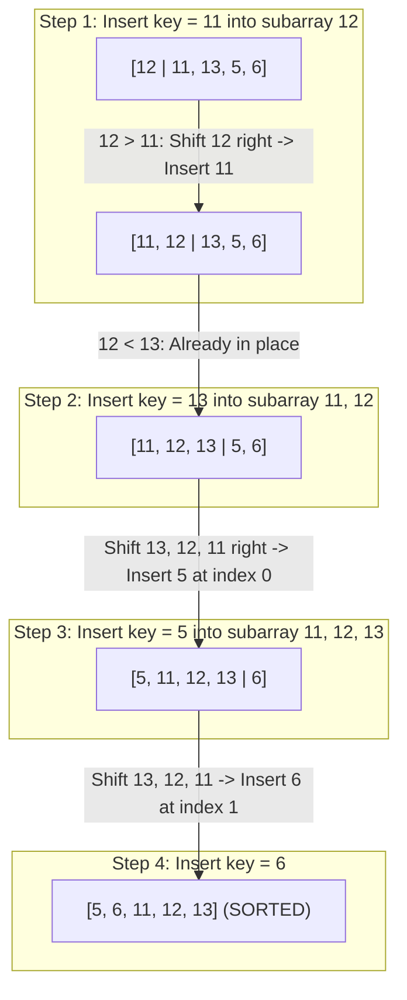

## 1. Problem Statement & Objectives

In real-time streaming pipelines, incoming data arrives incrementally item-by-item and must be continuously integrated into an ongoing sorted sequence. Problem statement: How can we insert a new element into an already-sorted subarray with minimal CPU operations?

Insertion Sort directly models the human card-sorting intuition: picking one card at a time and inserting it into its correct position within an already sorted hand.

## 2. Initial Naive Approach

The naive approach:

- Iteratively swapping adjacent elements backwards using `std::swap` until the current item reaches its proper place.
- *Bottleneck:* Each `std::swap` executes 3 memory assignments, creating substantial overhead compared to one-way array shifting.

## 3. Optimization Thinking & Algorithm Design

Subarray Shifting mechanics and Adaptive Sorting power:

1. **Subarray Shifting (Memory Optimization):** Instead of continuous swaps, save the incoming item in a temporary register `key = arr[i]`. Shift all elements strictly larger than `key` to the right by one slot (`arr[j + 1] = arr[j]`), then place `key` into the vacant slot `arr[j + 1] = key`. Eliminates 66% of assignment operations.
2. **High Adaptability (Adaptive Sorting):** On nearly-sorted collections, the inner loop terminates after a single comparison &rarr; Achieving blazing linear `Ω(N)` runtime.
3. **Online Algorithm Capability:** Can sort records on-the-fly as they are received across network sockets without needing prior knowledge of total collection size N.

## 4. Code Implementation & Execution Trace

Visualizing subarray shifting and key insertion on `[12, 11, 13, 5, 6]`:



**Standard C++ Implementation:**

```c++
#include <iostream>
#include <vector>

// Insertion Sort: Adaptive Subarray Shifting
void insertionSort(std::vector<int>& arr) {
    int n = static_cast<int>(arr.size());
    for (int i = 1; i < n; ++i) {
        int key = arr[i];
        int j = i - 1;
        // Shift elements greater than key to the right
        while (j >= 0 && arr[j] > key) {
            arr[j + 1] = arr[j];
            --j;
        }
        // Insert key into the vacant position
        arr[j + 1] = key;
    }
}

int main() {
    std::vector<int> data = {12, 11, 13, 5, 6};
    insertionSort(data);
    std::cout << "Sorted array: ";
    for (int x : data) std::cout << x << " ";
    std::cout << std::endl;
    return 0;
}
```

**Execution Trace Breakdown (Dry Run):**

- *Initial:* `data = {12, 11, 13, 5, 6}` (`N = 5`). Sorted prefix is `{12}`.
- *Pass `i = 1`:* `key = 11`. `j = 0`: `arr[0] = 12 > 11` `->` Shift 12 to `arr[1]`, `j = -1`. Insert 11 at `arr[0]` `->` `{11, 12, 13, 5, 6}`.
- *Pass `i = 2`:* `key = 13`. `j = 1`: `arr[1] = 12 < 13` (immediate break). Insert 13 at `arr[2]` `->` `{11, 12, 13, 5, 6}`.
- *Pass `i = 3`:* `key = 5`. Shift 13, 12, 11 to the right `->` Insert 5 at `arr[0]` `->` `{5, 11, 12, 13, 6}`.
- *Pass `i = 4`:* `key = 6`. Shift 13, 12, 11 to the right `->` Insert 6 at `arr[1]` `->` `{5, 6, 11, 12, 13}`.

## 5. Complexity Evaluation & Real-world Applications

**Metrics Scorecard (Standard Evaluation Framework):**

1. **Worst-Case Time Complexity (`O`):** `O(N²)` when collection is reverse sorted.
2. **Best-Case Time Complexity (`Ω`):** `Ω(N)` on already sorted input.
3. **Average-Case Time Complexity (`Θ`):** `Θ(N²)` on random input distributions.
4. **Auxiliary Space Complexity:** `O(1)` - Strictly In-place.
5. **Stability:** Stable (preserves original order of equal keys).

**Real-World Applications:** Powers industrial hybrid sorting algorithms including **TimSort** (Python, Java) and **Introsort** (C++ `std::sort`) as the underlying engine when partition size drops to `N <= 16 - 32`.
