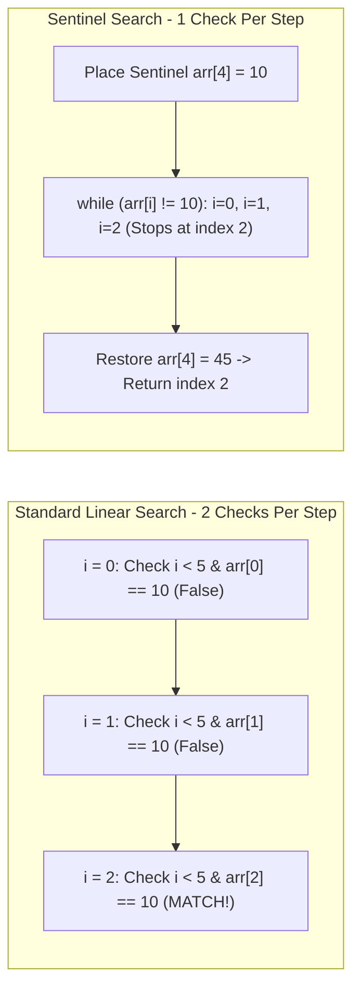

## 1. Problem Statement & Objectives

Data lookup is ubiquitous across all software layers. Problem statement: Given an *unsorted* collection of N elements or a non-random-access stream (such as a Singly Linked List), locate the first occurrence of a specified `target` value, or return `-1` if not present.

Linear Search is the universal baseline retrieval algorithm when data lacks any prior indexing or ordering guarantees.

## 2. Initial Naive Approach

The standard loop approach:

- Iterate with a standard `for (int i = 0; i < n; ++i)` loop from head to tail.
- *CPU Bottleneck:* In each iteration, the CPU evaluates **2 conditional checks**: one for boundary safety `i < n` and one for value equality `arr[i] == target`. Across large arrays, boundary checking consumes ~50% of inner-loop CPU instructions.

## 3. Optimization Thinking & Algorithm Design

Optimization via the Sentinel Linear Search technique:

1. **Place Sentinel at the Tail:** Save the original tail element `last = arr[n - 1]`, then assign the target directly to the tail `arr[n - 1] = target`.
2. **Eliminate Boundary Checks `i < n`:** Because `target` is guaranteed to exist at the tail, `while (arr[i] != target) ++i;` will never step out of bounds. This reduces conditional branch evaluations by exactly 50%.
3. **Restore and Validate:** After exiting the loop, restore `arr[n - 1] = last` and verify whether the matched index `i` represents a genuine element or the temporary sentinel.

## 4. Code Implementation & Execution Trace

Visualizing sequential comparison vs sentinel mechanics on `[20, 35, 10, 80, 45]` with `target = 10`:



**Standard C++ Implementation:**

```c++
#include <iostream>
#include <vector>

// 1. Standard Linear Search
int linearSearch(const std::vector<int>& arr, int target) {
    int n = static_cast<int>(arr.size());
    for (int i = 0; i < n; ++i) {
        if (arr[i] == target) {
            return i;
        }
    }
    return -1;
}

// 2. Optimized Sentinel Linear Search
int sentinelLinearSearch(std::vector<int>& arr, int target) {
    int n = static_cast<int>(arr.size());
    if (n == 0) return -1;

    int last = arr[n - 1];
    arr[n - 1] = target; // Place sentinel at the tail

    int i = 0;
    while (arr[i] != target) {
        ++i;
    }

    arr[n - 1] = last; // Restore original tail element

    if (i < n - 1 || arr[n - 1] == target) {
        return i;
    }
    return -1;
}

int main() {
    std::vector<int> data = {20, 35, 10, 80, 45};
    int target = 10;
    int idx = sentinelLinearSearch(data, target);
    std::cout << "Index of " << target << ": " << idx << std::endl;
    return 0;
}
```

**Execution Trace Breakdown (Dry Run):**

- *Input:* `data = {20, 35, 10, 80, 45}`, `target = 10`.
- *Sentinel Setup:* Save `last = 45`, set `data[4] = 10`. Buffer becomes `{20, 35, 10, 80, 10}`.
- *Execution:* `i = 0` (20 != 10) `-> i = 1` (35 != 10) `-> i = 2` (`10 == 10` &rarr; Loop exits).
- *Resolution:* Restore `data[4] = 45`. Since `i = 2 < 4`, returns verified index `2`.

## 5. Complexity Evaluation & Real-world Applications

**Metrics Scorecard (Standard Evaluation Framework):**

1. **Worst-Case Time Complexity (`O`):** `O(N)` when target resides at the tail or is absent.
2. **Best-Case Time Complexity (`Ω`):** `Ω(1)` when target is found at the first position.
3. **Average-Case Time Complexity (`Θ`):** `Θ(N)` (requires `N / 2` checks on average).
4. **Auxiliary Space Complexity:** `O(1)` - Zero extra allocations.
5. **Hardware Cache Friendliness:** Sequential memory access allows CPU prefetchers to cache lines with high spatial locality, frequently outperforming binary trees for `N <= 64`.

**Real-World Applications:** Small unsorted dataset lookups, Linked List traversals, and raw packet parsing in network socket buffers.
