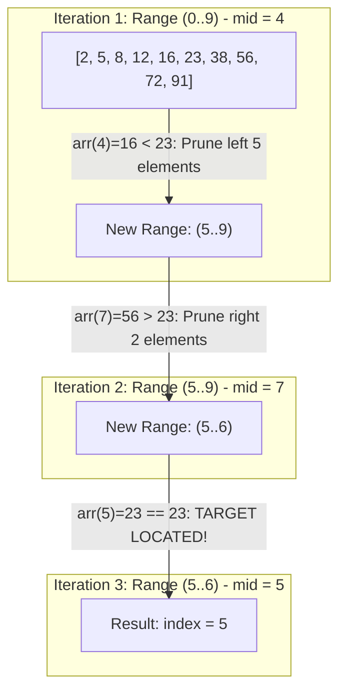

## Problem Statement & Objectives

When datasets scale to millions of records (`N = 10⁷`), sequential `O(N)` searches choke throughput. Problem statement: Given an array of N integers **sorted in ascending order**, locate the index of a specified `target` value in minimum computational time.

Binary Search leverages the Divide and Conquer paradigm to collapse search latency from linear `O(N)` to logarithmic `O(log₂ N)`.

## Initial Naive Approach

The naive approach:

- Scanning sequentially from index zero using a linear loop.
- *Inefficiency:* Discards the structural guarantee that elements are already sorted, inspecting millions of irrelevant items unnecessarily.

## Optimization Thinking & Algorithm Design

Divide and Conquer principles and engineering defenses:

1. **50% Search Space Pruning:** Compare the midpoint element `arr[mid]` against `target`:
  - If `arr[mid] == target`: Match found immediately.
  - If `arr[mid] < target`: All elements to the left are strictly smaller &rarr; Prune the left half and constrain to `[mid + 1, right]`.
  - If `arr[mid] > target`: All elements to the right are strictly larger &rarr; Prune the right half and constrain to `[left, mid - 1]`.
2. **Integer Overflow Mitigation:** The standard formula `mid = (left + right) / 2` overflows 32-bit signed integers when `left + right > 2^31 - 1`. *Robust pattern:* Always compute `mid = left + (right - left) / 2`.
3. **Boundary Range Query (Lower Bound):** Finding the first element `>= target`, serving as the backbone for database range indices.

## Code Implementation & Execution Trace

Visualizing search window halving on a 10-element array with `target = 23`:



**Standard C++ Implementation:**

```c++
#include <iostream>
#include <vector>

// 1. Standard Iterative Binary Search: Strict O(1) Auxiliary Space
int binarySearch(const std::vector<int>& arr, int target) {
    int left = 0;
    int right = static_cast<int>(arr.size()) - 1;

    while (left <= right) {
        // Prevent integer overflow
        int mid = left + (right - left) / 2;

        if (arr[mid] == target) {
            return mid;
        } else if (arr[mid] < target) {
            left = mid + 1; // Narrow to right half
        } else {
            right = mid - 1; // Narrow to left half
        }
    }
    return -1;
}

// 2. Lower Bound: Locate first element >= target
int lowerBound(const std::vector<int>& arr, int target) {
    int left = 0;
    int right = static_cast<int>(arr.size());
    while (left < right) {
        int mid = left + (right - left) / 2;
        if (arr[mid] >= target) {
            right = mid;
        } else {
            left = mid + 1;
        }
    }
    return left;
}

int main() {
    std::vector<int> data = {2, 5, 8, 12, 16, 23, 38, 56, 72, 91};
    int target = 23;
    int idx = binarySearch(data, target);
    std::cout << "Index of " << target << ": " << idx << std::endl;
    return 0;
}
```

**Execution Trace Breakdown (Dry Run):**

- *Input:* `data = {2, 5, 8, 12, 16, 23, 38, 56, 72, 91}`, `N = 10`, `target = 23`.
- *Pass 1:* `left = 0`, `right = 9` &rarr; `mid = 4`. `data[4] = 16 < 23` &rarr; `left = 5`.
- *Pass 2:* `left = 5`, `right = 9` &rarr; `mid = 7`. `data[7] = 56 > 23` &rarr; `right = 6`.
- *Pass 3:* `left = 5`, `right = 6` &rarr; `mid = 5`. `data[5] = 23 == 23` &rarr; Match found! Returns index `5` in exactly 3 comparisons.

## Complexity Evaluation & Real-world Applications

**Metrics Scorecard (Standard Evaluation Framework):**

1. **Worst-Case Time Complexity (`O`):** `O(log₂ N)` - For `N = 1,000,000`, Binary Search requires at most **20 comparisons** (compared to 1,000,000 in Linear Search &rarr; **50,000x speedup**).
2. **Best-Case Time Complexity (`Ω`):** `Ω(1)` when midpoint matches on the initial check.
3. **Average-Case Time Complexity (`Θ`):** `Θ(log₂ N)`.
4. **Auxiliary Space Complexity:** `O(1)` for Iterative pattern.

**Real-World Applications:** Database index retrieval (B-Tree and LSM-Tree search), `std::lower_bound` in C++ STL, `git bisect` for automated bug tracking in git logs, and Binary Search on Answer paradigms.
