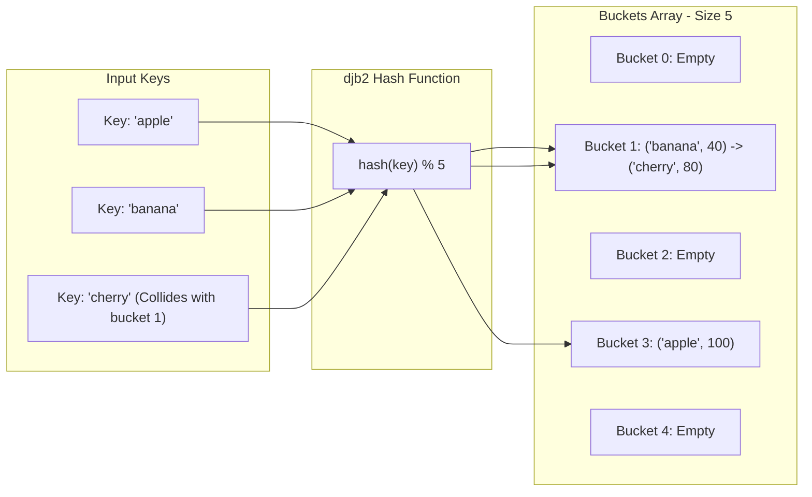

## Problem Statement & Objectives

In high-throughput distributed systems, databases, and web servers, key-value lookup operations must execute instantaneously. Problem statement: Design a storage data structure that achieves **constant `O(1)` expected average time complexity for Insert, Lookup (Get), and Delete operations**.

Hash Tables combined with robust Hashing Algorithms represent the global standard for achieving `O(1)` retrieval speeds independent of dataset magnitude.

## Initial Naive Approach

Comparing against classical structures:

- _Flat Arrays:_ Lookup requires sequential `O(N)` comparisons.
- _Balanced Binary Search Trees (AVL / Red-Black Tree):_ Maintains `O(log N)` lookups, but incurs tree rebalancing rotations and pointer chasing overhead.

## Optimization Thinking & Algorithm Design

Hash Table Architecture and Collision Resolution Strategies:

1. **Hash Function Mechanics:** Uniformly maps variable-length keys into array indices via `index = hash(key) % Capacity`. Industry standard string hashing algorithm: `djb2` (bitwise shift multiplication by 33 + character value).
2. **Collision Resolution Mechanisms:** When two distinct keys produce identical hash indices:

- _Separate Chaining:_ Each bucket houses a dynamic linked list. Collisions append to the bucket list.
- _Open Addressing:_ Probing for subsequent empty slots across the primary array (Linear Probing, Quadratic Probing, Double Hashing).

3. **Load Factor (`α`) & Dynamic Rehashing:** When `α = frac{	ext{numElements}}{	ext{Capacity}} >= 0.75`, the table automatically doubles capacity and re-inserts all items to maintain short bucket chains and sustain strict `O(1)` lookup guarantees.

## Code Implementation & Execution Trace

Visualizing Separate Chaining collision handling across buckets:



**Production C++ Implementation:**

```c++
#include <iostream>
#include <vector>
#include <list>
#include <string>
#include <utility>

// Hash Table with Separate Chaining Collision Resolution
class HashTable {
private:
    struct Entry {
        std::string key;
        int value;
    };

    std::vector<std::list<Entry>> table;
    int numElements;
    int capacity;

    // Classic djb2 polynomial rolling hash
    int hashFunction(const std::string& key) const {
        unsigned long hash = 5381;
        for (char c : key) {
            hash = ((hash << 5) + hash) + static_cast<unsigned char>(c); // hash * 33 + c
        }
        return static_cast<int>(hash % capacity);
    }

    // Dynamic Rehashing when Load Factor threshold is exceeded
    void rehash() {
        int oldCapacity = capacity;
        capacity *= 2;
        std::vector<std::list<Entry>> oldTable = std::move(table);
        table.resize(capacity);
        numElements = 0;

        for (int i = 0; i < oldCapacity; ++i) {
            for (const auto& entry : oldTable[i]) {
                insert(entry.key, entry.value);
            }
        }
    }

public:
    HashTable(int initialCapacity = 7) : numElements(0), capacity(initialCapacity) {
        table.resize(capacity);
    }

    void insert(const std::string& key, int value) {
        // Rehash threshold: Load Factor >= 0.75
        if (static_cast<double>(numElements) / capacity >= 0.75) {
            rehash();
        }

        int bucket = hashFunction(key);
        for (auto& entry : table[bucket]) {
            if (entry.key == key) {
                entry.value = value; // Update value if key already exists
                return;
            }
        }
        table[bucket].push_back({key, value});
        ++numElements;
    }

    bool get(const std::string& key, int& outValue) const {
        int bucket = hashFunction(key);
        for (const auto& entry : table[bucket]) {
            if (entry.key == key) {
                outValue = entry.value;
                return true;
            }
        }
        return false;
    }

    bool remove(const std::string& key) {
        int bucket = hashFunction(key);
        for (auto it = table[bucket].begin(); it != table[bucket].end(); ++it) {
            if (it->key == key) {
                table[bucket].erase(it);
                --numElements;
                return true;
            }
        }
        return false;
    }
};

int main() {
    HashTable ht;
    ht.insert("apple", 100);
    ht.insert("banana", 40);
    ht.insert("cherry", 80);

    int val;
    if (ht.get("banana", val)) {
        std::cout << "Value for 'banana': " << val << std::endl;
    }
    return 0;
}
```

**Execution Trace Breakdown (Dry Run):**

- _Initialization:_ `capacity = 7`, `numElements = 0`.
- _Insert "apple" (value 100):_ `hashFunction("apple")` computes bucket `3` &rarr; Appends `{"apple", 100}` into `table[3]`. `numElements = 1` (`α pprox 0.14`).
- _Insert "banana" (value 40):_ `hashFunction("banana")` computes bucket `1` &rarr; Appends `{"banana", 40}` into `table[1]`. `numElements = 2`.
- _Insert "cherry" (value 80):_ Resolves to bucket `1` &rarr; Collision! Appends `{"cherry", 80}` to the linked list in `table[1]`.
- _Lookup `get("banana")`:_ Hash points directly to bucket `1` &rarr; Traverses first node, finds key "banana" &rarr; Outputs `40` in `O(1)` time.

## Complexity Evaluation & Real-world Applications

**Metrics Scorecard (Standard Evaluation Framework):**

1. **Average-Case Time Complexity (`Θ`):** `Θ(1)` for Insert, Lookup, and Delete under uniform distribution and `α < 0.75`.
2. **Worst-Case Time Complexity (`O`):** `O(N)` under adversarial pathological collisions where all keys collide into a single bucket.
3. **Auxiliary Space Complexity:** `O(N)` for bucket arrays and linked nodes.
4. **Cryptographic & DoS Defenses:** In public internet endpoints, use collision-resistant keyed hashes like **SipHash** to defend against HashDoS attacks.

**Real-World Applications:** `std::unordered_map` / `std::unordered_set` in C++ STL, HashMap in Java, JavaScript V8 Object/Map memory layouts, Redis In-Memory Cache, database query hash-joins, and network packet routing tables.
