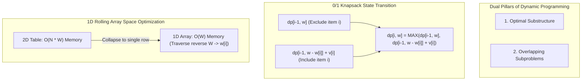

## 1. Problem Statement & Objectives

In computer science, numerous optimization problems suffer from exponential search space explosions when approached naively via brute-force search. The quintessential archetype is the **0/1 Knapsack Problem**.

Given a knapsack with maximum weight capacity `W` and a set of `N` discrete items, where each item `i` possesses weight `w[i]` and utility value `v[i]` (for `i = 0, 1, ..., N - 1`). The objective is to determine a subset of items that maximizes total value while strictly keeping total weight within capacity `W`. Each item can be selected at most once (a binary 0 or 1 decision).

Evaluating all `2ᴺ` possible subsets via exhaustive brute force yields an impossible time complexity of `O(2ᴺ)` when `N >= 40` (exceeding 10¹² operations). **Dynamic Programming (DP)**, pioneered by mathematician Richard Bellman in the 1950s, eliminates this exponential barrier, reducing execution time to pseudo-polynomial `O(N x W)`.

## 2. Initial Naive Approach

A naive recursive formulation branches into two choices at each item `i`:

1. **Exclude item `i`:** Optimal value equals the subproblem result for `i - 1` items with full capacity `w`.
2. **Include item `i` (provided `w[i] <= w`):** Optimal value equals `v[i]` plus the subproblem result for `i - 1` items with remaining capacity `w - w[i]`.

Recurrence relation:

```
knapsack(i, w) = max(
    knapsack(i - 1, w),
    v[i] + knapsack(i - 1, w - w[i]) // condition: w[i] <= w
)
```

This plain recursion explodes because identical subproblems `(i, w)` are re-evaluated exponentially across independent branches, causing severe Call Stack pressure and quadratic/exponential runtimes.

## 3. Optimization Thinking & Algorithm Design

Dynamic Programming requires **two fundamental invariants**:

1. **Optimal Substructure:** An optimal solution to global state `(N, W)` is constructed directly from optimal solutions to lower-order subproblems `(N - 1, W)` and `(N - 1, W - w[N-1])`.
2. **Overlapping Subproblems:** The recursive space contains a bounded set of identical states evaluated repeatedly. By caching subproblem results immediately upon computation, redundant calculations drop to zero.

Two primary implementation paradigms exist:

- **Top-Down with Memoization:** Preserves natural recursive structure while consulting a cache `memo[i][w]`. Lookups resolve in `O(1)` time.
- **Bottom-Up with Tabulation:** Allocates a 2D table `dp[N+1][W+1]`, iteratively resolving subproblems starting from base cases `i = 0` and `w = 0` up to target `dp[N][W]`.

**Space Optimization:** Since computing row `i` strictly depends on row `i - 1`, the 2D matrix can be collapsed into a 1D array of size `W + 1`. Crucially, the capacity `w` must be traversed in reverse (from `W` down to `w[i]`) to prevent overwriting prior state values within the same iteration.

## 4. Code Implementation & Execution Trace

Visualizing DP state transitions and overlapping subproblem structure:



**Complete C++ Implementation (Bottom-Up Tabulation with 1D Space Optimization):**

```c++
#include <iostream>
#include <vector>
#include <algorithm>

// 1. Classic 2D DP Table: Preserves full matrix for path backtracking
int knapsack2D(int W, const std::vector<int>& weights, const std::vector<int>& values, int n) {
    std::vector<std::vector<int>> dp(n + 1, std::vector<int>(W + 1, 0));

    for (int i = 1; i <= n; ++i) {
        int currentWeight = weights[i - 1];
        int currentValue = values[i - 1];
        for (int w = 0; w <= W; ++w) {
            if (currentWeight <= w) {
                dp[i][w] = std::max(dp[i - 1][w], currentValue + dp[i - 1][w - currentWeight]);
            } else {
                dp[i][w] = dp[i - 1][w];
            }
        }
    }
    return dp[n][W];
}

// 2. Space-Optimized 1D Rolling Array DP: O(W) Auxiliary Space
int knapsackOptimized(int W, const std::vector<int>& weights, const std::vector<int>& values, int n) {
    std::vector<int> dp(W + 1, 0);

    for (int i = 0; i < n; ++i) {
        int currentWeight = weights[i];
        int currentValue = values[i];
        // Traverse backwards to preserve previous row states
        for (int w = W; w >= currentWeight; --w) {
            dp[w] = std::max(dp[w], currentValue + dp[w - currentWeight]);
        }
    }
    return dp[W];
}

int main() {
    int W = 5; // Maximum knapsack capacity
    std::vector<int> weights = {2, 3, 4, 5};
    std::vector<int> values = {3, 4, 5, 8};
    int n = static_cast<int>(weights.size());

    int maxVal2D = knapsack2D(W, weights, values, n);
    int maxVal1D = knapsackOptimized(W, weights, values, n);

    std::cout << "Max Value (2D Table): " << maxVal2D << std::endl;
    std::cout << "Max Value (1D Optimized): " << maxVal1D << std::endl;

    return 0;
}
```

**Execution Trace Breakdown (Dry Run):**

- _Inputs:_ `W = 5`, `weights = {2, 3, 4, 5}`, `values = {3, 4, 5, 8}`, `N = 4`.
- _Init:_ `dp = [0, 0, 0, 0, 0, 0]` (size `W + 1 = 6`).
- _Item 1 (w=2, v=3):_ Loop `w` from 5 down to 2 &rarr; `dp = [0, 0, 3, 3, 3, 3]`.
- _Item 2 (w=3, v=4):_ Loop `w` from 5 down to 3:
  - `w = 5: dp[5] = max(3, 4 + dp[2]) = max(3, 4 + 3) = 7` (Combo item 1 & 2: weight 5).
  - `w = 4: dp[4] = max(3, 4 + dp[1]) = 4`.
  - `w = 3: dp[3] = max(3, 4 + dp[0]) = 4` &rarr; `dp = [0, 0, 3, 4, 4, 7]`.
- *Item 3 (w=4, v=5):* Loop `w` from 5 down to 4 &rarr; `dp = [0, 0, 3, 4, 5, 7]`.
- *Item 4 (w=5, v=8):* Loop `w = 5`: `dp[5] = max(7, 8 + dp[0]) = 8` &rarr; Final optimal value is `8`.

## 5. Complexity Evaluation & Real-world Applications

Performance Scorecard anchored to RAM Model metrics:

- **Time Complexity:** `Θ(N x W)` across all cases (Best, Average, Worst). Iterates through `N` items, each updating `W` capacity states in constant time.
- **Space Complexity:**
  - Standard 2D Matrix: `O(N x W)` Heap memory (required for solution path reconstruction).
  - 1D Rolling Array: `O(W)` Auxiliary Space, slashing memory consumption by &gt;95% when `N` is large.
- **Real-World Applications:**
  - **Cloud Resource Allocation:** Packing virtual machines (VMs) onto hypervisors to maximize throughput within memory/CPU constraints.
  - **Graph Routing:** Algorithmic foundation for Bellman-Ford and Floyd-Warshall shortest path algorithms.
  - **Bioinformatics:** DNA/RNA global and local sequence alignment via Needleman-Wunsch and Smith-Waterman algorithms.
  - **Natural Language Processing (NLP):** Viterbi decoding algorithm in Hidden Markov Models and beam-search decoders.
