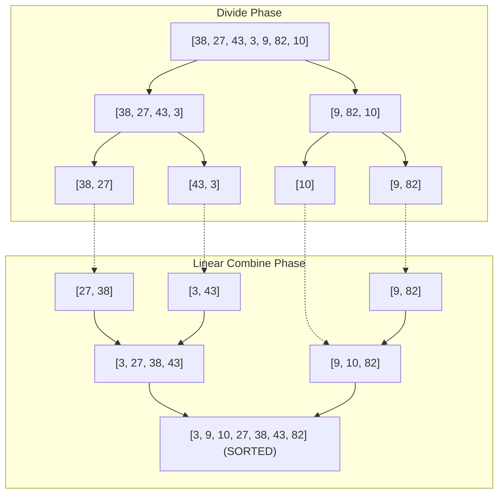

## 1. Problem Statement & Objectives

When operating on massive datasets comprising millions or billions of elements, processing monolithic blocks sequentially often triggers quadratic `O(N²)` bottlenecks. The **Divide and Conquer (D&C)** paradigm solves this by recursively decomposing complex problems into smaller, independent subproblems of identical structure.

The classical benchmark is **Large-Scale Array Sorting**: Given an unsorted array of `N` items, rearrange elements in non-decreasing order such that worst-case execution time is strictly bounded by `O(N \log N)` while guaranteeing _Stability_ - preserving the relative input order of equivalent keys.

## 2. Initial Naive Approach

Elementary sorting algorithms (Bubble, Selection, Insertion) operate locally via adjacent comparisons, requiring `O(N²)` time. At `N = 10⁶`, `N² = 10¹²` operations, taking thousands of CPU seconds.

Arbitrary division without an efficient recombination mechanism provides no asymptotic benefit. In 1945, John von Neumann designed **MergeSort**: Recursively halving the array into symmetric partitions, sorting each recursively, and linearly merging the two sorted subarrays in `O(N)` time.

## 3. Optimization Thinking & Algorithm Design

The Divide and Conquer lifecycle follows **3 rigid phases**:

1. **Divide:** Partition the original problem of size `N` into `a` subproblems, each of size `N / b`. In MergeSort, `a = 2, b = 2` (symmetric binary split).
2. **Conquer:** Recursively resolve each subproblem. When reaching the Base Case (a subarray with 0 or 1 element), the subproblem is trivially sorted in `O(1)` time.
3. **Combine:** Merge subproblem solutions into the global solution. MergeSort's `merge()` function utilizes two pointers to interleave elements into an auxiliary buffer in linear `O(N)` time.

**Analytical Framework: Master Theorem:**

Recurrence relations following `T(N) = a x T(N / b) + f(N)` with `f(N) = O(Nᵈ)` categorize into 3 distinct regimes:

- **Case 1 (Leaf Dominant):** If `d < log_b(a)` &rarr; `T(N) = Θ(N^{log_b(a)})`.
- **Case 2 (Even Distribution):** If `d = log_b(a)` &rarr; `T(N) = Θ(Nᵈ log N)`. For MergeSort: `a = 2, b = 2, d = 1` &rarr; `log_2(2) = 1 = d` &rarr; `T(N) = Θ(N log N)`.
- **Case 3 (Root Dominant):** If `d > log_b(a)` &rarr; `T(N) = Θ(f(N))`.

## 4. Code Implementation & Execution Trace

Visualizing MergeSort recursive division tree and linear combine phases:



**Standard C++ Implementation (MergeSort with pre-allocated temporary buffer):**

```
#include <iostream>
#include <vector>

// Merge two sorted subarrays: arr[left..mid] and arr[mid+1..right]
void merge(std::vector<int>& arr, std::vector<int>& temp, int left, int mid, int right) {
    int i = left;      // Pointer for left subarray
    int j = mid + 1;   // Pointer for right subarray
    int k = left;      // Pointer for temp buffer

    while (i <= mid && j <= right) {
        // Strict <= comparison preserves stability
        if (arr[i] <= arr[j]) {
            temp[k++] = arr[i++];
        } else {
            temp[k++] = arr[j++];
        }
    }

    while (i <= mid) {
        temp[k++] = arr[i++];
    }

    while (j <= right) {
        temp[k++] = arr[j++];
    }

    for (int idx = left; idx <= right; ++idx) {
        arr[idx] = temp[idx];
    }
}

// Recursive divide and conquer routine
void mergeSortInternal(std::vector<int>& arr, std::vector<int>& temp, int left, int right) {
    if (left >= right) {
        return; // Base Case
    }

    int mid = left + (right - left) / 2; // Prevent 32-bit overflow

    mergeSortInternal(arr, temp, left, mid);
    mergeSortInternal(arr, temp, mid + 1, right);
    merge(arr, temp, left, mid, right);
}

// User-facing wrapper
void mergeSort(std::vector<int>& arr) {
    if (arr.empty()) return;
    std::vector<int> temp(arr.size());
    mergeSortInternal(arr, temp, 0, static_cast<int>(arr.size()) - 1);
}

int main() {
    std::vector<int> data = {38, 27, 43, 3, 9, 82, 10};
    mergeSort(data);

    std::cout << "MergeSort output: ";
    for (int x : data) std::cout << x << " ";
    std::cout << std::endl;

    return 0;
}
```

**Execution Trace Breakdown (Dry Run):**

- _Input:_ `data = {38, 27, 43, 3, 9, 82, 10}` (`N = 7`).
- _Division Level 1:_ `mid = 3` &rarr; Left `[0..3] = {38, 27, 43, 3}`, Right `[4..6] = {9, 82, 10}`.
- _Left Branch:_
  <ul>
  Divides to `{38, 27}` and `{43, 3}`.
- Merges `{38}` & `{27}` &rarr; `{27, 38}`.
- Merges `{43}` & `{3}` &rarr; `{3, 43}`.
- Merges `{27, 38}` & `{3, 43}` &rarr; `{3, 27, 38, 43}`.

</li>
<li>*Right Branch:*


- Divides to `{9, 82}` and `{10}` &rarr; Merges to `{9, 10, 82}`.

</li>
<li>*Final Root Merge:* Combines `{3, 27, 38, 43}` and `{9, 10, 82}` into `{3, 9, 10, 27, 38, 43, 82}` in 7 pointer steps.</li>
</ul>

## 5. Complexity Evaluation & Real-world Applications

Performance Scorecard anchored to RAM Model metrics:

- **Time Complexity:** `Θ(N log N)` universally across Best, Average, and Worst Cases. Immune to degenerate inputs that degrade QuickSort to `O(N²)`.
- **Space Complexity:** `O(N)` Auxiliary Space for the temporary buffer plus `O(log N)` Call Stack memory depth.
- **Stability:** Fully preserved due to the `arr[i] <= arr[j]` comparator during merging.
- **Real-World Applications:**
  <ul>
  **External Sorting:** Processing multi-terabyte log files exceeding physical RAM capacity (underpins MapReduce and Spark shuffle engines).
- **Fast Fourier Transform (FFT):** Core signal processing for telecommunications and MP3 audio encoding.
- **Strassen Matrix Multiplication:** Accelerated tensor multiplications in deep learning frameworks.
- **Computational Geometry:** Closest Pair of Points in 2D/3D spaces in `O(N log N)` time.

</li>
</ul>
