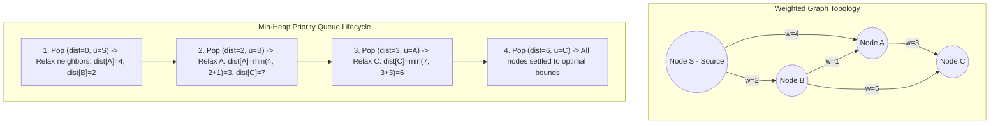

## Problem Statement & Objectives

The Single-Source Shortest Path (SSSP) problem is foundational to network routing and graph algorithms. Problem statement:

Given a directed or undirected weighted graph `G = (V, E)` with `V` vertices and `E` edges, where each edge `(u, v)` is assigned a non-negative weight `w(u, v) >= 0` (representing latency, geometric distance, or cost). Given a source vertex `s in V`, determine the shortest path distance from `s` to all other vertices and reconstruct the explicit traversal paths.

Invented in 1956 by Edsger W. Dijkstra, Dijkstra's algorithm remains the premier algorithm for non-negative graph routing.

## Initial Naive Approach

Standard Breadth-First Search (BFS) computes shortest paths only when all edge weights are uniformly 1. On non-uniform graphs, BFS prematurely marks nodes visited along low-hop but high-weight paths.

Dijkstra's original 1959 formulation performed linear array scanning to extract the minimum distance node, yielding `O(V²)` complexity. On sparse road networks (where `E ~ V`), scanning arrays across millions of vertices introduces excessive latency.

## Optimization Thinking & Algorithm Design

Dijkstra's algorithm relies on the **Greedy Choice Property** and **Edge Relaxation**:

1. **Distance Array & Settled Invariant:** Maintain `dist[v]` initialized to `&infin;`, with `dist[s] = 0`. Once vertex `u` with the minimal unvisited distance is extracted, its distance is finalized and immutable because all remaining path extensions through non-negative edges can only increase cost.
2. **Edge Relaxation:** For each neighbor `v` of `u`, check if routing through `u` provides a shorter path:

```c++
if (dist[u] + w(u, v) < dist[v]) {
    dist[v] = dist[u] + w(u, v);
    parent[v] = u; // Track parent for path reconstruction
}
```

3. **Min-Heap Priority Queue:** Storing distance candidates in a binary min-heap (`std::priority_queue`) enables `O(log V)` minimum extraction and relaxation pushes, optimizing total runtime to `O((V + E) log V)`.

**Critical Invariant:** Dijkstra fails on graphs containing negative edge weights because future negative edges can invalidate previously settled greedy assumptions.

## Code Implementation & Execution Trace

State transitions and relaxation progression using Min-Heap priority queue:



**Complete C++ Implementation (Dijkstra with std::priority_queue and Path Reconstruction):**

```c++
#include <iostream>
#include <vector>
#include <queue>
#include <utility>
#include <algorithm>

const long long INF = 1e18;

struct Edge {
    int to;
    long long weight;
};

using State = std::pair<long long, int>; // {distance, vertex}

void dijkstra(int startNode, int numVertices,
              const std::vector<std::vector<Edge>>& graph,
              std::vector<long long>& dist,
              std::vector<int>& parent) {
    dist.assign(numVertices, INF);
    parent.assign(numVertices, -1);

    std::priority_queue<State, std::vector<State>, std::greater<State>> pq;

    dist[startNode] = 0;
    pq.push({0, startNode});

    while (!pq.empty()) {
        auto [d, u] = pq.top();
        pq.pop();

        // Lazy deletion: ignore stale entries
        if (d > dist[u]) {
            continue;
        }

        for (const auto& edge : graph[u]) {
            int v = edge.to;
            long long w = edge.weight;

            if (dist[u] + w < dist[v]) {
                dist[v] = dist[u] + w;
                parent[v] = u;
                pq.push({dist[v], v});
            }
        }
    }
}

std::vector<int> reconstructPath(int target, const std::vector<int>& parent) {
    std::vector<int> path;
    for (int curr = target; curr != -1; curr = parent[curr]) {
        path.push_back(curr);
    }
    std::reverse(path.begin(), path.end());
    return path;
}

int main() {
    int V = 5;
    std::vector<std::vector<Edge>> graph(V);

    graph[0].push_back({1, 4});
    graph[0].push_back({2, 2});
    graph[2].push_back({1, 1});
    graph[2].push_back({3, 5});
    graph[1].push_back({3, 3});
    graph[1].push_back({4, 6});
    graph[3].push_back({4, 1});

    std::vector<long long> dist;
    std::vector<int> parent;
    dijkstra(0, V, graph, dist, parent);

    std::cout << "--- SHORTEST PATH RESULTS FROM NODE 0 ---" << std::endl;
    for (int i = 0; i < V; ++i) {
        std::cout << "Distance to node " << i << ": " << dist[i] << " | Path: ";
        auto path = reconstructPath(i, parent);
        for (size_t j = 0; j < path.size(); ++j) {
            std::cout << path[j] << (j + 1 < path.size() ? " -> " : "");
        }
        std::cout << std::endl;
    }

    return 0;
}
```

**Execution Trace Breakdown (Dry Run):**

- _Init:_ `dist = [0, &infin;, &infin;, &infin;, &infin;]`, `pq = {(0, 0)}`.
- _Step 1:_ Pop `(0, 0)`. Discovers node 1 (`dist[1]=4`) and node 2 (`dist[2]=2`).
- _Step 2:_ Pop `(2, 2)`. Relaxes node 1: `2 + 1 = 3 < 4` &rarr; Updates `dist[1]=3, parent[1]=2`; Relaxes node 3: `dist[3]=7`.
- _Step 3:_ Pop `(3, 1)`. Relaxes node 3: `3 + 3 = 6 < 7` &rarr; Updates `dist[3]=6, parent[3]=1`; Relaxes node 4: `dist[4]=9`.
- _Step 4:_ Pop `(4, 1)` &rarr; Discarded by lazy deletion check (`4 > 3`).
- _Step 5:_ Pop `(6, 3)`. Relaxes node 4: `6 + 1 = 7 < 9` &rarr; Updates `dist[4]=7, parent[4]=3`.
- _Outcome:_ Shortest path to node 4 converges to `7` along route `0 -> 2 -> 1 -> 3 -> 4`.

## Complexity Evaluation & Real-world Applications

Performance Scorecard anchored to RAM Model metrics:

- **Time Complexity:** `O((V + E) \log V)` utilizing Binary Heap priority queue. Every vertex is extracted once (`V \log V`) and every edge relaxed at most once (`E \log V`).
- **Space Complexity:** `O(V + E)` to maintain Adjacency List graph representation, distance vectors, and priority queue elements.
- **Real-World Applications:**
  - **Digital Maps & Navigation:** Engine powering Google Maps, Apple Maps, and OSRM (coupled with Contraction Hierarchies and A* heuristics).
  - **Internet Protocol Routing:** Open Shortest Path First (OSPF) and IS-IS interior gateway protocols.
  - **Game Engine AI:** Real-time pathfinding on navigation meshes (NavMesh).
  - **Social Graphs:** Calculating degrees of separation and shortest connection chains.
