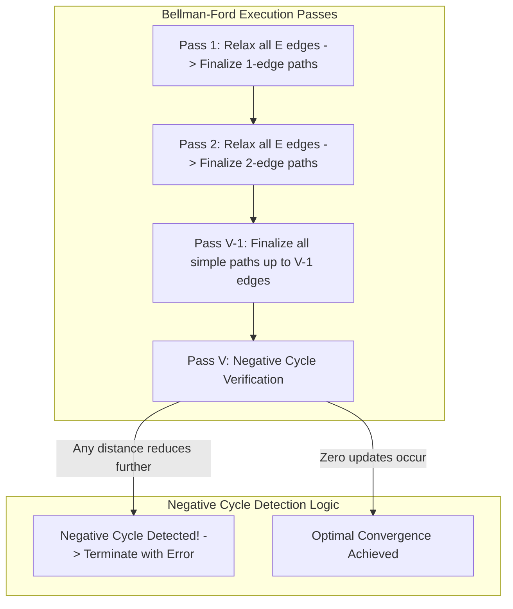

## 1. Problem Statement & Objectives

In production graph architectures, edge costs are not universally positive. In financial systems (such as FX Currency Arbitrage) or renewable energy trading grids, edges frequently carry **negative weights** representing arbitrage gains or energy credits.

Problem statement: Given a directed graph `G = (V, E)` with `V` vertices and `E` edges, where edge weights may be arbitrary real numbers. Given a source vertex `s`:

1. Compute shortest path distances from `s` to all reachable vertices.
2. Detect whether the graph contains a **Negative Weight Cycle**. A negative cycle is a directed cycle whose total edge sum &lt; 0. Traversing this cycle infinitely reduces total distance towards `-&infin;`, rendering the shortest path problem ill-defined.

The Bellman-Ford algorithm (developed by Richard Bellman and Lester Ford Jr.) serves as the definitive solution for negative-weight routing.

## 2. Initial Naive Approach

Dijkstra's algorithm fundamentally collapses in the presence of negative weights because its greedy invariant permanently locks nodes once popped from the priority queue. If a negative edge relaxes an already-settled node later, Dijkstra has no rollback mechanism to propagate updates downstream.

To eliminate greedy assumptions, Bellman-Ford adopts dynamic programming by globally and iteratively relaxing _all edges_ across the entire graph.

## 3. Optimization Thinking & Algorithm Design

The mathematical foundation of Bellman-Ford rests on the **Simple Path Invariant**:

1. **Upper Bound on Path Length:** In a graph with `V` vertices devoid of negative cycles, any simple shortest path contains at most `V - 1` edges. Repeating any vertex implies a cycle.
2. **Dynamic Programming over `V - 1` Passes:** Iteration `k` guarantees optimal paths for all routes comprising up to `k` edges. After `V - 1` full passes over all `E` edges, all vertex distances converge to global optimality.
3. **Negative Cycle Detection (Pass `V`):** Executing a `V`-th relaxation pass tests for negative cycles: If any edge `(u, v)` still satisfies `dist[u] + w < dist[v]`, a negative cycle exists along the path.
4. **Early-Exit Optimization:** If an iteration completes without a single distance update (`updated == false`), the algorithm terminates immediately, reducing best-case time to `O(E)`.

## 4. Code Implementation & Execution Trace

Progression of edge relaxation passes and negative cycle detection lifecycle:



**Complete C++ Implementation (Bellman-Ford with Early-Exit Flag & Negative Cycle Detection):**

```c++
#include <iostream>
#include <vector>
#include <algorithm>

const long long INF = 1e18;

struct Edge {
    int from;
    int to;
    long long weight;
};

struct BellmanFordResult {
    std::vector<long long> dist;
    std::vector<int> parent;
    bool hasNegativeCycle;
};

BellmanFordResult bellmanFord(int startNode, int numVertices, const std::vector<Edge>& edges) {
    std::vector<long long> dist(numVertices, INF);
    std::vector<int> parent(numVertices, -1);
    dist[startNode] = 0;

    // 1. Perform at most V - 1 relaxation iterations
    for (int i = 1; i <= numVertices - 1; ++i) {
        bool updated = false;

        for (const auto& edge : edges) {
            if (dist[edge.from] != INF && dist[edge.from] + edge.weight < dist[edge.to]) {
                dist[edge.to] = dist[edge.from] + edge.weight;
                parent[edge.to] = edge.from;
                updated = true;
            }
        }

        if (!updated) {
            break; // Converged early
        }
    }

    // 2. Pass V: Negative cycle detection
    bool hasNegativeCycle = false;
    for (const auto& edge : edges) {
        if (dist[edge.from] != INF && dist[edge.from] + edge.weight < dist[edge.to]) {
            hasNegativeCycle = true;
            break;
        }
    }

    return {dist, parent, hasNegativeCycle};
}

int main() {
    int V = 5;
    std::vector<Edge> edges = {
        {0, 1, -1},
        {0, 2, 4},
        {1, 2, 3},
        {1, 3, 2},
        {1, 4, 2},
        {3, 2, 5},
        {3, 1, 1},
        {4, 3, -3}
    };

    auto result = bellmanFord(0, V, edges);

    if (result.hasNegativeCycle) {
        std::cout << "WARNING: Graph contains a Negative Weight Cycle!" << std::endl;
    } else {
        std::cout << "--- BELLMAN-FORD SHORTEST PATHS FROM NODE 0 ---" << std::endl;
        for (int i = 0; i < V; ++i) {
            std::cout << "Distance to node " << i << ": " << result.dist[i] << std::endl;
        }
    }

    return 0;
}
```

**Execution Trace Breakdown (Dry Run):**

- _Init:_ `dist = [0, &infin;, &infin;, &infin;, &infin;]`.
- _Pass 1 (i = 1):_ Relaxes edges from 0 and 1 &rarr; `dist = [0, -1, 2, 1, 1]`.
- _Pass 2 (i = 2):_ Edge `(4->3, w=-3)` relaxes node 3: `1 + (-3) = -2 < 1` &rarr; `dist[3] = -2`.
- _Pass 3 (i = 3):_ Zero updates occur &rarr; `updated = false` triggers early break.
- _Verification:_ Pass 5 finds zero further reductions &rarr; Stable optimal shortest path distances confirmed.

## 5. Complexity Evaluation & Real-world Applications

Performance Scorecard anchored to RAM Model metrics:

- **Time Complexity:** `O(V x E)` for worst/average cases. On dense graphs (`E ~ V²`), approaches `O(V³)`. Best case with early-exit flag is `O(E)`.
- **Space Complexity:** `O(V)` for distance and predecessor vectors, plus `O(E)` to store raw edge tuples.
- **Real-World Applications:**
  - **Routing Information Protocol (RIP):** Foundation of Distance-Vector routing in computer networking.
  - **Financial Currency Arbitrage:** Detecting risk-free profit loops by taking negative log weights of foreign exchange rates.
  - **Systems of Difference Constraints:** Solving linear inequalities of form `x[j] - x[i] <= c` in compiler optimization and project scheduling.
