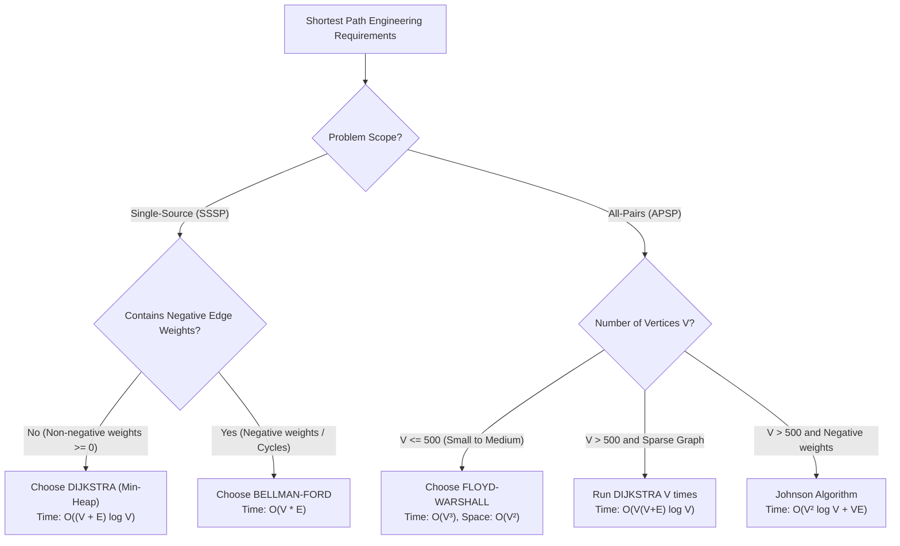

## Problem Statement & Objectives

In production software engineering, selecting an incorrect shortest path algorithm causes critical system failure: Severe Time Limit Exceeded (TLE), memory exhaustion, or logic corruption from unhandled negative cycles.

The 3 classical shortest path pillars are:

1. **Dijkstra:** High-performance greedy algorithm for non-negative graphs.
2. **Bellman-Ford:** Dynamic programming edge-relaxation engine supporting negative edge weights and cycle detection.
3. **Floyd-Warshall:** Matrix dynamic programming solver for All-Pairs Shortest Paths (APSP).

This article provides an objective quantitative comparison and an actionable Decision Tree for systems architects.

## Initial Naive Approach

Common architectural anti-patterns in production:

- **Invoking Dijkstra on negative weight graphs:** Produces silent data corruption without raising exceptions.
- **Running Bellman-Ford on massive road maps:** Processing millions of vertices takes hours where Dijkstra with Min-Heap executes in milliseconds.
- **Executing Dijkstra V times on dense matrices instead of Floyd-Warshall:** Overhead from priority queues and pointer indirection degrades performance compared to cache-friendly contiguous matrix DP.

## Optimization Thinking & Algorithm Design

**Multi-Dimensional Comparison Matrix:**

<table style="width:100%; border-collapse: collapse; margin-bottom: 20px;">
  <thead>
    <tr style="border-bottom: 2px solid #e2e8f0; text-align: left;">
      <th style="padding: 8px;">Dimension</th>
      <th style="padding: 8px;">Dijkstra</th>
      <th style="padding: 8px;">Bellman-Ford</th>
      <th style="padding: 8px;">Floyd-Warshall</th>
    </tr>
  </thead>
  <tbody>
    <tr style="border-bottom: 1px solid #edf2f7;">
      <td style="padding: 8px"><b>Problem Scope</b></td>
      <td style="padding: 8px">Single-Source (SSSP)</td>
      <td style="padding: 8px">Single-Source (SSSP)</td>
      <td style="padding: 8px">All-Pairs (APSP)</td>
    </tr>
    <tr style="border-bottom: 1px solid #edf2f7;">
      <td style="padding: 8px"><b>Time Complexity</b></td>
      <td style="padding: 8px">`O((V + E) \log V)`</td>
      <td style="padding: 8px">`O(V x E)` (Best: `O(E)`)</td>
      <td style="padding: 8px">`Θ(V³)`</td>
    </tr>
    <tr style="border-bottom: 1px solid #edf2f7;">
      <td style="padding: 8px"><b>Space Complexity</b></td>
      <td style="padding: 8px">`O(V + E)`</td>
      <td style="padding: 8px">`O(V + E)`</td>
      <td style="padding: 8px">`O(V²)`</td>
    </tr>
    <tr style="border-bottom: 1px solid #edf2f7;">
      <td style="padding: 8px"><b>Negative Weights</b></td>
      <td style="padding: 8px">NO</td>
      <td style="padding: 8px">YES</td>
      <td style="padding: 8px">YES</td>
    </tr>
    <tr style="border-bottom: 1px solid #edf2f7;">
      <td style="padding: 8px"><b>Negative Cycles</b></td>
      <td style="padding: 8px">Fails silently</td>
      <td style="padding: 8px">Detects at pass V</td>
      <td style="padding: 8px">Detects via diagonal `dist[i][i] < 0`</td>
    </tr>
    <tr style="border-bottom: 1px solid #edf2f7;">
      <td style="padding: 8px"><b>Core Data Structure</b></td>
      <td style="padding: 8px">Min-Heap + Adjacency List</td>
      <td style="padding: 8px">Edge List Array</td>
      <td style="padding: 8px">2D Adjacency Matrix</td>
    </tr>
    <tr>
      <td style="padding: 8px"><b>Production Protocols</b></td>
      <td style="padding: 8px">OSPF, Google Maps GPS</td>
      <td style="padding: 8px">RIP, FX Arbitrage</td>
      <td style="padding: 8px">Transitive Closure, Route Tables</td>
    </tr>
  </tbody>
</table>

## Code Implementation & Execution Trace

Architectural Decision Tree for shortest path algorithm selection:



**Unified C++ Test Harness (Executing all 3 algorithms on the same graph instance):**

```c++
#include <iostream>
#include <vector>
#include <queue>
#include <algorithm>

const long long INF = 1e15;

struct Edge {
    int from, to;
    long long weight;
};

long long benchmarkDijkstra(int V, int start, int end, const std::vector<std::vector<std::pair<int, long long>>>& adj) {
    std::vector<long long> dist(V, INF);
    using State = std::pair<long long, int>;
    std::priority_queue<State, std::vector<State>, std::greater<State>> pq;

    dist[start] = 0;
    pq.push({0, start});

    while (!pq.empty()) {
        auto [d, u] = pq.top();
        pq.pop();
        if (d > dist[u]) continue;
        if (u == end) break;

        for (const auto& edge : adj[u]) {
            int v = edge.first;
            long long w = edge.second;
            if (dist[u] + w < dist[v]) {
                dist[v] = dist[u] + w;
                pq.push({dist[v], v});
            }
        }
    }
    return dist[end];
}

long long benchmarkBellmanFord(int V, int start, int end, const std::vector<Edge>& edges) {
    std::vector<long long> dist(V, INF);
    dist[start] = 0;

    for (int i = 1; i <= V - 1; ++i) {
        bool updated = false;
        for (const auto& e : edges) {
            if (dist[e.from] != INF && dist[e.from] + e.weight < dist[e.to]) {
                dist[e.to] = dist[e.from] + e.weight;
                updated = true;
            }
        }
        if (!updated) break;
    }
    return dist[end];
}

long long benchmarkFloydWarshall(int V, int start, int end, std::vector<std::vector<long long>> dist) {
    for (int k = 0; k < V; ++k) {
        for (int i = 0; i < V; ++i) {
            for (int j = 0; j < V; ++j) {
                if (dist[i][k] != INF && dist[k][j] != INF) {
                    dist[i][j] = std::min(dist[i][j], dist[i][k] + dist[k][j]);
                }
            }
        }
    }
    return dist[start][end];
}

int main() {
    int V = 5;
    std::vector<Edge> edgeList = {
        {0, 1, 4}, {0, 2, 2}, {1, 2, 1}, {1, 3, 5},
        {2, 3, 8}, {2, 4, 10}, {3, 4, 2}
    };

    std::vector<std::vector<std::pair<int, long long>>> adj(V);
    std::vector<std::vector<long long>> matrix(V, std::vector<long long>(V, INF));
    for (int i = 0; i < V; ++i) matrix[i][i] = 0;

    for (const auto& e : edgeList) {
        adj[e.from].push_back({e.to, e.weight});
        matrix[e.from][e.to] = e.weight;
    }

    std::cout << "--- SHORTEST PATH FROM 0 TO 4 ACROSS 3 ALGORITHMS ---" << std::endl;
    std::cout << "1. Dijkstra:       Distance = " << benchmarkDijkstra(V, 0, 4, adj) << std::endl;
    std::cout << "2. Bellman-Ford:  Distance = " << benchmarkBellmanFord(V, 0, 4, edgeList) << std::endl;
    std::cout << "3. Floyd-Warshall: Distance = " << benchmarkFloydWarshall(V, 0, 4, matrix) << std::endl;

    return 0;
}
```

## Complexity Evaluation & Real-world Applications

Key architectural rules of thumb:

1. **When to choose Dijkstra?** When routing from a single origin on large-scale positive graphs (road navigation, web crawlers, social graphs). Delivers the highest performance.
2. **When to choose Bellman-Ford?** When edge costs can be negative (financial exchange, energy optimization) or in decentralized routing (RIP) where nodes communicate strictly with adjacent neighbors.
3. **When to choose Floyd-Warshall?** When graph size is moderate (`V <= 500`) and instantaneous `O(1)` all-pairs distance queries are required.
