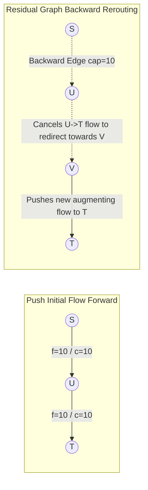

## 1. Problem Statement & Objectives

In municipal water grids, oil pipeline topologies, Internet routing backbones, and airline logistics, a core operational challenge is: *How to transport the maximum possible volume from source to destination without violating individual segment capacities?*

Problem statement: **Maximum Flow Problem**. Given a flow network `G = (V, E)` represented as a directed graph where each edge `(u, v)` has a maximum capacity `c(u, v) >= 0`. Two special nodes are defined: **Source `s`** and **Sink `t`**.

Find a flow assignment function `f(u, v)` satisfying two strict invariants:

1. **Capacity Constraint:** `0 <= f(u, v) <= c(u, v)` for all edges.
2. **Conservation of Flow:** Total incoming flow equals total outgoing flow for all intermediate vertices (excluding `s` and `t`).

Objective: Maximize total net flow exiting source `s`: `|f| = sum f(s, v)`.

## 2. Initial Naive Approach

A naive greedy heuristic locates arbitrary paths from `s` to `t`, pushes maximum allowable capacity, reduces edge bounds, and repeats until disconnected.

Pure greedy strategies **fail** because committing flow along a suboptimal path permanently locks capacity, preventing future discovery of the global maximum.

In 1956, Lester Ford Jr. and Delbert Fulkerson revolutionized flow optimization by introducing **Backward Edges** on the **Residual Graph**, allowing the algorithm to dynamically cancel and redirect prior flow decisions.

## 3. Optimization Thinking & Algorithm Design

The Ford-Fulkerson method is established on 3 foundational pillars:

1. **Residual Graph (`G_f`):** For each edge with capacity `c` and current flow `f`:
  

- *Forward Edge:* Residual capacity `c(u, v) - f(u, v)` (represents available headroom to push additional flow).
- *Backward Edge:* Residual capacity `f(u, v)` (represents capability to cancel/reroute previously sent flow).
2. **Augmenting Path:** A simple path from `s` to `t` in `G_f` where every constituent edge has residual capacity `> 0`. The path bottleneck is the minimum residual capacity along this path.
3. **Max-Flow Min-Cut Theorem:** The maximum flow value from `s` to `t` strictly equals the total capacity of the Minimum Cut separating `s` from `t`.
4. **Edmonds-Karp Specialization (1972):** Utilizing **BFS** rather than DFS to consistently choose the shortest augmenting path guarantees polynomial convergence in `O(V x E²)` time, eliminating risks of infinite loops on irrational capacities.

## 4. Code Implementation & Execution Trace

Residual graph mechanics and flow augmentation with backward edges:



**Complete C++ Implementation (Edmonds-Karp BFS Algorithm):**

```
#include <iostream>
#include <vector>
#include <queue>
#include <algorithm>

const long long INF = 1e18;

class EdmondsKarp {
private:
    int n;
    std::vector<std::vector<long long>> capacity;
    std::vector<std::vector<int>> adj;

    long long bfs(int s, int t, std::vector<int>& parent) {
        std::fill(parent.begin(), parent.end(), -1);
        parent[s] = -2;

        std::queue<std::pair<int, long long>> q;
        q.push({s, INF});

        while (!q.empty()) {
            auto [u, flow] = q.front();
            q.pop();

            for (int v : adj[u]) {
                if (parent[v] == -1 && capacity[u][v] > 0) {
                    parent[v] = u;
                    long long newFlow = std::min(flow, capacity[u][v]);
                    if (v == t) {
                        return newFlow;
                    }
                    q.push({v, newFlow});
                }
            }
        }
        return 0;
    }

public:
    EdmondsKarp(int vertices) : n(vertices) {
        capacity.assign(n, std::vector<long long>(n, 0));
        adj.resize(n);
    }

    void addEdge(int from, int to, long long cap) {
        capacity[from][to] += cap;
        adj[from].push_back(to);
        adj[to].push_back(from);
    }

    long long maxFlow(int s, int t) {
        long long totalFlow = 0;
        std::vector<int> parent(n);
        long long newFlow = 0;

        while ((newFlow = bfs(s, t, parent)) > 0) {
            totalFlow += newFlow;
            int curr = t;
            while (curr != s) {
                int prev = parent[curr];
                capacity[prev][curr] -= newFlow;
                capacity[curr][prev] += newFlow;
                curr = prev;
            }
        }
        return totalFlow;
    }
};

int main() {
    int V = 6;
    EdmondsKarp ek(V);

    ek.addEdge(0, 1, 16);
    ek.addEdge(0, 2, 13);
    ek.addEdge(1, 2, 10);
    ek.addEdge(1, 3, 12);
    ek.addEdge(2, 1, 4);
    ek.addEdge(2, 4, 14);
    ek.addEdge(3, 2, 9);
    ek.addEdge(3, 5, 20);
    ek.addEdge(4, 3, 7);
    ek.addEdge(4, 5, 4);

    long long flow = ek.maxFlow(0, 5);
    std::cout << "--- EDMONDS-KARP MAXIMUM FLOW RESULT ---" << std::endl;
    std::cout << "Maximum Flow from 0 to 5: " << flow << std::endl;

    return 0;
}
```

**Execution Trace Breakdown (Dry Run):**

- *Network:* `S = 0, T = 5`.
- *Augmentation 1:* BFS discovers `0 -> 1 -> 3 -> 5` with `bottleneck = 12` &rarr; Flow = 12.
- *Augmentation 2:* BFS discovers `0 -> 2 -> 4 -> 5` with `bottleneck = 4` &rarr; Flow = 16.
- *Augmentation 3:* BFS discovers `0 -> 2 -> 4 -> 3 -> 5` with `bottleneck = 7` &rarr; Flow = 23.
- *Convergence:* Next BFS fails to reach sink `5` &rarr; Max flow confirmed at `23`.

## 5. Complexity Evaluation & Real-world Applications

Performance Scorecard anchored to RAM Model metrics:

- **Time Complexity:**
  <ul>
  Standard Ford-Fulkerson: `O(E x |f*|)` where `|f*|` is maximum flow value.
- Edmonds-Karp (BFS): `O(V x E²)`. Each BFS takes `O(E)`, total augmentations capped at `O(V x E)`.

</li>
<li>**Space Complexity:** `O(V²)` for capacity matrix or `O(V + E)` using symmetric adjacency lists.</li>
<li>**Real-World Applications:**
  

- **Urban Water Supply Systems:** Calculating maximum sustainable throughput in distribution pipelines.
- **Computer Vision (Graph Cut Segmentation):** Pixel labeling separating foreground from background in medical imaging.
- **Airline Crew Scheduling:** Bipartite task assignment matching flight attendants and pilots.

</li>
</ul>
