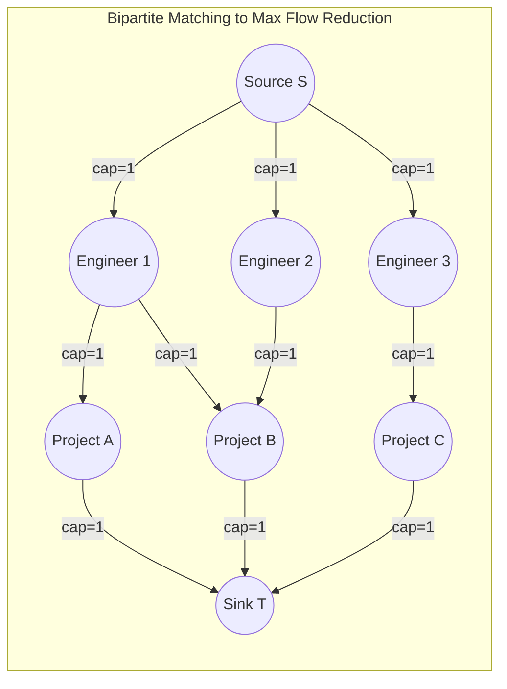

## Problem Statement & Objectives

Network Flow theory forms one of the most powerful paradigms in computer science. When engineering large-scale routing pipelines, choosing between classical **Ford-Fulkerson / Edmonds-Karp** and modern **Dinic's algorithm** results in orders-of-magnitude performance variance.

This article provides an architectural dissection of both methods, evaluates real-world scalability limits, and demonstrates reducing classical problems like Maximum Bipartite Matching to network flow.

## Initial Naive Approach

Why Edmonds-Karp suffers on dense networks:

- Each BFS pass discovers exactly 1 shortest augmenting path, pushes a small bottleneck flow, and discards the entire BFS state.
- With 10,000 parallel paths of equal length, Edmonds-Karp executes 10,000 separate BFS traversals.
- Dinic bundles all 10,000 paths into a single **Level Graph**, saturating them simultaneously via DFS (Blocking Flow) in one consolidated phase.

## Optimization Thinking & Algorithm Design

**Comprehensive Comparison Matrix:**

<table style="width:100%; border-collapse: collapse; margin-bottom: 20px;">
  <thead>
    <tr style="border-bottom: 2px solid #e2e8f0; text-align: left;">
      <th style="padding: 8px;">Evaluation Criteria</th>
      <th style="padding: 8px;">Edmonds-Karp (BFS)</th>
      <th style="padding: 8px;">Dinic's Algorithm</th>
    </tr>
  </thead>
  <tbody>
    <tr style="border-bottom: 1px solid #edf2f7;">
      <td style="padding: 8px"><b>Augmentation Mechanism</b></td>
      <td style="padding: 8px">Single-path per BFS traversal</td>
      <td style="padding: 8px">Multi-path Blocking Flow via DFS</td>
    </tr>
    <tr style="border-bottom: 1px solid #edf2f7;">
      <td style="padding: 8px"><b>Time Complexity (General)</b></td>
      <td style="padding: 8px">`O(V x E²)`</td>
      <td style="padding: 8px">`O(V² x E)` (10x - 1000x faster)</td>
    </tr>
    <tr style="border-bottom: 1px solid #edf2f7;">
      <td style="padding: 8px"><b>Unit Networks Complexity</b></td>
      <td style="padding: 8px">`O(V x E)`</td>
      <td style="padding: 8px">`O(E \sqrt{V})`</td>
    </tr>
    <tr style="border-bottom: 1px solid #edf2f7;">
      <td style="padding: 8px"><b>Key Optimization Technique</b></td>
      <td style="padding: 8px">Shortest-path BFS selection</td>
      <td style="padding: 8px">Level Graph + `work[]` dead-end pruning</td>
    </tr>
    <tr style="border-bottom: 1px solid #edf2f7;">
      <td style="padding: 8px"><b>Space Complexity</b></td>
      <td style="padding: 8px">`O(V + E)`</td>
      <td style="padding: 8px">`O(V + E)`</td>
    </tr>
    <tr>
      <td style="padding: 8px"><b>Recommended Usage</b></td>
      <td style="padding: 8px">Small topologies (`V <= 100`)</td>
      <td style="padding: 8px">Production Systems & High-load Pipelines</td>
    </tr>
  </tbody>
</table>

## Code Implementation & Execution Trace

Transforming Maximum Bipartite Matching into a Network Flow problem:



**Production C++ Implementation: Solving Bipartite Matching via Dinic:**

```c++
#include <iostream>
#include <vector>
#include <queue>
#include <algorithm>

const int INF = 1e9;

class BipartiteMatcher {
private:
    struct Edge {
        int to, cap, flow, rev;
    };
    int n, s, t;
    std::vector<std::vector<Edge>> adj;
    std::vector<int> level, work;

    bool bfs() {
        std::fill(level.begin(), level.end(), -1);
        level[s] = 0;
        std::queue<int> q;
        q.push(s);
        while (!q.empty()) {
            int u = q.front(); q.pop();
            for (const auto& e : adj[u]) {
                if (e.cap - e.flow > 0 && level[e.to] == -1) {
                    level[e.to] = level[u] + 1;
                    q.push(e.to);
                }
            }
        }
        return level[t] != -1;
    }

    int dfs(int u, int pushed) {
        if (!pushed || u == t) return pushed;
        for (int& cid = work[u]; cid < static_cast<int>(adj[u].size()); ++cid) {
            auto& e = adj[u][cid];
            int v = e.to;
            if (level[u] + 1 != level[v] || e.cap - e.flow <= 0) continue;
            int tr = dfs(v, std::min(pushed, e.cap - e.flow));
            if (!tr) continue;
            e.flow += tr;
            adj[v][e.rev].flow -= tr;
            return tr;
        }
        return 0;
    }

public:
    BipartiteMatcher(int numWorkers, int numJobs) {
        n = numWorkers + numJobs + 2;
        s = 0;
        t = n - 1;
        adj.resize(n);
        level.resize(n);
        work.resize(n);
    }

    void addMatchingEdge(int workerId, int jobId, int numWorkers) {
        int u = workerId;
        int v = numWorkers + jobId;
        addEdge(u, v, 1);
    }

    void addEdge(int from, int to, int cap) {
        adj[from].push_back({to, cap, 0, static_cast<int>(adj[to].size())});
        adj[to].push_back({from, 0, 0, static_cast<int>(adj[from].size()) - 1});
    }

    int solve(int numWorkers, int numJobs) {
        for (int i = 1; i <= numWorkers; ++i) addEdge(s, i, 1);
        for (int j = 1; j <= numJobs; ++j) addEdge(numWorkers + j, t, 1);

        int maxMatch = 0;
        while (bfs()) {
            std::fill(work.begin(), work.end(), 0);
            while (int pushed = dfs(s, INF)) {
                maxMatch += pushed;
            }
        }
        return maxMatch;
    }
};

int main() {
    int workers = 3;
    int jobs = 3;
    BipartiteMatcher matcher(workers, jobs);

    matcher.addMatchingEdge(1, 1, workers);
    matcher.addMatchingEdge(1, 2, workers);
    matcher.addMatchingEdge(2, 2, workers);
    matcher.addMatchingEdge(3, 3, workers);

    int result = matcher.solve(workers, jobs);
    std::cout << "Max Bipartite Matches: " << result << std::endl;

    return 0;
}
```

## Complexity Evaluation & Real-world Applications

Architectural takeaways for distributed systems:

1. **Standardize on Dinic as Default:** In all real-world network flow applications, Dinic overwhelmingly outperforms Edmonds-Karp in speed and memory stability.
2. **Universal Reduction Pattern:** Diverse problems (bipartite matching, minimum cut image segmentation, server load balancing) map directly to Max Flow and solve in `O(E \sqrt{V})` time.
