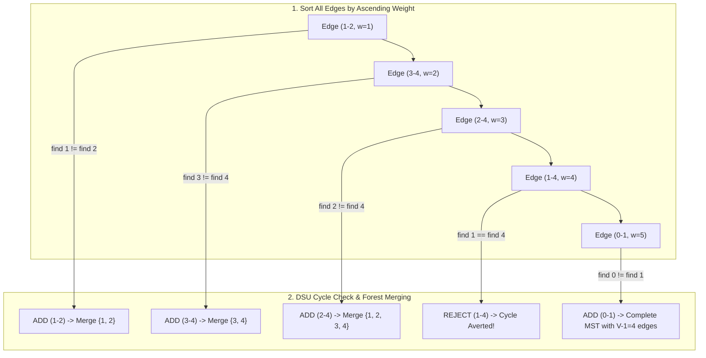

## 1. Problem Statement & Objectives

When engineering regional optical fiber backbones, electrical grids, or oil pipelines, the core economic requirement is: _How to interconnect all `V` municipalities at minimum capital expenditure while eliminating redundant, cyclic wiring?_

Problem statement: **Minimum Spanning Tree (MST)**. Given an undirected, connected, weighted graph `G = (V, E)`. A spanning tree is an acyclic connected subgraph containing all `V` vertices and exactly `V - 1` edges. Find a spanning tree with minimal total weight: `w(T) = sum_{(u, v) in T} w(u, v)`.

Kruskal's algorithm (published by Joseph Kruskal in 1956) is the quintessential **Edge-Centric Greedy** strategy.

## 2. Initial Naive Approach

Sort all edges by ascending weight. Iteratively add edges from smallest to largest, provided adding edge `(u, v)` does not introduce a cycle.

Key Challenge: _How to efficiently test whether adding `(u, v)` creates a cycle?_

Executing BFS/DFS for cycle detection per candidate edge takes `O(V)` time, ballooning total runtime to `O(E x V)` - intractable on large graphs.

## 3. Optimization Thinking & Algorithm Design

Kruskal's algorithm achieves near-linear efficiency by combining with **Disjoint Set Union (DSU / Union-Find)**:

1. **Spanning Forest Model:** Initially, each vertex `v in V` constitutes an isolated 1-node tree. Kruskal merges these trees until exactly 1 spanning tree of `V - 1` edges remains.
2. **Cycle Detection in `O(alpha(V))`:** Adding edge `(u, v)` creates a cycle if and only if both endpoints share the same root representative: `find(u) == find(v)`.
3. **Two DSU Optimization Pillars:**

- **Path Compression:** Inside `find(u)`, re-point traversed nodes directly to the root, flattening tree depth to near-constant height.
- **Union by Rank:** Always attach the shallower tree beneath the root of the deeper tree to prevent degeneration into linked lists.

DSU operations operate in inverse Ackermann amortized time `O(alpha(V)) <= 4`. Total time is strictly bounded by edge sorting: `O(E \log E) = O(E \log V)`.

## 4. Code Implementation & Execution Trace

Edge sorting and DSU forest merging progression:



**Complete C++ Implementation (Kruskal's Algorithm with Path Compression & Union by Rank):**

```
#include <iostream>
#include <vector>
#include <algorithm>

class DisjointSet {
private:
    std::vector<int> parent;
    std::vector<int> rank;

public:
    DisjointSet(int n) {
        parent.resize(n);
        rank.assign(n, 0);
        for (int i = 0; i < n; ++i) {
            parent[i] = i;
        }
    }

    int find(int u) {
        if (parent[u] != u) {
            parent[u] = find(parent[u]); // Path compression
        }
        return parent[u];
    }

    bool unite(int u, int v) {
        int rootU = find(u);
        int rootV = find(v);

        if (rootU == rootV) {
            return false; // Cycle detected
        }

        if (rank[rootU] < rank[rootV]) {
            parent[rootU] = rootV;
        } else if (rank[rootU] > rank[rootV]) {
            parent[rootV] = rootU;
        } else {
            parent[rootV] = rootU;
            rank[rootU]++;
        }
        return true;
    }
};

struct Edge {
    int u, v;
    long long weight;

    bool operator<(const Edge& other) const {
        return weight < other.weight;
    }
};

struct MSTResult {
    long long totalWeight;
    std::vector<Edge> mstEdges;
};

MSTResult kruskalMST(int V, std::vector<Edge>& edges) {
    std::sort(edges.begin(), edges.end()); // O(E log E)

    DisjointSet dsu(V);
    long long totalWeight = 0;
    std::vector<Edge> mstEdges;

    for (const auto& edge : edges) {
        if (dsu.unite(edge.u, edge.v)) {
            totalWeight += edge.weight;
            mstEdges.push_back(edge);

            if (static_cast<int>(mstEdges.size()) == V - 1) {
                break;
            }
        }
    }

    return {totalWeight, mstEdges};
}

int main() {
    int V = 5;
    std::vector<Edge> edges = {
        {0, 1, 9}, {0, 2, 75}, {1, 2, 95},
        {1, 3, 19}, {1, 4, 42}, {2, 3, 51},
        {3, 4, 31}
    };

    auto result = kruskalMST(V, edges);

    std::cout << "--- KRUSKAL MST OUTPUT ---" << std::endl;
    std::cout << "Total MST Weight: " << result.totalWeight << std::endl;
    for (const auto& e : result.mstEdges) {
        std::cout << "Edge (" << e.u << " - " << e.v << ") | Weight: " << e.weight << std::endl;
    }

    return 0;
}
```

**Execution Trace Breakdown (Dry Run):**

- _Sorted Edges:_ `(0-1: 9), (1-3: 19), (3-4: 31), (1-4: 42), (2-3: 51), (0-2: 75), (1-2: 95)`.
- _Edge 1 (0-1, w=9):_ Added &rarr; `total = 9`. DSU merges `{0, 1}`.
- _Edge 2 (1-3, w=19):_ Added &rarr; `total = 28`. DSU merges `{0, 1, 3}`.
- _Edge 3 (3-4, w=31):_ Added &rarr; `total = 59`. DSU merges `{0, 1, 3, 4}`.
- _Edge 4 (1-4, w=42):_ `find(1) == find(4)` &rarr; Discarded to prevent cycle.
- _Edge 5 (2-3, w=51):_ Added &rarr; `total = 110`. Exactly `V - 1 = 4` edges selected &rarr; Converged!

## 5. Complexity Evaluation & Real-world Applications

Performance Scorecard anchored to RAM Model metrics:

- **Time Complexity:** `O(E \log E) = O(E \log V)`. Edge sorting dominates; DSU processing runs in near-linear `O(E alpha(V))`.
- **Space Complexity:** `O(V + E)` for DSU parent/rank vectors and edge storage.
- **Real-World Applications:**
  <ul>
  **Telecommunications & Power Grid Layout:** Interconnecting regional transformers at minimum total cable length.
- **Machine Learning Clustering:** Single-linkage hierarchical clustering terminating at `K` connected components.
- **VLSI Circuit Layout:** Minimizing interconnect delay and silicon wire area.

</li>
</ul>
