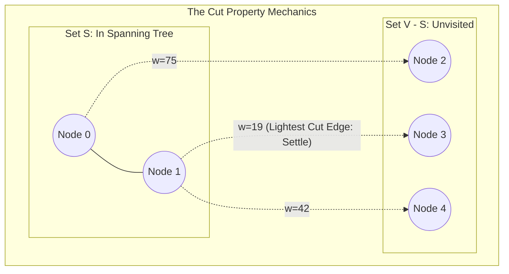

## 1. Problem Statement & Objectives

Unlike Kruskal's algorithm which aggregates disjoint edges into a forest, Prim's algorithm (originated by Vojtěch Jarník in 1930 and independently Robert Prim in 1957) constructs the Minimum Spanning Tree via **Vertex-Centric Growth**.

Starting from an arbitrary seed node, Prim continuously expands the boundary of a single connected component, absorbing the closest unvisited vertex until all vertices are incorporated.

## 2. Initial Naive Approach

A naive implementation scans all unvisited nodes linearly at each step, yielding `O(V²)` runtime.

On dense graphs (where `E ~ V²`), `O(V²)` is asymptotically optimal. However, on sparse graphs (`E ~ V`), linear scanning introduces substantial latency.

## 3. Optimization Thinking & Algorithm Design

Prim's algorithm rests upon the **Cut Property** of graph theory:

1. **The Cut Property:** Partition vertex set `V` into two disjoint sets: Set `S` (vertices currently inside the MST) and set `V \ S` (unvisited vertices). The lightest edge crossing this cut *must belong to the global Minimum Spanning Tree*.
2. **Frontier Expansion:** Track `inMST[v]` status. Seed with `inMST[0] = true`.
3. **Min-Heap Acceleration:**
  

- Store candidate cut-crossing edges in a binary min-heap (`std::priority_queue`).
- Pop the lightest edge `(u, v, w)`. If `v` is unvisited, mark `inMST[v] = true`, accumulate weight `w`, and enqueue all outgoing edges from `v` to unvisited neighbors.

Min-Heap optimization slashes sparse graph runtime to `O((V + E) \log V)`.

## 4. Code Implementation & Execution Trace

Visualizing the Cut Property boundary expansion in Prim's algorithm:



**Complete C++ Implementation (Prim's Algorithm with std::priority_queue):**

```
#include <iostream>
#include <vector>
#include <queue>
#include <utility>

struct Edge {
    int to;
    long long weight;
};

struct HeapNode {
    long long weight;
    int u;
    int parent;

    bool operator>(const HeapNode& other) const {
        return weight > other.weight;
    }
};

struct MSTEdge {
    int u, v;
    long long weight;
};

struct PrimResult {
    long long totalWeight;
    std::vector<MSTEdge> mstEdges;
};

PrimResult primMST(int V, const std::vector<std::vector<Edge>>& adj) {
    std::vector<bool> inMST(V, false);
    std::priority_queue<HeapNode, std::vector<HeapNode>, std::greater<HeapNode>> pq;

    pq.push({0, 0, -1});

    long long totalWeight = 0;
    std::vector<MSTEdge> mstEdges;

    while (!pq.empty()) {
        auto [w, u, p] = pq.top();
        pq.pop();

        if (inMST[u]) {
            continue;
        }

        inMST[u] = true;
        totalWeight += w;
        if (p != -1) {
            mstEdges.push_back({p, u, w});
        }

        for (const auto& edge : adj[u]) {
            if (!inMST[edge.to]) {
                pq.push({edge.weight, edge.to, u});
            }
        }
    }

    return {totalWeight, mstEdges};
}

int main() {
    int V = 5;
    std::vector<std::vector<Edge>> adj(V);

    auto addUndirectedEdge = [&](int u, int v, long long w) {
        adj[u].push_back({v, w});
        adj[v].push_back({u, w});
    };

    addUndirectedEdge(0, 1, 9);
    addUndirectedEdge(0, 2, 75);
    addUndirectedEdge(1, 2, 95);
    addUndirectedEdge(1, 3, 19);
    addUndirectedEdge(1, 4, 42);
    addUndirectedEdge(2, 3, 51);
    addUndirectedEdge(3, 4, 31);

    auto result = primMST(V, adj);

    std::cout << "--- PRIM MST OUTPUT ---" << std::endl;
    std::cout << "Total MST Weight: " << result.totalWeight << std::endl;
    for (const auto& e : result.mstEdges) {
        std::cout << "Edge (" << e.u << " - " << e.v << ") | Weight: " << e.weight << std::endl;
    }

    return 0;
}
```

**Execution Trace Breakdown (Dry Run):**

- *Start:* Node 0 incorporated. Pushes `(0-1: 9)`, `(0-2: 75)`.
- *Step 1:* Pops `(w=9, u=1)` &rarr; Settle node 1. Pushes `(1-3: 19)`, `(1-4: 42)`.
- *Step 2:* Pops `(w=19, u=3)` &rarr; Settle node 3. Pushes `(3-4: 31)`, `(3-2: 51)`.
- *Step 3:* Pops `(w=31, u=4)` &rarr; Settle node 4.
- *Step 4:* Pops `(w=51, u=2)` &rarr; Settle node 2. Total weight converges to `110`.

## 5. Complexity Evaluation & Real-world Applications

Performance Scorecard anchored to RAM Model metrics:

- **Time Complexity:**
  <ul>
  Binary Min-Heap: `O((V + E) \log V)`.
- Adjacency Matrix on Dense Graphs (`E ~ V²`): `O(V²)`.
- Fibonacci Heap (Theoretical): `O(E + V \log V)`.

</li>
<li>**Space Complexity:** `O(V + E)` for adjacency list and priority queue.</li>
<li>**Real-World Applications:**
  

- **Spanning Tree Protocol (STP - IEEE 802.1D):** Preventing bridge loops in Ethernet switched networks.
- **Approximation of Traveling Salesperson Problem (TSP):** MST-based 2-approximation metric tours.
- **Multicast Routing Trees:** Distributing single-origin video streams to millions of subscribers.

</li>
</ul>
