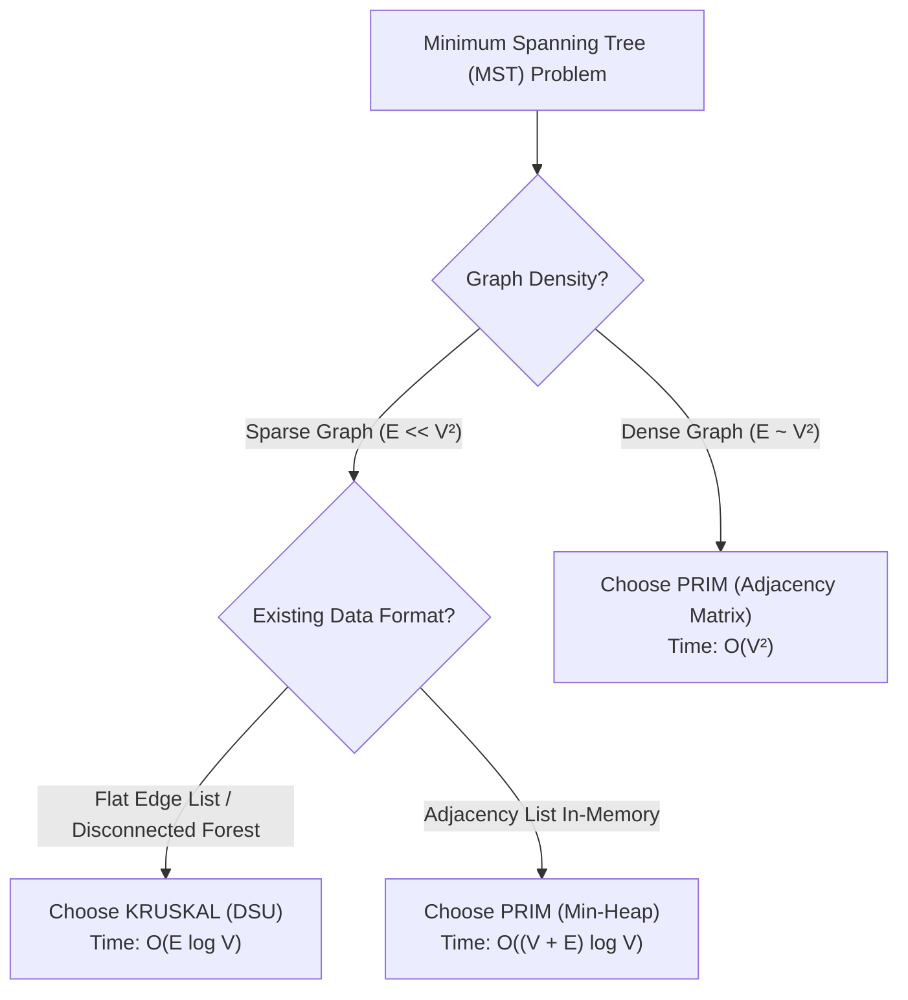

## Problem Statement & Objectives

In Minimum Spanning Tree construction, **Kruskal** and **Prim** produce equivalent optimal trees while operating on opposing architectural principles:

- **Kruskal:** Edge-Centric global sorting and DSU forest merging.
- **Prim:** Vertex-Centric local expansion growing a single tree from a seed node.

Understanding the performance boundary dictated by Graph Density is essential for systems engineering.

## Initial Naive Approach

Common production misconceptions:

1. **Using Kruskal on Dense Graphs (`E ~ V²`):** Sorting `10⁶` edges incurs severe overhead compared to Prim's simple `O(V²)` matrix iteration.
2. **Using Prim on Disconnected Graphs:** Prim only spans the component containing the seed node, whereas Kruskal naturally discovers the complete **Minimum Spanning Forest** without modifications.

## Optimization Thinking & Algorithm Design

**Comprehensive Architectural Comparison Matrix:**

<table style="width:100%; border-collapse: collapse; margin-bottom: 20px;">
  <thead>
    <tr style="border-bottom: 2px solid #e2e8f0; text-align: left;">
      <th style="padding: 8px;">Feature</th>
      <th style="padding: 8px;">Kruskal's Algorithm</th>
      <th style="padding: 8px;">Prim's Algorithm</th>
    </tr>
  </thead>
  <tbody>
    <tr style="border-bottom: 1px solid #edf2f7;">
      <td style="padding: 8px"><b>Paradigm</b></td>
      <td style="padding: 8px">Edge-Centric Greedy</td>
      <td style="padding: 8px">Vertex-Centric Greedy</td>
    </tr>
    <tr style="border-bottom: 1px solid #edf2f7;">
      <td style="padding: 8px"><b>Primary Data Structure</b></td>
      <td style="padding: 8px">Disjoint Set Union (DSU) + Sort</td>
      <td style="padding: 8px">Min-Heap Priority Queue / Matrix</td>
    </tr>
    <tr style="border-bottom: 1px solid #edf2f7;">
      <td style="padding: 8px"><b>Sparse Graph Time (`E ~ V`)</b></td>
      <td style="padding: 8px">`O(E \log V)` (Exceptional)</td>
      <td style="padding: 8px">`O(E \log V)`</td>
    </tr>
    <tr style="border-bottom: 1px solid #edf2f7;">
      <td style="padding: 8px"><b>Dense Graph Time (`E ~ V²`)</b></td>
      <td style="padding: 8px">`O(V² \log V)`</td>
      <td style="padding: 8px">`O(V²)` via Matrix (Optimal)</td>
    </tr>
    <tr style="border-bottom: 1px solid #edf2f7;">
      <td style="padding: 8px"><b>Graph Representation</b></td>
      <td style="padding: 8px">Flat Edge List</td>
      <td style="padding: 8px">Adjacency List / Matrix</td>
    </tr>
    <tr style="border-bottom: 1px solid #edf2f7;">
      <td style="padding: 8px"><b>Disconnected Graphs</b></td>
      <td style="padding: 8px">Automatic Minimum Spanning Forest</td>
      <td style="padding: 8px">Requires outer component loop</td>
    </tr>
    <tr>
      <td style="padding: 8px"><b>Parallelization</b></td>
      <td style="padding: 8px">High (Parallel QuickSort)</td>
      <td style="padding: 8px">Low (Strictly sequential vertex absorption)</td>
    </tr>
  </tbody>
</table>

## Code Implementation & Execution Trace

Decision Tree for Minimum Spanning Tree algorithm selection:



**C++ Side-by-Side Benchmark Test Suite:**

```c++
#include <iostream>
#include <vector>
#include <algorithm>
#include <queue>

struct Edge {
    int u, v;
    long long weight;
    bool operator<(const Edge& o) const { return weight < o.weight; }
};

struct DSU {
    std::vector<int> p;
    DSU(int n) : p(n) { for (int i = 0; i < n; ++i) p[i] = i; }
    int find(int x) { return p[x] == x ? x : p[x] = find(p[x]); }
    bool unite(int a, int b) {
        a = find(a); b = find(b);
        if (a == b) return false;
        p[a] = b;
        return true;
    }
};

long long runKruskal(int V, std::vector<Edge> edges) {
    std::sort(edges.begin(), edges.end());
    DSU dsu(V);
    long long total = 0;
    int count = 0;
    for (const auto& e : edges) {
        if (dsu.unite(e.u, e.v)) {
            total += e.weight;
            if (++count == V - 1) break;
        }
    }
    return total;
}

long long runPrim(int V, const std::vector<std::vector<std::pair<int, long long>>>& adj) {
    std::vector<bool> vis(V, false);
    using State = std::pair<long long, int>;
    std::priority_queue<State, std::vector<State>, std::greater<State>> pq;
    pq.push({0, 0});
    long long total = 0;

    while (!pq.empty()) {
        auto [w, u] = pq.top();
        pq.pop();
        if (vis[u]) continue;
        vis[u] = true;
        total += w;
        for (const auto& edge : adj[u]) {
            if (!vis[edge.first]) {
                pq.push({edge.second, edge.first});
            }
        }
    }
    return total;
}

int main() {
    int V = 4;
    std::vector<Edge> edges = {
        {0, 1, 1}, {1, 2, 2}, {2, 3, 3}, {0, 3, 4}, {0, 2, 5}
    };

    std::vector<std::vector<std::pair<int, long long>>> adj(V);
    for (const auto& e : edges) {
        adj[e.u].push_back({e.v, e.weight});
        adj[e.v].push_back({e.u, e.weight});
    }

    std::cout << "Kruskal MST Weight: " << runKruskal(V, edges) << std::endl;
    std::cout << "Prim MST Weight:    " << runPrim(V, adj) << std::endl;

    return 0;
}
```

## Complexity Evaluation & Real-world Applications

Engineering heuristics:

1. **Choose Kruskal:** When operating on sparse networks (road grids, topological maps), flat edge streams, or when computing disconnected spanning forests.
2. **Choose Prim:** When operating on dense full-mesh topologies where Prim's matrix approach `O(V²)` avoids sorting overhead entirely.
