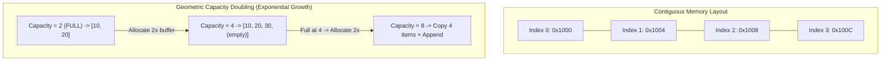

## 1. Problem Statement & Objectives

In modern computer architecture (Von Neumann model), physical RAM is structured as a contiguous sequence of byte-addressable memory cells. An **Array** is the most primitive and fundamental data structure in computer science, storing elements of identical data type in a **strictly contiguous block of memory**.

However, traditional static arrays require compile-time fixed dimensions. In real-world software engineering, dataset sizes fluctuate dynamically at runtime. The core engineering challenge: _How to design a **Dynamic Array (equivalent to `std::vector` in C++ or `ArrayList` in Java)** capable of dynamic growth while preserving instantaneous `O(1)` random access and maximizing CPU Cache Locality?_

## 2. Initial Naive Approach

A naive approach reallocates an array of size `N + 1` upon every insertion, copies all `N` existing elements, and frees the previous buffer.

This linear expansion strategy causes quadratic performance degradation: Appending `N` items requires `1 + 2 + ... + N = O(N²)` copy operations, driving the average cost per insertion to `O(N)` - unfeasible for scalable production systems.

## 3. Optimization Thinking & Algorithm Design

Modern runtimes resolve this through **Geometric (Exponential) Resizing**:

1. **Capacity Doubling:** When `size == capacity`, allocate a new heap block of size `capacity x 2`, move existing elements, and release the old buffer.
2. **Amortized Analysis:** While a resize pass takes `O(N)`, it happens infrequently (at capacities `1, 2, 4, 8, 16, ...`). Total copying across `N` insertions is bounded by `2N = O(N)`. Amortized cost per `push_back` is strictly **constant `O(1)`**.
3. **Direct Address Calculation:** Due to contiguous layout, accessing element `i` resolves in a single arithmetic instruction:

```
Address(arr[i]) = Base_Address + i x sizeof(ElementType)
```

4. **CPU Cache Locality:** Accessing one element automatically pre-fetches adjacent elements into the 64-byte L1/L2 CPU Cache line, making sequential array iteration significantly faster than linked structures.

## 4. Code Implementation & Execution Trace

Contiguous memory layout and geometric capacity doubling mechanics:



**Complete C++ Implementation: Custom Dynamic Vector:**

```
#include <iostream>
#include <stdexcept>
#include <utility>

template <typename T>
class MyVector {
private:
    T* data;
    size_t length;
    size_t cap;

    void reallocate(size_t newCapacity) {
        T* newBlock = new T[newCapacity];
        for (size_t i = 0; i < length; ++i) {
            newBlock[i] = std::move(data[i]);
        }
        delete[] data;
        data = newBlock;
        cap = newCapacity;
    }

public:
    MyVector() : data(nullptr), length(0), cap(0) {
        reallocate(2);
    }

    ~MyVector() {
        delete[] data;
    }

    void pushBack(const T& value) {
        if (length >= cap) {
            reallocate(cap * 2);
        }
        data[length++] = value;
    }

    void popBack() {
        if (length > 0) {
            --length;
        }
    }

    T& at(size_t index) {
        if (index >= length) {
            throw std::out_of_range("Vector index out of bounds!");
        }
        return data[index];
    }

    T& operator[](size_t index) { return data[index]; }
    const T& operator[](size_t index) const { return data[index]; }

    size_t size() const { return length; }
    size_t capacity() const { return cap; }
    bool empty() const { return length == 0; }
};

int main() {
    MyVector<int> vec;

    std::cout << "--- DYNAMIC VECTOR DEMO ---" << std::endl;
    for (int i = 1; i <= 5; ++i) {
        vec.pushBack(i * 10);
        std::cout << "Appended " << (i * 10) << " | Size: " << vec.size()
                  << " | Capacity: " << vec.capacity() << std::endl;
    }

    std::cout << "\nElements: ";
    for (size_t i = 0; i < vec.size(); ++i) {
        std::cout << vec[i] << " ";
    }
    std::cout << std::endl;

    return 0;
}
```

**Execution Trace Breakdown (Dry Run):**

- _Init:_ `size = 0, capacity = 2`. Heap allocation of size 2.
- _Append 10 (i=1):_ Stored at `data[0]` &rarr; `size = 1, capacity = 2`.
- _Append 20 (i=2):_ Stored at `data[1]` &rarr; `size = 2, capacity = 2` (Full).
- _Append 30 (i=3):_ Capacity exceeded &rarr; Triggers `reallocate(4)`, copies `[10, 20]`, sets `data[2] = 30` &rarr; `size = 3, capacity = 4`.
- _Append 40 (i=4):_ Stored at `data[3]` &rarr; `size = 4, capacity = 4`.
- _Append 50 (i=5):_ Triggers `reallocate(8)` &rarr; `size = 5, capacity = 8`.

## 5. Complexity Evaluation & Real-world Applications

Performance Scorecard anchored to RAM Model metrics:

- **Random Index Access:** `O(1)` strict constant time via direct memory offset arithmetic.
- **Append (push_back):** `O(1)` Amortized time, `O(N)` worst-case when triggering reallocation.
- **Arbitrary Insert / Delete:** `O(N)` due to shifting trailing elements.
- **Space Complexity:** `O(N)` with 50%-100% memory utilization efficiency.
- **Real-World Applications:**
  <ul>
  **Foundational Building Block:** Backing store for Hash Tables, Binary Heaps, and Ring Buffers.
- **Computer Graphics & Gaming:** 3D transformation matrices and GPU vertex buffers.
- **Database Storage Engines:** Storing page blocks in contiguous memory to optimize disk sequential I/O.

</li>
</ul>
