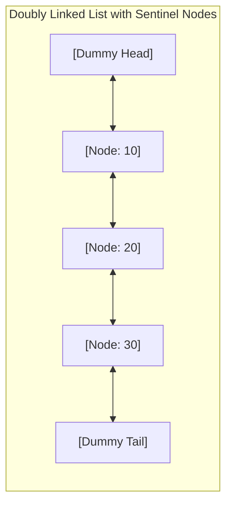

## Problem Statement & Objectives

While Arrays require contiguous allocations and suffer `O(N)` overhead during arbitrary insertions or deletions, many systems (such as OS process schedulers, text editor buffers, and LRU Caches) demand **fragmented heap allocation** and **constant `O(1)` insertion/deletion** at designated pointer locations.

A **Linked List** achieves this by structuring data as discrete **Nodes** scattered across heap memory, interconnected via **Explicit Pointers**.

## Initial Naive Approach

The simplest representation is the **Singly Linked List**: Each node contains payload data and a single `next` pointer. However, single linkage is strictly unidirectional; deleting a node requires finding its predecessor in `O(N)` time.

A **Doubly Linked List** equips each node with both `next` and `prev` pointers, enabling bidirectional traversal and true `O(1)` node self-removal.

## Optimization Thinking & Algorithm Design

Managing raw pointer rearrangements frequently invites subtle bugs (e.g., null dereferences on empty lists or single-element lists). Production implementations utilize **Sentinel (Dummy) Nodes**:

1. **Sentinel Pattern:** Instantiate permanent `dummyHead` and `dummyTail` nodes. An empty list maintains `dummyHead->next = dummyTail` and `dummyTail->prev = dummyHead`. All data nodes reside strictly between them.
2. **Eliminating Edge-Case Branches:** Insertions and deletions at head, tail, or middle follow an identical 4-pointer assignment pattern, eliminating all `if (head == nullptr)` special cases.
3. **Insertion Routine:**

```c++
newNode->next = target;
newNode->prev = target->prev;
target->prev->next = newNode;
target->prev = newNode;
```

4. **Deletion Routine:**

```c++
target->prev->next = target->next;
target->next->prev = target->prev;
delete target;
```

## Code Implementation & Execution Trace

Doubly linked list architecture with Sentinel Dummy Head/Tail:



**Complete C++ Implementation (Doubly Linked List with Sentinel Nodes):**

```c++
#include <iostream>

template <typename T>
class DoublyLinkedList {
private:
    struct Node {
        T data;
        Node* prev;
        Node* next;
        Node(const T& val = T()) : data(val), prev(nullptr), next(nullptr) {}
    };

    Node* head;
    Node* tail;
    size_t count;

public:
    DoublyLinkedList() : count(0) {
        head = new Node();
        tail = new Node();
        head->next = tail;
        tail->prev = head;
    }

    ~DoublyLinkedList() {
        clear();
        delete head;
        delete tail;
    }

    void pushFront(const T& val) {
        insertAfter(head, val);
    }

    void pushBack(const T& val) {
        insertAfter(tail->prev, val);
    }

    void insertAfter(Node* prevNode, const T& val) {
        Node* newNode = new Node(val);
        Node* nextNode = prevNode->next;

        newNode->next = nextNode;
        newNode->prev = prevNode;
        prevNode->next = newNode;
        nextNode->prev = newNode;

        ++count;
    }

    void removeNode(Node* target) {
        if (target == head || target == tail || target == nullptr) return;

        target->prev->next = target->next;
        target->next->prev = target->prev;
        delete target;
        --count;
    }

    void popFront() {
        if (!empty()) removeNode(head->next);
    }

    void popBack() {
        if (!empty()) removeNode(tail->prev);
    }

    void clear() {
        while (!empty()) popFront();
    }

    size_t size() const { return count; }
    bool empty() const { return count == 0; }

    void printForward() const {
        std::cout << "Forward:  ";
        for (Node* curr = head->next; curr != tail; curr = curr->next) {
            std::cout << curr->data << " <-> ";
        }
        std::cout << "NULL" << std::endl;
    }
};

int main() {
    DoublyLinkedList<int> list;

    std::cout << "--- DOUBLY LINKED LIST SENTINEL DEMO ---" << std::endl;
    list.pushBack(10);
    list.pushBack(20);
    list.pushBack(30);
    list.pushFront(5);

    list.printForward(); // 5 <-> 10 <-> 20 <-> 30 <-> NULL

    list.popFront();
    list.popBack();

    list.printForward(); // 10 <-> 20 <-> NULL
    std::cout << "Current size: " << list.size() << std::endl;

    return 0;
}
```

**Execution Trace Breakdown (Dry Run):**

- _Init:_ `head <-> tail`.
- _`pushBack(10)`:_ Inserted after `head` &rarr; `head <-> [10] <-> tail`.
- _`pushBack(20)`:_ Inserted after `[10]` &rarr; `head <-> [10] <-> [20] <-> tail`.
- _`pushFront(5)`:_ Inserted after `head` &rarr; `head <-> [5] <-> [10] <-> [20] <-> tail`.
- _`popFront()`:_ Removes `[5]` &rarr; Re-links `head <-> [10]` in constant `O(1)` time.

## Complexity Evaluation & Real-world Applications

Performance Scorecard anchored to RAM Model metrics:

- **Insert / Delete with Pointer:** `O(1)` strictly (no element shifting required).
- **Push / Pop Front & Back:** `O(1)` constant time with tail pointers.
- **Search by Value:** `O(N)` sequential linear scan.
- **Access by Index:** `O(N)` (Random access unsupported).
- **Space Complexity:** `O(N)` with 16-byte pointer overhead per node on 64-bit platforms.
- **Real-World Applications:**
  - **LRU Cache (Least Recently Used):** Pairing Doubly Linked List with Hash Maps for `O(1)` eviction and lookup.
  - **OS Process Scheduling:** Managing execution Ready Queues and Memory Free Lists.
  - **Media Players & Web Browsers:** Managing Next/Prev playlist tracks and browser history navigation.
