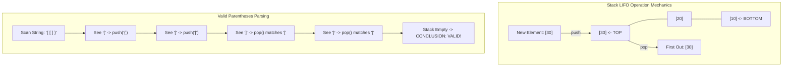

## 1. Problem Statement & Objectives

In systems engineering, numerous tasks require **Backtracking**, **Undo/Redo capabilities**, or **Nested Context Evaluation** (such as compiler syntax parsing or CPU function call dispatching). Common invariant: *The most recently initiated operation must be the first to complete.*

A **Stack** is a linear abstract data structure governed strictly by the **Last-In, First-Out (LIFO)** principle. All element additions and removals occur exclusively at a single boundary designated as the **Top**.

## 2. Initial Naive Approach

Stack can be implemented via two foundational architectures:

1. **Dynamic Array Stack:** Elements stored in a resizing vector with top at index `size - 1`. Delivers superior cache locality and amortized `O(1)` operations.
2. **Linked List Stack:** Nodes linked dynamically with top at `head`. Guarantees true worst-case `O(1)` operations without resize pauses.

## 3. Optimization Thinking & Algorithm Design

Three core Stack invariants:

- `push(x)`: Inserts element onto the Top in `O(1)`.
- `pop()`: Removes Top element in `O(1)` (raises *Stack Underflow* if empty).
- `top() / peek()`: Inspects Top element without removal in `O(1)`.

**Core Application: Valid Parentheses Parsing:**

Given a string containing bracket characters `'('`, `')'`, `'{'`, `'}'`, `'['`, `']'`. The sequence is valid if brackets close in correct symmetric nested order.

- When encountering opening brackets (`(`, `{`, `[`): `push` to Stack.
- When encountering closing brackets (`)`, `}`, `]`): If Stack is empty, fail immediately. Otherwise `pop` Top and verify matching pair type.
- End of string: If Stack is empty, string is strictly valid.

## 4. Code Implementation & Execution Trace

Visualizing LIFO semantics and bracket validation pipeline:



**Complete C++ Implementation: Generic Stack and Parentheses Validator:**

```c++
#include <iostream>
#include <vector>
#include <string>
#include <stdexcept>

template <typename T>
class MyStack {
private:
    std::vector<T> storage;

public:
    void push(const T& value) { storage.push_back(value); }

    void pop() {
        if (empty()) throw std::underflow_error("Stack underflow!");
        storage.pop_back();
    }

    T& top() {
        if (empty()) throw std::underflow_error("Stack is empty!");
        return storage.back();
    }

    const T& top() const {
        if (empty()) throw std::underflow_error("Stack is empty!");
        return storage.back();
    }

    bool empty() const { return storage.empty(); }
    size_t size() const { return storage.size(); }
};

bool isValidParentheses(const std::string& s) {
    MyStack<char> st;

    for (char c : s) {
        if (c == '(' || c == '{' || c == '[') {
            st.push(c);
        } else if (c == ')' || c == '}' || c == ']') {
            if (st.empty()) return false;

            char topChar = st.top();
            st.pop();

            if ((c == ')' && topChar != '(') ||
                (c == '}' && topChar != '{') ||
                (c == ']' && topChar != '[')) {
                return false;
            }
        }
    }

    return st.empty();
}

int main() {
    std::string s1 = "{[()]}";
    std::string s2 = "{[(])}";

    std::cout << "--- VALID PARENTHESES STACK DEMO ---" << std::endl;
    std::cout << s1 << " -> " << (isValidParentheses(s1) ? "VALID" : "INVALID") << std::endl;
    std::cout << s2 << " -> " << (isValidParentheses(s2) ? "VALID" : "INVALID") << std::endl;

    return 0;
}
```

**Execution Trace Breakdown (Dry Run):**

- *Input:* `"{[()]}"`.
- *Scan `'{'`, `'['`, `'('`:* Pushed sequentially &rarr; Stack = `['{', '[', '(']`.
- *Scan `')'`:* Pops `'('` &rarr; Match! Stack = `['{', '[']`.
- *Scan `']'`:* Pops `'['` &rarr; Match! Stack = `['{']`.
- *Scan `'}'`:* Pops `'{'` &rarr; Match! Stack = `[]`.
- *Result:* Empty stack confirms valid nesting.

## 5. Complexity Evaluation & Real-world Applications

Performance Scorecard anchored to RAM Model metrics:

- **Push / Pop / Top:** `O(1)` strict constant operations.
- **Search:** `O(N)` (requires unloading the stack).
- **Space Complexity:** `O(N)` linear auxiliary memory.
- **Real-World Applications:**
  - **Runtime Call Stack:** Managing function activation frames and recursion unwind addresses.
  - **Software Undo / Redo Buffers:** Action history rollbacks in IDEs and graphic editors.
  - **Expression Parsing:** Infix-to-Postfix conversion (Shunting-Yard algorithm) and RPN calculators.
  - **Iterative DFS:** Eliminating stack overflow risks during deep graph traversals.
