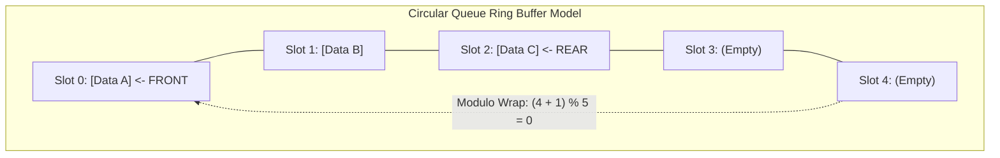

## Problem Statement & Objectives

In asynchronous event-driven architectures, web server connection listeners, OS print spoolers, and message brokers (Kafka, RabbitMQ), incoming tasks must be processed in **chronological arrival sequence**: *The earliest submitted job must be served first.*

A **Queue** is a linear structure governed by the **First-In, First-Out (FIFO)** principle. Elements are appended at the **Rear / Tail** and extracted from the opposing **Front / Head**.

## Initial Naive Approach

Implementing a queue on a linear array increments `rear` on enqueue and `front` on dequeue.

Over time, `rear` hits the buffer boundary while vacated slots before `front` sit idle. The queue mistakenly rejects insertions despite ample free memory - a defect known as **False Overflow**.

## Optimization Thinking & Algorithm Design

The standard architectural solution is the **Circular Queue (Ring Buffer)**:

1. **Modulo Wrapping Arithmetic:** Wrap array indices continuously using modulo arithmetic:

```
next_index = (current_index + 1) % capacity
```
2. **Full vs Empty Distinction:** Track explicit element count `count`: Empty when `count == 0`, Full when `count == capacity`.
3. **Constant Time Invariant:** Both `enqueue` and `dequeue` execute in deterministic **`O(1)`** time with zero memory allocations or element copying.

## Code Implementation & Execution Trace

Circular Queue Ring Buffer architecture:



**Complete C++ Implementation: Circular Queue Ring Buffer:**

```c++
#include <iostream>
#include <vector>
#include <stdexcept>

template <typename T>
class CircularQueue {
private:
    std::vector<T> buffer;
    size_t frontIdx;
    size_t rearIdx;
    size_t count;
    size_t capacity;

public:
    CircularQueue(size_t cap) 
        : buffer(cap), frontIdx(0), rearIdx(0), count(0), capacity(cap) {}

    bool enqueue(const T& value) {
        if (isFull()) return false;
        buffer[rearIdx] = value;
        rearIdx = (rearIdx + 1) % capacity;
        ++count;
        return true;
    }

    bool dequeue(T& outValue) {
        if (isEmpty()) return false;
        outValue = buffer[frontIdx];
        frontIdx = (frontIdx + 1) % capacity;
        --count;
        return true;
    }

    T front() const {
        if (isEmpty()) throw std::underflow_error("Queue is empty!");
        return buffer[frontIdx];
    }

    bool isEmpty() const { return count == 0; }
    bool isFull() const { return count == capacity; }
    size_t size() const { return count; }
};

int main() {
    CircularQueue<int> q(4);

    std::cout << "--- CIRCULAR QUEUE DEMO ---" << std::endl;
    q.enqueue(10);
    q.enqueue(20);
    q.enqueue(30);
    q.enqueue(40);

    int val;
    q.dequeue(val); // 10
    q.dequeue(val); // 20

    q.enqueue(50); // Wraps around into slot 0
    q.enqueue(60); // Wraps around into slot 1

    std::cout << "Front item: " << q.front() << std::endl; // 30

    return 0;
}
```

**Execution Trace Breakdown (Dry Run):**

- *Init:* `capacity = 4, count = 0`.
- *Enqueue 10, 20, 30, 40:* Slots 0..3 populated &rarr; `rearIdx = (3 + 1) % 4 = 0`. Full!
- *Dequeue 10, 20:* `frontIdx` advances to index 2 &rarr; `count = 2`.
- *Enqueue 50, 60:* Stored at indices 0 and 1 via modulo arithmetic without allocation delays.
- *Front check:* Points stably to index 2 (value `30`).

## Complexity Evaluation & Real-world Applications

Performance Scorecard anchored to RAM Model metrics:

- **Enqueue / Dequeue / Front:** `O(1)` strict deterministic constant time.
- **Space Complexity:** `O(K)` fixed pre-allocated buffer memory.
- **Real-World Applications:**
  - **Breadth-First Search (BFS):** Level-order graph traversal and shortest-path pathfinding.
  - **CPU Task Scheduling:** Round-Robin process time slicing in operating system kernels.
  - **Producer-Consumer Pipelines:** Lock-free ring buffers for high-frequency inter-thread communication.
  - **Real-time Audio Streaming:** Frame buffers preventing audio playback stuttering.
