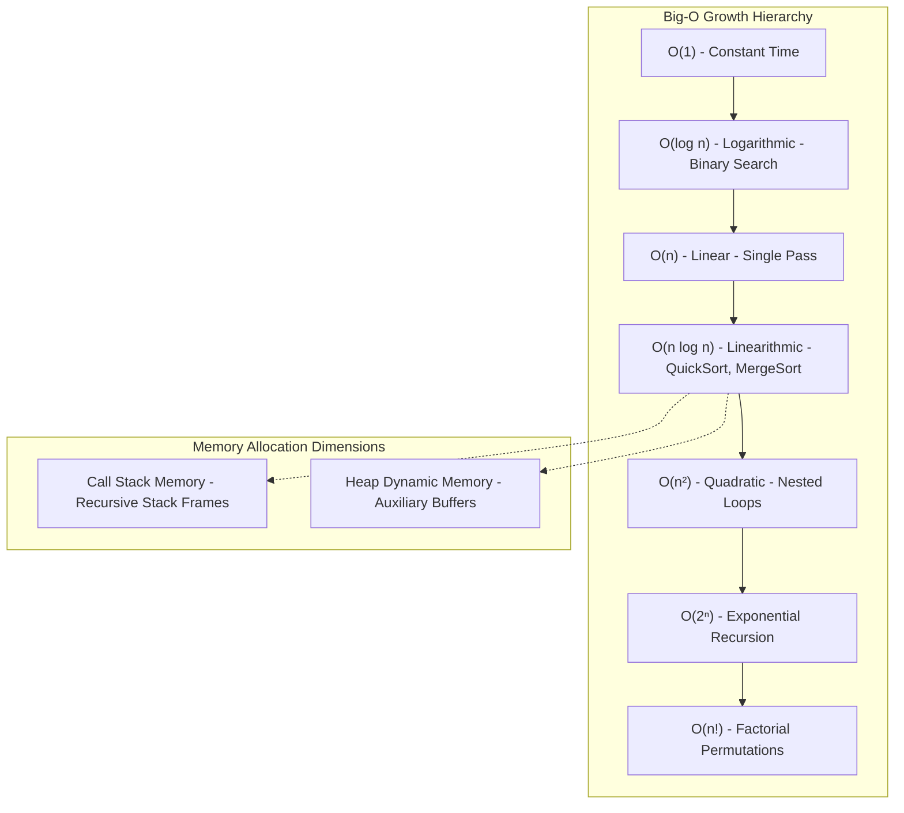

## 1. Problem Statement & Objectives

In software engineering and distributed systems optimization, the pivotal question every engineer must answer before deploying code to Production is: *"How fast does this algorithm execute, and how much computational resources will it consume when user traffic scales by 1,000x?"*.

A classic pitfall among junior developers is relying solely on physical Wall-clock timers via `console.time()` or `System.nanoTime()` to benchmark speed. This empirical approach is fundamentally non-deterministic because physical execution time fluctuates with CPU architecture, operating system load, background threads, and compiler optimizations. Computer science resolves this by introducing a **Standardized Mathematical Evaluation Framework** independent of hardware environments.

## 2. Initial Naive Approach

Empirical benchmarking pitfalls:

- Executing algorithms on a developer laptop with small sample sizes (N = 100) and measuring millisecond latency.
- *Why does this fail in production?* An O(N²) algorithm might execute in just `0.2ms` on N = 100, giving the illusion of speed. However, when scaled to N = 1,000,000 in production, execution time explodes to **over 11 days**, freezing servers and causing cascading outages.

We require Asymptotic Analysis to mathematically model and predict resource consumption as input size N approaches infinity.

## 3. Optimization Thinking & Algorithm Design

To rigorously benchmark algorithms across this series, we establish an evaluation model rooted in the **Random Access Machine (RAM) Model of Computation** across three core pillars:

1. **Asymptotic Notation Hierarchy:**

- **Big-O (O):** Mathematical Upper Bound - Represents the worst-case scenario. This is the primary contractual metric for system SLAs.
- **Big-Omega (Ω):** Mathematical Lower Bound - Represents the best-case theoretical execution limit.
- **Big-Theta (Θ):** Tight Bound - When upper and lower asymptotic bounds coincide, capturing true average behavior.
2. **Decoupling Time vs Space Complexity:**

- **Time Complexity:** Number of primitive machine operations (assignments, comparisons, arithmetic) expressed as a function of input size N.
- **Space Complexity (Total Space vs Auxiliary Space):** Total memory consumed during runtime. *Auxiliary Space* specifically denotes extra temporary memory allocated by the algorithm itself (excluding input storage), encompassing dynamic Heap buffers and recursive Call Stack frames.

## 4. Code Implementation & Execution Trace

Big-O growth hierarchy diagram and system memory allocation dimensions:

**TypeScript Reference Implementations for Big-O Tiers:**

- **O(1) Constant Time:** Array index access `arr[0]` or HashMap lookup.
- **O(log N) Logarithmic Time:** Binary Search halving the candidate search space at each iteration.
- **O(N) Linear Time:** Iterating through N elements in a single sequential pass.
- **O(N log N) Linearithmic Time:** Divide-and-conquer sorting algorithms like QuickSort, MergeSort, TimSort.
- **O(N²) Quadratic Time:** Nested loops inspecting all candidate pairs (i, j).

## 5. Complexity Evaluation & Real-world Applications

**The Standardized 5-Point Evaluation Framework for the Series:**

Every subsequent article in this series will benchmark algorithms against these 5 core metrics:

1. **Worst-Case Time Complexity (O):** Ensures system resiliency against adversarial payloads.
2. **Best/Average-Case Time (Ω / Θ):** Real-world operational throughput on random distributions.
3. **Auxiliary Space Complexity:** Transient RAM footprint across Call Stack and Heap allocations.
4. **Stability &amp; In-Place Capability:** Preserving relative ordering of identical keys without extra memory allocations.
5. **Scalability Threshold:** Maximum input size N executing in under `100ms` in low-latency production systems.
