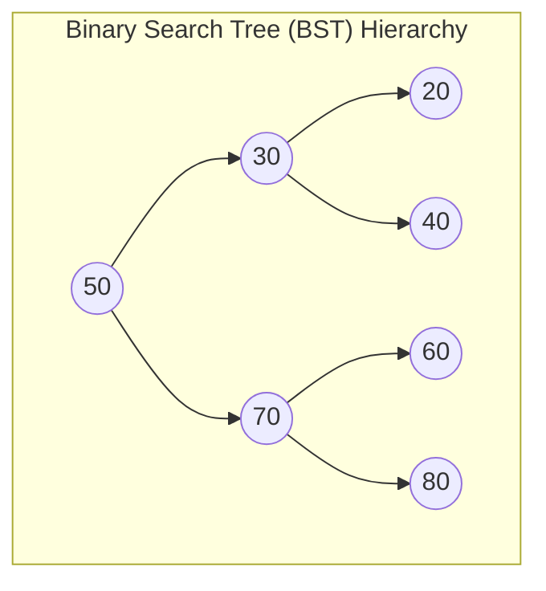

## 1. Problem Statement & Objectives

Linear data structures organize elements sequentially. However, real-world information is intrinsically **Hierarchical** - such as file directory trees, HTML DOM element graphs in web browsers, or decision trees in machine learning.

A **Tree** is an acyclic non-linear data structure comprising connected nodes branching downwards from a unique **Root Node**.

The preeminent tree structure is the **Binary Search Tree (BST)**: Each node possesses at most 2 children (`left` and `right`), satisfying the **BST Invariant**:

```
All keys in Left Subtree < Root Key < All keys in Right Subtree
```

## 2. Initial Naive Approach

Why does BST outperform Arrays and Linked Lists?

- Sorted Array: Fast `O(\log N)` lookup, but sluggish `O(N)` insertion/deletion.
- Linked List: Fast `O(1)` insertion with known pointer, but sluggish `O(N)` lookup.
- **BST synthesizes the best of both:** Providing `O(\log N)` Search, Insert, and Delete simultaneously on balanced trees.

## 3. Optimization Thinking & Algorithm Design

**The 4 Foundational Tree Traversals:**

1. **In-order Traversal (Left &rarr; Root &rarr; Right):** *Golden property:* In-order traversal on a BST produces a **strictly ascending sorted sequence**.
2. **Pre-order Traversal (Root &rarr; Left &rarr; Right):** Used for tree cloning and prefix serialization.
3. **Post-order Traversal (Left &rarr; Right &rarr; Root):** Evaluates subtrees first, mandatory for recursive memory deallocation from leaves up to root.
4. **Level-order Traversal (BFS):** Scans nodes tier-by-tier horizontally utilizing a Queue.

**BST Deletion (3 Cases):**

- *Case 1 (Leaf - 0 children):* Remove node directly.
- *Case 2 (1 child):* Splice child directly into parent.
- *Case 3 (2 children):* Locate the **In-order Successor** (minimum node in right subtree), copy its value into current node, and recursively delete the successor.

## 4. Code Implementation & Execution Trace

Binary Search Tree structure and In-Order sorted progression:



**Complete C++ Implementation: Binary Search Tree with Search, Insert, Delete &amp; Traversals:**

```
#include <iostream>
#include <queue>

class BinarySearchTree {
private:
    struct TreeNode {
        int val;
        TreeNode* left;
        TreeNode* right;
        TreeNode(int x) : val(x), left(nullptr), right(nullptr) {}
    };

    TreeNode* root;

    TreeNode* insertInternal(TreeNode* node, int val) {
        if (node == nullptr) return new TreeNode(val);
        if (val < node->val) {
            node->left = insertInternal(node->left, val);
        } else if (val > node->val) {
            node->right = insertInternal(node->right, val);
        }
        return node;
    }

    bool searchInternal(TreeNode* node, int val) const {
        if (node == nullptr) return false;
        if (node->val == val) return true;
        if (val < node->val) return searchInternal(node->left, val);
        return searchInternal(node->right, val);
    }

    TreeNode* findMin(TreeNode* node) const {
        while (node && node->left != nullptr) {
            node = node->left;
        }
        return node;
    }

    TreeNode* removeInternal(TreeNode* node, int val) {
        if (node == nullptr) return nullptr;

        if (val < node->val) {
            node->left = removeInternal(node->left, val);
        } else if (val > node->val) {
            node->right = removeInternal(node->right, val);
        } else {
            if (node->left == nullptr) {
                TreeNode* temp = node->right;
                delete node;
                return temp;
            } else if (node->right == nullptr) {
                TreeNode* temp = node->left;
                delete node;
                return temp;
            }
            TreeNode* successor = findMin(node->right);
            node->val = successor->val;
            node->right = removeInternal(node->right, successor->val);
        }
        return node;
    }

    void inOrderInternal(TreeNode* node) const {
        if (node == nullptr) return;
        inOrderInternal(node->left);
        std::cout << node->val << " ";
        inOrderInternal(node->right);
    }

    void destroyTree(TreeNode* node) {
        if (node == nullptr) return;
        destroyTree(node->left);
        destroyTree(node->right);
        delete node;
    }

public:
    BinarySearchTree() : root(nullptr) {}
    ~BinarySearchTree() { destroyTree(root); }

    void insert(int val) { root = insertInternal(root, val); }
    bool search(int val) const { return searchInternal(root, val); }
    void remove(int val) { root = removeInternal(root, val); }

    void printInOrder() const {
        std::cout << "In-Order Traversal (Sorted): ";
        inOrderInternal(root);
        std::cout << std::endl;
    }
};

int main() {
    BinarySearchTree bst;

    std::cout << "--- BINARY SEARCH TREE DEMO ---" << std::endl;
    bst.insert(50);
    bst.insert(30);
    bst.insert(70);
    bst.insert(20);
    bst.insert(40);
    bst.insert(60);
    bst.insert(80);

    bst.printInOrder(); // 20 30 40 50 60 70 80

    std::cout << "Search 40: " << (bst.search(40) ? "FOUND" : "NOT FOUND") << std::endl;

    std::cout << "Deleting root node 50 (2 children)..." << std::endl;
    bst.remove(50);
    bst.printInOrder(); // 20 30 40 60 70 80

    return 0;
}
```

**Execution Trace Breakdown (Dry Run):**

- *Insert:* `50, 30, 70, 20, 40, 60, 80` builds balanced 3-tier tree.
- *In-order:* Traverses left subtree `[20, 30, 40]` &rarr; Root `50` &rarr; Right subtree `[60, 70, 80]` &rarr; Yields sorted sequence.
- *Delete 50:* Successor located at `60` &rarr; Roots becomes `60`, leaf 60 unlinked &rarr; BST invariant fully preserved.

## 5. Complexity Evaluation & Real-world Applications

Performance Scorecard anchored to RAM Model metrics:

- **Search / Insert / Delete (Average Case):** `O(\log N)` proportional to tree depth `h ~ \log₂ N`.
- **Worst Case (Degenerate Tree):** `O(N)` (resolved by self-balancing Red-Black trees in `std::map`).
- **Traversals:** `Θ(N)` time with `O(h)` Call Stack memory.
- **Real-World Applications:**
  <ul>
  **C++ STL std::map / std::set:** Backed by Red-Black Trees guaranteeing `O(\log N)` operations.
- **Database Indexes (B-Tree / B+ Tree):** Multi-way tree extensions optimizing disk block lookups.
- **Huffman Compression Coding:** Binary prefix trees generating minimal-length bit encodings.

</li>
</ul>
