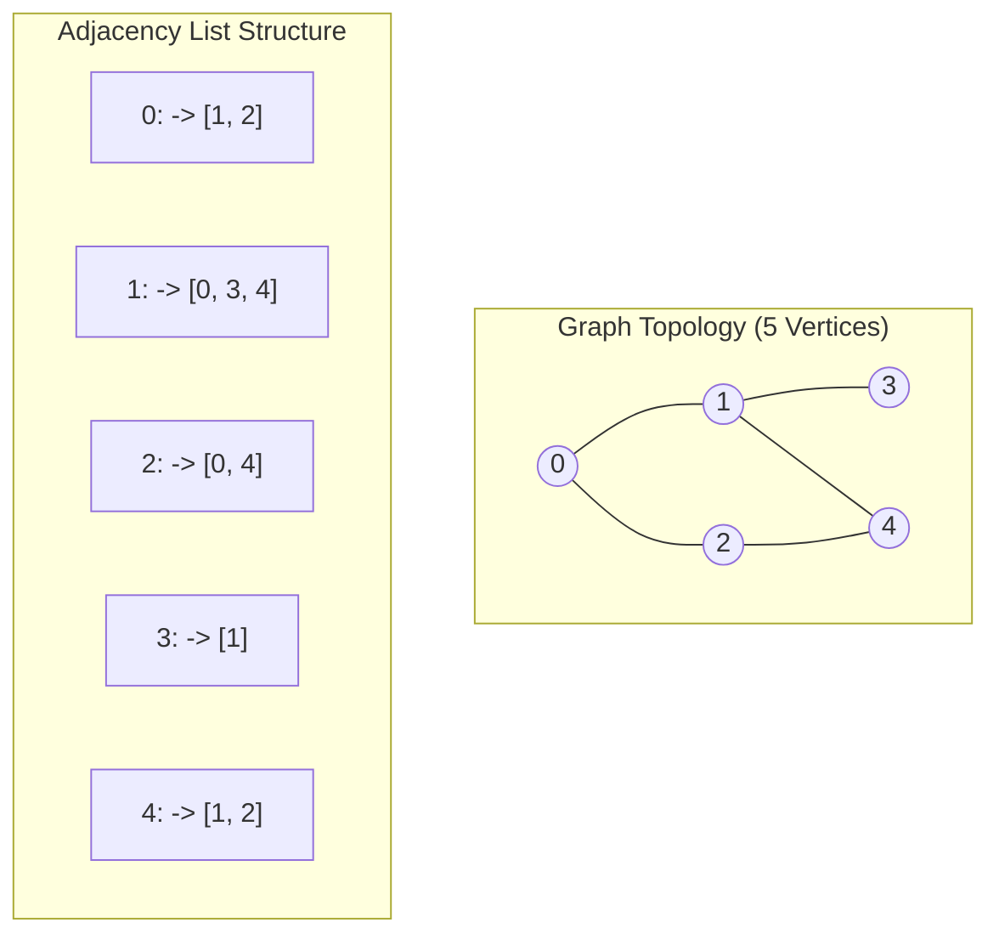

## 1. Problem Statement & Objectives

When modeling complex interconnected systems - such as social media friend networks, Google PageRank hyperlink topologies, international airline flight routes, or power distribution grids - relationships transcend linear and hierarchical structures into **arbitrary multi-dimensional meshes**.

A **Graph** is the most generalized non-linear data structure, formally defined as a pair `G = (V, E)` where:

- `V` (Vertices / Nodes): Discrete entities (users, airports, servers).
- `E` (Edges / Links): Connections between pairs of vertices (friendships, flight routes, network cables). Edges can be Directed or Undirected, Weighted or Unweighted.

## 2. Initial Naive Approach

Two foundational graph representations in memory:

1. **Adjacency Matrix:**
  

- A 2D array `adj[V][V]` where `adj[u][v] = 1` indicates an edge between `u` and `v`.
- *Pros:* Instantaneous `O(1)` edge existence checks.
- *Cons:* High fixed `O(V²)` memory consumption on sparse networks.
2. **Adjacency List:**
  

- An array of lists: `std::vector<std::vector<int>> adj(V)` storing only incident neighbors.
- *Pros:* Optimal `O(V + E)` memory scaling and linear `O(deg(u))` neighbor traversal. Standard representation in 99% of production systems.

## 3. Optimization Thinking & Algorithm Design

**Two Foundational Graph Traversals:**

1. **Breadth-First Search (BFS):**
  

- Operates via a **Queue**, radiating outwards level-by-level.
- *Key Property:* Guarantees finding the **shortest unweighted path** from source to all destinations.
2. **Depth-First Search (DFS):**
  

- Operates via **Recursion / Call Stack**, exploring branches deeply before backtracking.
- *Key Property:* Used for cycle detection, topological sorting, and strongly connected components (SCC).

*Safety Invariant:* A boolean `visited[V]` table is mandatory to prevent infinite loops on cyclic topologies.

## 4. Code Implementation & Execution Trace

Adjacency list structure and graph traversal topology:



**Complete C++ Implementation: Graph Class with Adjacency List, BFS and DFS:**

```
#include <iostream>
#include <vector>
#include <queue>

class Graph {
private:
    int numVertices;
    std::vector<std::vector<int>> adj;

    void dfsInternal(int u, std::vector<bool>& visited) const {
        visited[u] = true;
        std::cout << u << " ";

        for (int v : adj[u]) {
            if (!visited[v]) {
                dfsInternal(v, visited);
            }
        }
    }

public:
    Graph(int vertices) : numVertices(vertices), adj(vertices) {}

    void addEdge(int u, int v, bool bidirectional = true) {
        adj[u].push_back(v);
        if (bidirectional) {
            adj[v].push_back(u);
        }
    }

    void bfs(int startNode) const {
        std::vector<bool> visited(numVertices, false);
        std::queue<int> q;

        visited[startNode] = true;
        q.push(startNode);

        std::cout << "BFS from " << startNode << ": ";
        while (!q.empty()) {
            int u = q.front();
            q.pop();
            std::cout << u << " ";

            for (int v : adj[u]) {
                if (!visited[v]) {
                    visited[v] = true;
                    q.push(v);
                }
            }
        }
        std::cout << std::endl;
    }

    void dfs(int startNode) const {
        std::vector<bool> visited(numVertices, false);
        std::cout << "DFS from " << startNode << ": ";
        dfsInternal(startNode, visited);
        std::cout << std::endl;
    }
};

int main() {
    Graph g(5);

    g.addEdge(0, 1);
    g.addEdge(0, 2);
    g.addEdge(1, 3);
    g.addEdge(1, 4);
    g.addEdge(2, 4);

    std::cout << "--- GRAPH TRAVERSAL DEMO ---" << std::endl;
    g.bfs(0); // BFS: 0 1 2 3 4
    g.dfs(0); // DFS: 0 1 3 4 2

    return 0;
}
```

**Execution Trace Breakdown (Dry Run):**

- *BFS from 0:* Pops 0 &rarr; Enqueues `1, 2` &rarr; Pops 1 &rarr; Enqueues `3, 4` &rarr; Pops 2, 3, 4 &rarr; Traversal sequence: `0 1 2 3 4`.
- *DFS from 0:* Visits `0 -> 1 -> 3 (backtracks) -> 4 -> 2` &rarr; Traversal sequence: `0 1 3 4 2`.

## 5. Complexity Evaluation & Real-world Applications

Performance Scorecard anchored to RAM Model metrics:

- **Time Complexity:** `Θ(V + E)` for BFS and DFS via Adjacency List (each vertex visited once, each edge inspected twice).
- **Space Complexity:** `O(V + E)` for Adjacency List graph storage, plus `O(V)` for `visited` status and traversal queues/stacks.
- **Adjacency Matrix vs Adjacency List:**
  <ul>
  Matrix: `O(V²)` space, `O(1)` edge lookup, `O(V)` neighbor search (Best for dense graphs `E ~ V²`).
- List: `O(V + E)` space, `O(deg(u))` edge lookup (Optimal for sparse graphs).

</li>
<li>**Real-World Applications:**
  

- **Social Network Graphs:** Friend-of-a-friend recommendations via 2-hop BFS.
- **Search Engine Web Crawlers:** Googlebot web graph indexing via distributed BFS.
- **Package Dependency Resolvers:** npm / yarn circular dependency checks and build order topological sorting via DFS.

</li>
</ul>
