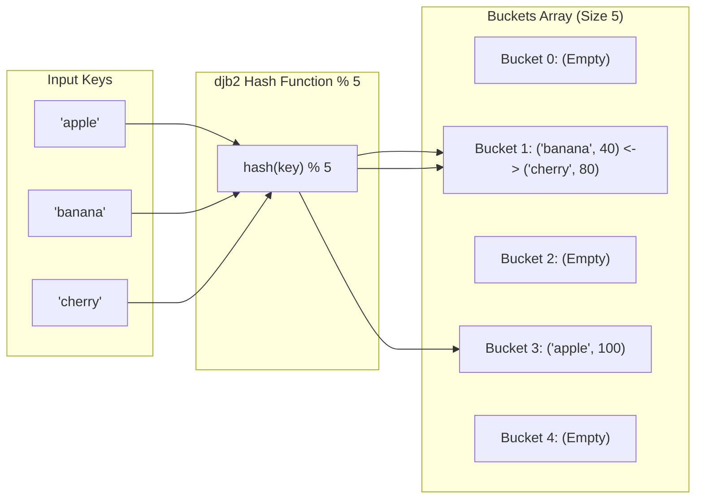

## 1. Problem Statement & Objectives

In high-throughput systems (such as user session stores, database index lookups, and distributed in-memory caches like Redis), Key-Value lookups execute millions of times per second. Linear scans across Arrays or Linked Lists taking `O(N)` time would bring production infrastructure to a halt.

A **Hash Table (Hash Map)** is a revolutionary data structure enabling **Insert**, **Delete**, and **Lookup** in **average constant time `O(1)`**, irrespective of dataset scale.

## 2. Initial Naive Approach

A Hash Table applies a **Hash Function** to map arbitrary keys to integer array slot indices (Buckets):

```
bucket_index = hash(key) % capacity
```

Core Mathematical Obstacle: By the *Pigeonhole Principle*, mapping an infinite domain of keys to a finite array space inevitably causes **two distinct keys to produce the exact same bucket index (`hash(k₁) % M == hash(k₂) % M`)**. This collision event is termed a **Hash Collision**.

## 3. Optimization Thinking & Algorithm Design

Two primary architectural strategies resolve collisions to sustain `O(1)` performance:

1. **Separate Chaining:**
  

- Each bucket houses a Linked List (or Red-Black Tree for deep collision chains).
- Colliding keys are appended to the bucket chain in `O(1)` time.
- Default strategy in C++ `std::unordered_map` and Java `HashMap`.
2. **Open Addressing (Linear Probing):**
  

- Elements reside directly in the table array. Upon collision, search sequentially for the next vacant slot: `(bucket + 1) % capacity`.
3. **Load Factor &amp; Dynamic Rehashing:**
  

- Load Factor `alpha = N / capacity` tracks table saturation.
- When `alpha >= 0.75`, the table allocates double capacity (`capacity x 2`) and re-hashes all entries, preserving average `O(1)` lookups.

## 4. Code Implementation & Execution Trace

Hash function mapping and Separate Chaining collision handling:



**Complete C++ Implementation: Custom HashTable with Separate Chaining:**

```
#include <iostream>
#include <vector>
#include <list>
#include <string>
#include <utility>

template <typename K, typename V>
class HashTable {
private:
    struct Entry {
        K key;
        V value;
    };

    std::vector<std::list<Entry>> table;
    size_t numElements;
    size_t capacity;

    size_t hashFunction(const std::string& key) const {
        unsigned long hash = 5381;
        for (char c : key) {
            hash = ((hash << 5) + hash) + static_cast<unsigned char>(c);
        }
        return hash % capacity;
    }

    void rehash() {
        size_t oldCapacity = capacity;
        capacity *= 2;
        std::vector<std::list<Entry>> oldTable = std::move(table);
        table.resize(capacity);
        numElements = 0;

        for (size_t i = 0; i < oldCapacity; ++i) {
            for (const auto& entry : oldTable[i]) {
                insert(entry.key, entry.value);
            }
        }
    }

public:
    HashTable(size_t initialCapacity = 7) 
        : numElements(0), capacity(initialCapacity) {
        table.resize(capacity);
    }

    void insert(const K& key, const V& value) {
        if (static_cast<double>(numElements) / capacity >= 0.75) {
            rehash();
        }

        size_t bucket = hashFunction(key);
        for (auto& entry : table[bucket]) {
            if (entry.key == key) {
                entry.value = value;
                return;
            }
        }
        table[bucket].push_back({key, value});
        ++numElements;
    }

    bool get(const K& key, V& outValue) const {
        size_t bucket = hashFunction(key);
        for (const auto& entry : table[bucket]) {
            if (entry.key == key) {
                outValue = entry.value;
                return true;
            }
        }
        return false;
    }

    bool remove(const K& key) {
        size_t bucket = hashFunction(key);
        for (auto it = table[bucket].begin(); it != table[bucket].end(); ++it) {
            if (it->key == key) {
                table[bucket].erase(it);
                --numElements;
                return true;
            }
        }
        return false;
    }

    size_t size() const { return numElements; }
};

int main() {
    HashTable<std::string, int> ht;

    std::cout << "--- HASH TABLE SEPARATE CHAINING DEMO ---" << std::endl;
    ht.insert("apple", 100);
    ht.insert("banana", 40);
    ht.insert("cherry", 80);

    int val;
    if (ht.get("banana", val)) {
        std::cout << "Value for 'banana': " << val << std::endl;
    }

    ht.remove("banana");
    std::cout << "Lookup 'banana' after delete: " 
              << (ht.get("banana", val) ? "FOUND" : "NOT FOUND") << std::endl;

    return 0;
}
```

**Execution Trace Breakdown (Dry Run):**

- *Insert "apple" (val 100):* Maps to `bucket 3` &rarr; Appends to `table[3]`.
- *Insert "banana" (val 40):* Maps to `bucket 1` &rarr; Appends to `table[1]`.
- *Insert "cherry" (val 80):* Collision at `bucket 1` &rarr; Appends to linked list at `table[1]`.
- *Lookup "banana":* Hashes to `bucket 1` &rarr; Traverses first node, matches "banana" &rarr; Returns `40` in `O(1)`.

## 5. Complexity Evaluation & Real-world Applications

Performance Scorecard anchored to RAM Model metrics:

- **Average Case Operations:** `O(1)` for Insert, Delete, and Lookup under uniform distribution.
- **Worst Case Operations:** `O(N)` under pathological collisions (mitigated to `O(\log N)` with Red-Black tree buckets).
- **Space Complexity:** `O(N + M)` where `N` is element count and `M` is bucket array size.
- **Real-World Applications:**
  <ul>
  **Database Hash Indexes:** Exact match acceleration in PostgreSQL / MySQL Memory Engine.
- **In-Memory Distributed Caches:** High-performance Key-Value storage in Redis and Memcached.
- **Compilers &amp; Interpreters:** Managing variable identifiers and scoping in Symbol Tables.

</li>
</ul>
