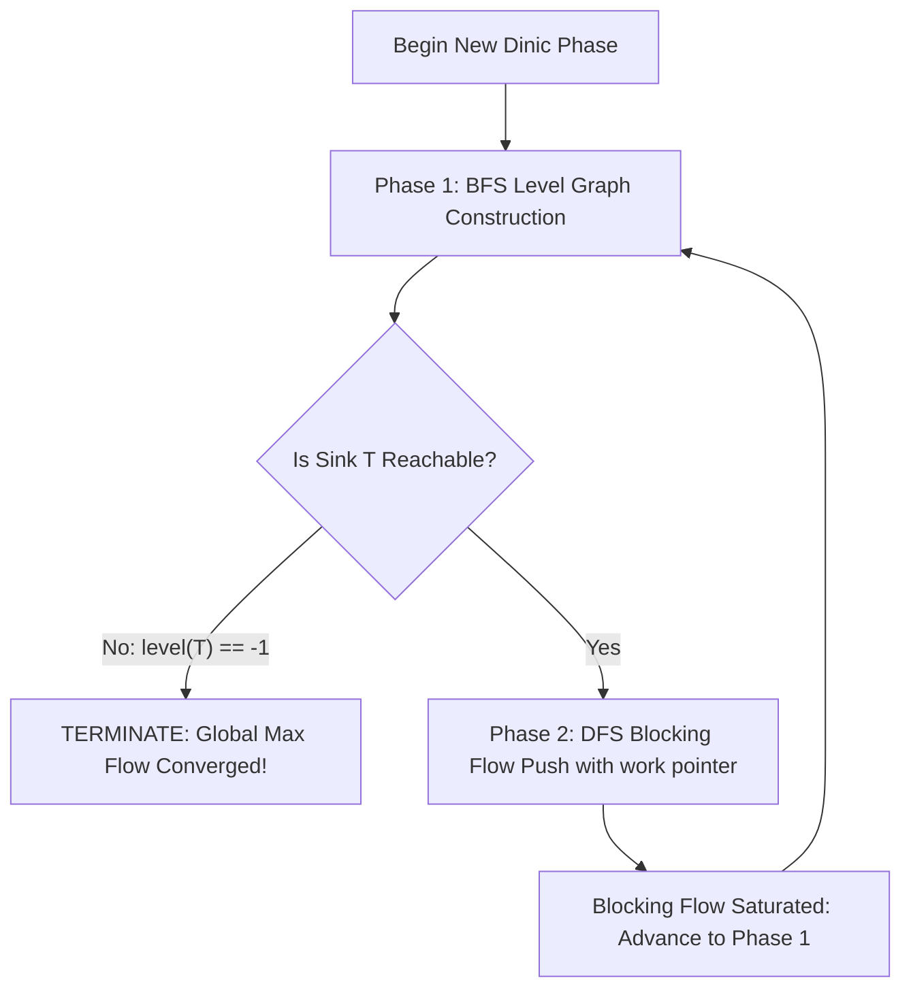

## 1. Problem Statement & Objectives

While Edmonds-Karp provides polynomial `O(V x E²)` guarantees, on modern graphs with tens of thousands of nodes and hundreds of thousands of edges, executing a full BFS pass to push flow along a *single augmenting path* introduces severe latency.

In 1970, mathematician Yefim A. Dinitz formulated **Dinic's Algorithm**. Dinic shifts the paradigm: Instead of single-path augmentation, it constructs a **Layered Level Graph** and pushes multiple augmenting paths simultaneously in a single phase via **Blocking Flows**.

Dinic achieves `O(V² x E)` on general networks and `O(E \sqrt{V})` on unit networks (equivalent to the Hopcroft-Karp maximum bipartite matching bound).

## 2. Initial Naive Approach

Architectural distinction between Edmonds-Karp and Dinic:

- **Edmonds-Karp:** Runs BFS &rarr; Augments 1 path &rarr; Destroys BFS tree &rarr; Repeats up to `O(V x E)` times.
- **Dinic:** Runs BFS to build a layered level graph &rarr; Runs DFS to push flow until all paths at that distance are completely saturated (Blocking Flow) &rarr; Advances to next phase. Strictly capped at `V - 1` phases.

## 3. Optimization Thinking & Algorithm Design

Dinic operates in 2 repeating phases:

1. **Phase 1: Level Graph Construction (BFS):**
  

- Assign source `level[s] = 0`.
- BFS propagates levels: For each edge with residual capacity `cap > 0`, set `level[v] = level[u] + 1`.
- If sink `t` is unreachable (`level[t] == -1`), terminate immediately &rarr; Max flow achieved.
2. **Phase 2: Blocking Flow Push (DFS):**
  

- Only advance across adjacent levels: `level[v] == level[u] + 1` and `cap > 0`.
- **Dead-End Pruning (Work Pointer Optimization):** Maintain array `work[u]` tracking current edge index. When a sub-branch yields zero flow, `work[u]` increments to discard that dead-end for the remainder of the phase, eliminating redundant traversals.

## 4. Code Implementation & Execution Trace

Two-phase architecture of Dinic's Algorithm:



**Complete C++ Implementation (Dinic's Algorithm with Work Pointer Optimization):**

```
#include <iostream>
#include <vector>
#include <queue>
#include <algorithm>

const long long INF = 1e18;

struct FlowEdge {
    int to;
    long long cap;
    long long flow = 0;
    int rev;
};

class Dinic {
private:
    int n, s, t;
    std::vector<std::vector<FlowEdge>> adj;
    std::vector<int> level;
    std::vector<int> work;

    bool bfs() {
        std::fill(level.begin(), level.end(), -1);
        level[s] = 0;
        std::queue<int> q;
        q.push(s);

        while (!q.empty()) {
            int u = q.front();
            q.pop();

            for (const auto& edge : adj[u]) {
                if (edge.cap - edge.flow > 0 && level[edge.to] == -1) {
                    level[edge.to] = level[u] + 1;
                    q.push(edge.to);
                }
            }
        }
        return level[t] != -1;
    }

    long long dfs(int u, long long pushed) {
        if (pushed == 0) return 0;
        if (u == t) return pushed;

        for (int& cid = work[u]; cid < static_cast<int>(adj[u].size()); ++cid) {
            auto& edge = adj[u][cid];
            int v = edge.to;

            if (level[u] + 1 != level[v] || edge.cap - edge.flow <= 0) {
                continue;
            }

            long long tr = dfs(v, std::min(pushed, edge.cap - edge.flow));
            if (tr == 0) {
                continue; // Dead end, work[u] will increment
            }

            edge.flow += tr;
            adj[v][edge.rev].flow -= tr;
            return tr;
        }
        return 0;
    }

public:
    Dinic(int numVertices, int source, int sink) 
        : n(numVertices), s(source), t(sink) {
        adj.resize(n);
        level.resize(n);
        work.resize(n);
    }

    void addEdge(int from, int to, long long cap) {
        FlowEdge a{to, cap, 0, static_cast<int>(adj[to].size())};
        FlowEdge b{from, 0, 0, static_cast<int>(adj[from].size())};
        adj[from].push_back(a);
        adj[to].push_back(b);
    }

    long long maxFlow() {
        long long totalFlow = 0;
        while (bfs()) {
            std::fill(work.begin(), work.end(), 0);
            while (long long pushed = dfs(s, INF)) {
                totalFlow += pushed;
            }
        }
        return totalFlow;
    }
};

int main() {
    int V = 6;
    int S = 0, T = 5;
    Dinic dinic(V, S, T);

    dinic.addEdge(0, 1, 10);
    dinic.addEdge(0, 2, 10);
    dinic.addEdge(1, 2, 2);
    dinic.addEdge(1, 3, 4);
    dinic.addEdge(1, 4, 8);
    dinic.addEdge(2, 4, 9);
    dinic.addEdge(3, 5, 10);
    dinic.addEdge(4, 3, 6);
    dinic.addEdge(4, 5, 10);

    long long maxF = dinic.maxFlow();
    std::cout << "--- DINIC MAXIMUM FLOW OUTPUT ---" << std::endl;
    std::cout << "Total Maximum Flow: " << maxF << std::endl;

    return 0;
}
```

**Execution Trace Breakdown (Dry Run):**

- *Phase 1:* BFS computes levels `[0, 1, 1, 2, 2, 3]`. DFS saturates `0->1->3->5` (4), `0->1->4->5` (6), `0->2->4->5` (4) &rarr; Flow = 14.
- *Phase 2:* Re-levels network &rarr; DFS pushes remaining capacity across `0->2->4->3->5` (5) &rarr; Flow = 19.
- *Phase 3:* BFS discovers sink unreachable &rarr; Maximum flow converged at `19`.

## 5. Complexity Evaluation & Real-world Applications

Performance Scorecard anchored to RAM Model metrics:

- **Time Complexity:**
  <ul>
  General Networks: `O(V² x E)`. At most `V - 1` BFS phases, each DFS blocking flow takes `O(V x E)`.
- Unit Networks: `O(E \sqrt{V})` - solves matching on 100,000 nodes in milliseconds.
- Bipartite Matching: `O(E \sqrt{V})` (Hopcroft-Karp equivalent).

</li>
<li>**Space Complexity:** `O(V + E)` for adjacency lists and symmetric `FlowEdge` records.</li>
<li>**Real-World Applications:**
  

- **Maximum Bipartite Matching:** University timetable scheduling, candidate-to-vacancy recruitment matching.
- **Project Selection Problem:** Optimizing enterprise investment portfolios with dependency constraints.
- **CDN Bandwidth Optimization:** Routing video streams from Edge nodes to client clusters.

</li>
</ul>
