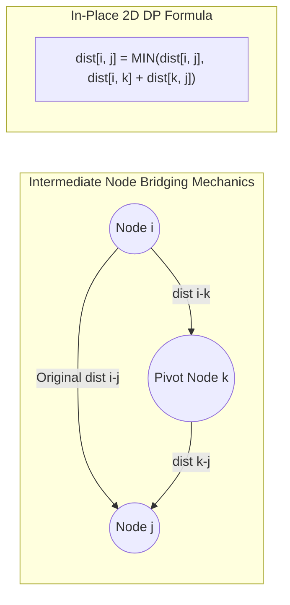

## 1. Problem Statement & Objectives

In distributed telecom backbones, logistics route matrix precomputation, and game engines, applications often require instant `O(1)` query responses for the shortest distance between **any arbitrary pair of nodes `(u, v)`**.

Problem statement: **All-Pairs Shortest Path (APSP)**. Given a directed graph `G = (V, E)` which may contain negative weights (but no negative cycles). Construct a complete 2D distance matrix `dist[V][V]` where `dist[i][j]` holds the minimum path length from `i` to `j` for all `0 <= i, j < V`.

The Floyd-Warshall algorithm (published by Robert Floyd and Stephen Warshall in 1962) provides a remarkably elegant 3-nested-loop dynamic programming solution.

## 2. Initial Naive Approach

Iterating Single-Source Shortest Path (SSSP) algorithms `V` times across every vertex:

- **Running Dijkstra `V` times:** `O(V x (V + E) \log V)`, but cannot handle negative edges.
- **Running Bellman-Ford `V` times:** `O(V² E)`, which explodes to `O(V⁴)` on dense graphs.

Floyd-Warshall provides a uniform `O(V³)` bound through in-place matrix dynamic programming with exceptional cache locality.

## 3. Optimization Thinking & Algorithm Design

The DP state characterizes shortest paths through **permitted intermediate vertices**:

1. **State Definition:** Let `dp[k][i][j]` denote the shortest distance from `i` to `j` using only intermediate vertices from subset `{0, 1, ..., k}`.
2. **State Transition:** Expanding the allowed intermediate vertex set from `k - 1` to `k`:

```
dp[k][i][j] = min(
    dp[k - 1][i][j],
    dp[k - 1][i][k] + dp[k - 1][k][j]
)
```

3. **In-Place 2D Matrix Optimization:** Because values in row `k` and column `k` remain unchanged when vertex `k` is the pivot, dimension `k` can be dropped, computing directly on `dist[i][j]`. _Crucial Rule:_ The intermediate pivot loop `k` must be the **outermost** loop.
4. **Negative Cycle Detection:** Inspect the main diagonal: If any `dist[i][i] < 0`, vertex `i` participates in a negative cycle.

## 4. Code Implementation & Execution Trace

Matrix transformation mechanics via intermediate pivot vertex `k`:



**Complete C++ Implementation (Floyd-Warshall with Next Node Matrix for Path Backtracking):**

```
#include <iostream>
#include <vector>
#include <algorithm>

const long long INF = 1e15;

void floydWarshall(int V, std::vector<std::vector<long long>>& dist,
                   std::vector<std::vector<int>>& nextNode) {
    for (int i = 0; i < V; ++i) {
        for (int j = 0; j < V; ++j) {
            if (i == j) {
                dist[i][j] = 0;
                nextNode[i][j] = j;
            } else if (dist[i][j] != INF) {
                nextNode[i][j] = j;
            } else {
                nextNode[i][j] = -1;
            }
        }
    }

    // k MUST be the outermost loop
    for (int k = 0; k < V; ++k) {
        for (int i = 0; i < V; ++i) {
            for (int j = 0; j < V; ++j) {
                if (dist[i][k] != INF && dist[k][j] != INF) {
                    if (dist[i][k] + dist[k][j] < dist[i][j]) {
                        dist[i][j] = dist[i][k] + dist[k][j];
                        nextNode[i][j] = nextNode[i][k];
                    }
                }
            }
        }
    }
}

bool hasNegativeCycle(int V, const std::vector<std::vector<long long>>& dist) {
    for (int i = 0; i < V; ++i) {
        if (dist[i][i] < 0) return true;
    }
    return false;
}

std::vector<int> getPath(int u, int v, const std::vector<std::vector<int>>& nextNode) {
    if (nextNode[u][v] == -1) return {};
    std::vector<int> path = {u};
    while (u != v) {
        u = nextNode[u][v];
        path.push_back(u);
    }
    return path;
}

int main() {
    int V = 4;
    std::vector<std::vector<long long>> dist(V, std::vector<long long>(V, INF));
    std::vector<std::vector<int>> nextNode(V, std::vector<int>(V, -1));

    dist[0][1] = 5;
    dist[0][3] = 10;
    dist[1][2] = 3;
    dist[2][3] = 1;

    floydWarshall(V, dist, nextNode);

    if (hasNegativeCycle(V, dist)) {
        std::cout << "Negative cycle detected!" << std::endl;
    } else {
        std::cout << "--- ALL-PAIRS SHORTEST PATH MATRIX ---" << std::endl;
        for (int i = 0; i < V; ++i) {
            for (int j = 0; j < V; ++j) {
                if (dist[i][j] == INF) std::cout << "INF\t";
                else std::cout << dist[i][j] << "\t";
            }
            std::cout << std::endl;
        }

        std::cout << "\nShortest path from 0 to 3: ";
        auto path = getPath(0, 3, nextNode);
        for (size_t i = 0; i < path.size(); ++i) {
            std::cout << path[i] << (i + 1 < path.size() ? " -> " : "");
        }
        std::cout << " (Cost: " << dist[0][3] << ")" << std::endl;
    }

    return 0;
}
```

**Execution Trace Breakdown (Dry Run):**

- _Init:_ `dist[0][1]=5, dist[0][3]=10, dist[1][2]=3, dist[2][3]=1`.
- _Pivot `k = 1`:_ Discovers path `0 -> 1 -> 2` with cost `5 + 3 = 8` &rarr; Updates `dist[0][2] = 8`.
- _Pivot `k = 2`:_ Relaxes path `0 -> 2 -> 3`: `dist[0][2] + dist[2][3] = 8 + 1 = 9 < 10` &rarr; Updates `dist[0][3] = 9`. Route optimizes from direct edge (10) to 3-hop path `0 -> 1 -> 2 -> 3` (9).
- _Convergence:_ Matrix stably settles across all pairs.

## 5. Complexity Evaluation & Real-world Applications

Performance Scorecard anchored to RAM Model metrics:

- **Time Complexity:** `Θ(V³)` strictly across all cases due to deterministic `V x V x V` triply nested loops. Completely independent of edge count `E`.
- **Space Complexity:** `O(V²)` for the 2D distance and predecessor matrices. Highly cache-friendly on modern CPUs due to contiguous memory stride access.
- **Real-World Applications:**
  <ul>
  **Transitive Closure & Reachability:** Warshall's algorithm variant computing reachability in static code analysis and dependency graphs.
- **Logistics & Airline Routing:** Fast lookup matrices for global hub-to-hub transit distances.
- **Social Network Graph Metrics:** Computing network diameter, closeness centrality, and betweenness metrics.

</li>
</ul>
