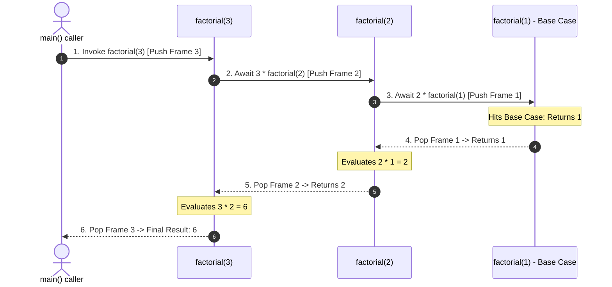

## 1. Problem Statement & Objectives

Complex hierarchical problems (binary tree traversals, directory tree walking, Backtracking searches, Divide and Conquer algorithms) are notoriously difficult to formulate using flat iterative loops. Problem statement: How can we solve a macro problem by decomposing it into *smaller subproblems of identical structure*?

Recursion is the foundational programming paradigm where a function calls itself repeatedly until reaching a well-defined base termination state.

## 2. Initial Naive Approach

Common recursion pitfalls:

- Missing or unreachable Base Cases &rarr; Unbounded recursive dispatch triggering catastrophic **Call Stack Overflow crashes**.
- Overlapping subproblem recalculation (e.g. naive Fibonacci) causing exponential `O(2ᴺ)` time explosion.

## 3. Optimization Thinking & Algorithm Design

Recursion invariants and Call Stack optimization:

1. **Two Invariant Components of Recursive Functions:**

- *Base Case:* The non-recursive boundary that returns an explicit result immediately without further function dispatch.
- *Recursive Step:* Calling the function with strictly narrowed arguments moving closer to the Base Case.
2. **Call Stack Frame Lifecycle:** Each invocation allocates an active Stack Frame (holding parameters, local variables, return pointers). Frames are popped sequentially upon unwinding.
3. **Tail Call Optimization (TCO):** When the recursive invocation is the *final operation* of the function with zero deferred computations, modern C++ compilers reuse the existing Stack Frame &rarr; Collapsing Auxiliary Space from `O(N)` to strict `O(1)`.

## 4. Code Implementation & Execution Trace

Visualizing Call Stack Push and Pop frame mechanics during `factorial(3)` execution:



**Standard C++ Implementation:**

```
#include <iostream>

// 1. Traditional Recursion: O(N) Call Stack Depth
long long factorial(int n) {
    if (n <= 1) return 1; // Base Case
    return n * factorial(n - 1); // Deferred multiplication requires frame preservation
}

// 2. Tail Recursive Optimization: O(1) Auxiliary Space via TCO
long long factorialTail(int n, long long accumulator = 1) {
    if (n <= 1) return accumulator; // Base Case
    // Tail call passes accumulated state directly
    return factorialTail(n - 1, n * accumulator);
}

// 3. Fast Exponentiation: O(log N) Time Complexity
double fastPower(double base, int exp) {
    if (exp == 0) return 1.0; // Base Case
    if (exp < 0) return 1.0 / fastPower(base, -exp);
    double half = fastPower(base, exp / 2);
    if (exp % 2 == 0) {
        return half * half;
    } else {
        return half * half * base;
    }
}

int main() {
    int n = 5;
    std::cout << n << "! (Tail Recursive) = " << factorialTail(n) << std::endl;
    std::cout << "2^10 (Fast Power) = " << fastPower(2.0, 10) << std::endl;
    return 0;
}
```

**Execution Trace Breakdown (Dry Run):**

- *Tracing `factorialTail(3, 1)`:*
- `N = 3, 	ext{acc} = 1`: Calls `factorialTail(2, 3)`.
- `N = 2, 	ext{acc} = 3`: Calls `factorialTail(1, 6)`.
- `N = 1, 	ext{acc} = 6`: Hits Base Case (`N <= 1`) &rarr; Returns `6` directly without frame unwinding delays.
- *Tracing `fastPower(2, 10)`:* Recursion divides exponent `10 -> 5 -> 2 -> 1 -> 0` &rarr; Completed in 4 invocations rather than 10 iterations.

## 5. Complexity Evaluation & Real-world Applications

**Metrics Scorecard (Standard Evaluation Framework):**

1. **Time Complexity:** Dictated by recurrence relations (Master Theorem), e.g. `O(N)` for Factorial, `O(log₂ N)` for Fast Exponentiation, `O(N log N)` for Divide-and-Conquer sorts.
2. **Auxiliary Space Complexity:** `O(D)` where `D` is the maximum depth of the active Call Stack. With Tail Call Optimization, space drops to strict `O(1)`.
3. **Stack Depth Guardrails:** Ensure recursion depth remains safely beneath runtime limits (typically `10^4 - 10^5` stack frames).

**Real-World Applications:** AST tree parsing in compiler frontends, DOM tree rendering, Divide-and-Conquer sorting (QuickSort/MergeSort), and Backtracking exploration engines (N-Queens, Sudoku).
