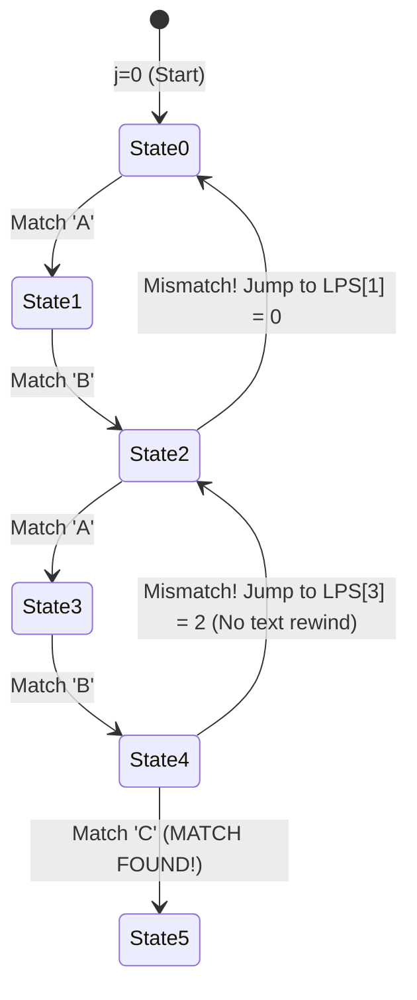

## 1. Problem Statement & Objectives

In source code editors (VS Code, Vim), text search utilities (grep, ripgrep), network intrusion detection systems (Snort), and bioinformatics alignment software (BLAST), a core operation is: _Locate all occurrences of a search `Pattern` (length `M`) inside a large body of `Text` (length `N`)._

Problem statement: **Exact String Matching**. Given `Text[0..N-1]` and `Pattern[0..M-1]` (where `M <= N`). Return all index offsets `i` where `Text[i .. i + M - 1] == Pattern[0 .. M - 1]`.

The two preeminent algorithms for this problem are **Knuth-Morris-Pratt (KMP)** and **Rabin-Karp**.

## 2. Initial Naive Approach

Naive string matching slides `Pattern` over `Text` character by character. Upon a mismatch at index `j`, the text pointer rewinds to `i + 1` and pattern matching restarts from index 0.

Worst-case inputs with repetitive characters (e.g., `Text = "AAAAAAAAB"`, `Pattern = "AAAB"`) cause `O(N x M)` quadratic explosions, requiring hundreds of billions of comparisons on large corpora.

## 3. Optimization Thinking & Algorithm Design

**1. Knuth-Morris-Pratt (KMP - 1977):**

KMP achieves guaranteed `O(N + M)` time by **never rewinding the text pointer**. Upon mismatch, KMP utilizes prior matched prefix data to shift the pattern via the **LPS (Longest Proper Prefix which is also Suffix)** table:

- `LPS[i]` stores the length of the longest proper prefix of `Pattern[0..i]` that matches a suffix of `Pattern[0..i]`.
- Upon mismatch at `Pattern[j]`, the pattern shifts to `j = LPS[j - 1]` without resetting the text index `i`.

**2. Rabin-Karp Algorithm (1987):**

Rabin-Karp transforms string matching into integer matching via **Polynomial Rolling Hashes**:

- Precompute pattern hash `H(P) = sum P[i] x B^{M - 1 - i} \pmod P` in `O(M)`.
- Slide window across `Text` in `O(1)` time by subtracting the leading character and adding the trailing character:

```
H_{new} = (H_{old} - Text[i] x B^{M-1}) x B + Text[i + M] \pmod P
```

- Character comparisons execute strictly when window hash equals pattern hash.

## 4. Code Implementation & Execution Trace

KMP state machine and deterministic LPS fallback transitions:



**Complete C++ Implementation (KMP and Rabin-Karp Pattern Matching Engines):**

```
#include <iostream>
#include <vector>
#include <string>

// 1. KNUTH-MORRIS-PRATT (KMP)
std::vector<int> computeLPS(const std::string& pattern) {
    int m = static_cast<int>(pattern.size());
    std::vector<int> lps(m, 0);
    int len = 0;
    int i = 1;

    while (i < m) {
        if (pattern[i] == pattern[len]) {
            ++len;
            lps[i] = len;
            ++i;
        } else {
            if (len != 0) {
                len = lps[len - 1];
            } else {
                lps[i] = 0;
                ++i;
            }
        }
    }
    return lps;
}

std::vector<int> KMPSearch(const std::string& text, const std::string& pattern) {
    std::vector<int> matches;
    int n = static_cast<int>(text.size());
    int m = static_cast<int>(pattern.size());
    if (m == 0 || n < m) return matches;

    std::vector<int> lps = computeLPS(pattern);
    int i = 0; // Text pointer (NEVER BACKTRACKS)
    int j = 0; // Pattern pointer

    while (i < n) {
        if (text[i] == pattern[j]) {
            ++i;
            ++j;
        }

        if (j == m) {
            matches.push_back(i - j);
            j = lps[j - 1];
        } else if (i < n && text[i] != pattern[j]) {
            if (j != 0) {
                j = lps[j - 1];
            } else {
                ++i;
            }
        }
    }
    return matches;
}

// 2. RABIN-KARP ROLLING HASH
std::vector<int> rabinKarpSearch(const std::string& text, const std::string& pattern) {
    std::vector<int> matches;
    int n = static_cast<int>(text.size());
    int m = static_cast<int>(pattern.size());
    if (m == 0 || n < m) return matches;

    const long long BASE = 256;
    const long long MOD = 1000000007;

    long long patternHash = 0;
    long long currentHash = 0;
    long long h = 1;

    for (int i = 0; i < m - 1; ++i) {
        h = (h * BASE) % MOD;
    }

    for (int i = 0; i < m; ++i) {
        patternHash = (BASE * patternHash + pattern[i]) % MOD;
        currentHash = (BASE * currentHash + text[i]) % MOD;
    }

    for (int i = 0; i <= n - m; ++i) {
        if (patternHash == currentHash) {
            bool match = true;
            for (int j = 0; j < m; ++j) {
                if (text[i + j] != pattern[j]) {
                    match = false;
                    break;
                }
            }
            if (match) {
                matches.push_back(i);
            }
        }

        if (i < n - m) {
            currentHash = (BASE * (currentHash - text[i] * h) + text[i + m]) % MOD;
            if (currentHash < 0) {
                currentHash += MOD;
            }
        }
    }
    return matches;
}

int main() {
    std::string text = "ABABDABACDABABCABAB";
    std::string pattern = "ABABCABAB";

    auto kmpMatches = KMPSearch(text, pattern);
    auto rkMatches = rabinKarpSearch(text, pattern);

    std::cout << "--- PATTERN MATCHING RESULTS ---" << std::endl;
    std::cout << "KMP Matches at:        ";
    for (int idx : kmpMatches) std::cout << idx << " ";
    std::cout << std::endl;

    std::cout << "Rabin-Karp Matches at: ";
    for (int idx : rkMatches) std::cout << idx << " ";
    std::cout << std::endl;

    return 0;
}
```

**Execution Trace Breakdown (Dry Run KMP):**

- _Pattern `"ABABCABAB"`:_ `LPS = [0, 0, 1, 2, 0, 1, 2, 3, 4]`.
- _Matching on `"ABABDABACDABABCABAB"`:_
  <ul>
  Matches prefix `"ABAB"` (`j = 4`).
- Mismatch at `Text[4] = 'D'` vs `Pattern[4] = 'C'`.
- KMP preserves `i = 4` and sets `j = LPS[3] = 2` (prefix `"AB"`).
- Compares `Text[4] = 'D'` with `Pattern[2] = 'A'` directly &rarr; zero backtracking.
- Pattern match confirmed at `index = 10`.

</li>
</ul>

## 5. Complexity Evaluation & Real-world Applications

Performance Scorecard anchored to RAM Model metrics:

- **Time Complexity:**
  <ul>
  **KMP:** `Θ(N + M)` deterministic across all cases. LPS computation takes `O(M)`; scanning takes `O(N)` with zero rewinds.
- **Rabin-Karp:** `O(N + M)` average time. Degenerates to `O(N x M)` in pathological worst-case collision scenarios.

</li>
<li>**Space Complexity:**


- KMP: `O(M)` for the LPS table.
- Rabin-Karp: `O(1)` auxiliary space.

</li>
<li>**Real-World Applications:**


- **Code Search & IDE Tools:** Substring matching engines in text editors and regex parsers.
- **Genomic DNA Alignment:** Locating mutated gene subsequences in multi-gigabyte genomic sequences.
- **Plagiarism Detection:** Multi-pattern rolling hash comparison across large document repositories.
- **Intrusion Detection Systems (IDS):** Real-time packet payload signature filtering in network firewalls.

</li>
</ul>
