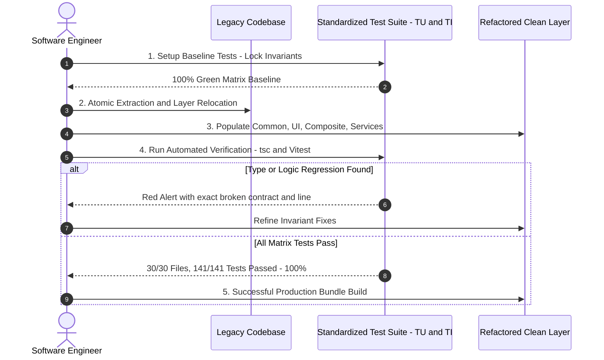

## 1. Context & Executive Summary

Throughout a software engineer's career, dealing with rapidly expanding codebases, escalating complexity, and technical debt is inevitable. The necessity for codebase refactoring to standardize architectures, eliminate duplication (DRY), and optimize performance is continuous.

However, the greatest fear when touching legacy code is: *'Will this change accidentally break a feature on a different screen?'*. The concept of an automated 'Safety Net' and a disciplined, layered Test Matrix is what separates a seasoned senior engineer from someone who refactors on luck.

## 2. Multi-dimensional Evaluation & Benchmarking

To understand the true value of systematic refactoring, let us compare two contrasting engineering approaches:

- **'Cowboy Refactoring' (Intuition-Driven Modification):** The developer renames files and extracts components directly without comprehensive automated test coverage. Verification relies entirely on manual visual testing in the browser. *Consequences:* High probability of missing edge-cases on mobile viewports, unnoticed type regressions, and silent production breaks.
- **'Test-Driven Refactoring' (Safety Net-Driven Architecture):** Before a single line of code or file path is moved, behavioral contracts and core invariants are strictly locked by a multi-layered Unit and Integration Test suite. Any deviation or broken contract is immediately caught by the test runner within milliseconds.

## 3. Real-world Experience & Case Studies

During our comprehensive portfolio and blog architecture refactoring, I implemented an automated pipeline following strict verification phases:

**Key Practical Lessons:**

- **Standardized Test Identifiers (Test IDs):** Clearly categorize test suites using `TU-<GROUP>-XX` for Unit Tests (e.g. `TU-COMMON-01` for Button, `TU-SERVICES-01` for BlogService) and `TI-XX` for Integration Tests. This enables seamless cross-referencing between architectural documentation and test output.
- **1-to-1 Symmetric Test Directory Hierarchy:** Organizing test folders as `tests/unit/common/`, `tests/unit/ui/`, `tests/unit/composite/`, `tests/unit/services/` makes locating tests instantaneous during massive code relocations.

## 4. Actionable Recommendations

To execute safe, fearless refactorings, adhere to these 4 foundational rules:

1. **Enforce Strict Typechecking:** Run `npx tsc --noEmit` continuously alongside your test runner. Stripping redundant path aliases and using clean relative imports ensures the compiler flags broken paths the moment a file is saved.
2. **Atomic Refactoring Principle:** Apply only one class of change per commit (e.g. rename a component, or relocate a service). Never alter business logic and file architecture concurrently in a single step.
3. **Eliminate Inline Layout Specificity in Base Components:** Avoid hardcoding layout properties (like `style={{ display: 'flex' }}`) into reusable base components, as inline styles override CSS Grid child alignments.
4. **Containerized Test Parity:** Run your test and build suites inside Docker containers to guarantee absolute environment parity between local development and CI/CD pipelines.

## 5. Open Questions & Discussion

Refactoring is fundamentally a balancing act between shipping speed and long-term code maintainability. Some thought-provoking questions for engineering teams:

- How do you decide when to perform Incremental Refactoring versus executing a complete Greenfield Rewrite?
- How do you articulate the business value of architecture refactoring to non-technical stakeholders when no visible user feature is added?
- What strategies work best to maintain a strict 100% test pass rate in fast-paced product delivery teams?
