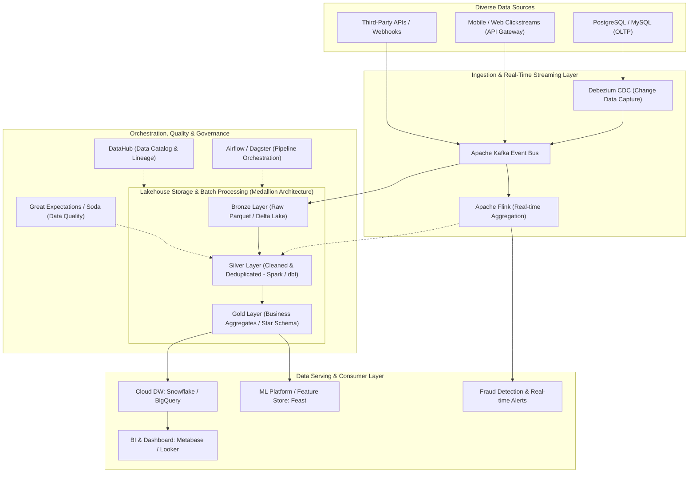

## Context & Executive Summary

In the contemporary era of Artificial Intelligence, Machine Learning, and Big Data, an enduring industry axiom rings true: _'Without reliable data pipelines, AI is just math on a whiteboard.'_ The most sophisticated Deep Learning architectures, predictive recommendation engines, and executive BI dashboards are rendered powerless if the underlying data streams are corrupted, fragmented, or delayed.

**Data Engineers (DEs)** are the systems architects and infrastructure builders operating behind the scenes. The core mission of a Data Engineer is designing, constructing, operating, and optimizing distributed platforms to ingest, store, transform, and serve massive volumes of data (scaling from gigabytes to petabytes) with uncompromising **Accuracy**, **Reliability**, **Security**, and **Low-Latency**.

This article delivers an end-to-end panoramic view of the Data Engineering discipline, tracing the architectural paradigm shift from legacy on-premises Data Warehouses to the cloud-native **Modern Data Stack & Lakehouse Architecture**, while detailing a structured competency roadmap for software engineers looking to master the field.

## Multi-dimensional Evaluation & Benchmarking

To understand the strategic footprint of Data Engineering across modern tech organizations, we evaluate two critical dimensions: Organizational Role Taxonomy and Architectural Processing Paradigms.

**1. Role Taxonomy: Data Engineer vs Data Scientist vs Backend Engineer:**

<table style="width:100%; border-collapse: collapse; margin-bottom: 20px;">
  <thead>
    <tr style="border-bottom: 2px solid #e2e8f0; text-align: left;">
      <th style="padding: 8px;">Dimension</th>
      <th style="padding: 8px;">Backend Engineer</th>
      <th style="padding: 8px;">Data Engineer</th>
      <th style="padding: 8px;">Data Scientist</th>
    </tr>
  </thead>
  <tbody>
    <tr style="border-bottom: 1px solid #edf2f7;">
      <td style="padding: 8px"><b>Core Objective</b></td>
      <td style="padding: 8px">Build OLTP business services, APIs, and microservices</td>
      <td style="padding: 8px">Build OLAP data platforms, pipelines, and Lakehouse stores</td>
      <td style="padding: 8px">Build statistical models, ML algorithms, and extract insights</td>
    </tr>
    <tr style="border-bottom: 1px solid #edf2f7;">
      <td style="padding: 8px"><b>Workload Type</b></td>
      <td style="padding: 8px">OLTP (ACID transactions, single-record CRUD)</td>
      <td style="padding: 8px">OLAP / Streaming (Batch & streaming over billions of records)</td>
      <td style="padding: 8px">Experimental (Jupyter, Model Training, Feature Engineering)</td>
    </tr>
    <tr style="border-bottom: 1px solid #edf2f7;">
      <td style="padding: 8px"><b>Primary Tooling</b></td>
      <td style="padding: 8px">Java/Go/Node.js, PostgreSQL, Redis, Docker, k8s</td>
      <td style="padding: 8px">Python/Scala, Spark, Kafka, Iceberg, dbt, Airflow, Snowflake</td>
      <td style="padding: 8px">Python/R, PyTorch, TensorFlow, Scikit-learn, Pandas</td>
    </tr>
    <tr>
      <td style="padding: 8px"><b>Success Metrics</b></td>
      <td style="padding: 8px">API p99 Latency &lt; 50ms, 99.99% Uptime, High QPS</td>
      <td style="padding: 8px">Data Freshness SLA, Pipeline Reliability, Cost Efficiency</td>
      <td style="padding: 8px">Model Accuracy, F1-Score, Business Lift, Prediction ROI</td>
    </tr>
  </tbody>
</table>

**2. Evolution of Data Architecture Paradigms:**

- **Legacy ETL (Extract &rarr; Transform &rarr; Load):** Raw data from OLTP databases was extracted, transformed via heavy middleware servers (Informatica, SSIS), and loaded into rigid data warehouses. _Bottleneck:_ Intermediate compute bottlenecks and multi-month release cycles.
- **Modern ELT (Extract &rarr; Load &rarr; Transform):** Leveraging the massively parallel processing (MPP) capabilities of Cloud Data Warehouses (Snowflake, BigQuery), raw data loads directly into object stores first, and transformations execute in-place using SQL and **dbt (data build tool)**.
- **Lakehouse Architecture (Data Lake + Data Warehouse):** Combines the infinite, low-cost elasticity of Object Storage (S3, GCS) with open columnar file formats (Apache Parquet, Apache Iceberg, Delta Lake) to provide ACID transactions and blazing fast SQL analytics over unstructured and structured data alike.

## Real-world Experience & Case Studies

To demonstrate a production-scale implementation, below is an end-to-end Modern Data Platform architecture processing over 100 million daily events for a FinTech & E-Commerce ecosystem:

**Hard-Earned Production Engineering Lessons:**

1. **Idempotency & Deterministic Backfills:** Pipeline executions must be strictly idempotent: Re-running a backfill or recovery job for any time window must yield identical results without producing duplicate records. Partition overwriting and Merge-on-Read strategies are mandatory.
2. **Data Contracts:** Protect analytical systems from unannounced upstream schema alterations. Enforce Schema Registries (Avro / Protobuf) and compile-time data contracts between product engineering and data engineering teams.
3. **Medallion Multi-Tier Strategy (Bronze &rarr; Silver &rarr; Gold):** Preserve pristine immutable raw records in Bronze for disaster recovery, standardize and deduplicate in Silver, and expose highly performant dimensional models strictly in Gold.

## Actionable Recommendations

A structured Competency Skill Matrix for engineers transitioning into or leveling up in Data Engineering:

1. **Core Software Engineering & Computer Science Foundations:**
  - Master **Python** (scripting, object-oriented design, async I/O) and **Advanced SQL** (Window functions, CTEs, physical query plan optimization).
  - Understand low-level computer science concepts: Data structures, memory hierarchies (I/O-bound vs CPU-bound bottlenecks), and network protocols.
  - Explore **Scala/Java** or **Rust** for high-performance distributed engine development.
2. **Dimensional Data Modeling:**
  - Master Kimball Dimensional Modeling (Fact tables, Dimension tables, Conformed Dimensions, Star/Snowflake schemas).
  - Implement Slowly Changing Dimensions (SCD Type 1, 2, 3) and Data Vault patterns.
3. **Distributed Compute & Big Data Frameworks:**
  - Deeply study **Apache Spark**: RDD lifecycle, Catalyst query optimizer, Tungsten execution engine, memory partition tuning, and mitigating data skew.
  - Master modern data transformation workflows using **dbt (data build tool)** on cloud warehouses.
4. **Event Streaming & Workflow Orchestration:**
  - Architect event backbones with **Apache Kafka** (topics, partitions, consumer group rebalancing, exactly-once semantics).
  - Construct maintainable DAG workflows using **Apache Airflow** or **Dagster**.
5. **DataOps & Observability:**
  - Automate data quality testing using `dbt test`, `Great Expectations`, or `Soda`.
  - Implement CI/CD automated validation and end-to-end Data Lineage tracking with `DataHub`.

## Open Questions & Discussion

Key emerging architectural paradigms shaping the frontier of Data Engineering:

- **Data Mesh vs Centralized Lakehouse:** Should enterprises maintain a centralized data engineering core or federate data ownership to autonomous, domain-driven product teams?
- **Generative AI & The Evolving Data Engineer:** While AI automates boilerplate SQL, the Data Engineer's role increasingly elevates to defining the **Semantic Layer**, enforcing **Data Quality Guardrails**, and building **RAG Vector Pipelines** for enterprise LLM systems.
- **Open Table Format Standardization:** Will the industry converge on Apache Iceberg as the unified open standard across all major cloud analytical ecosystems?

**Discussion Prompt:** _In your experience, is the primary bottleneck in building large-scale data platforms rooted in technology choices (tools/frameworks) or organizational data governance and engineering discipline? Share your insights!_
