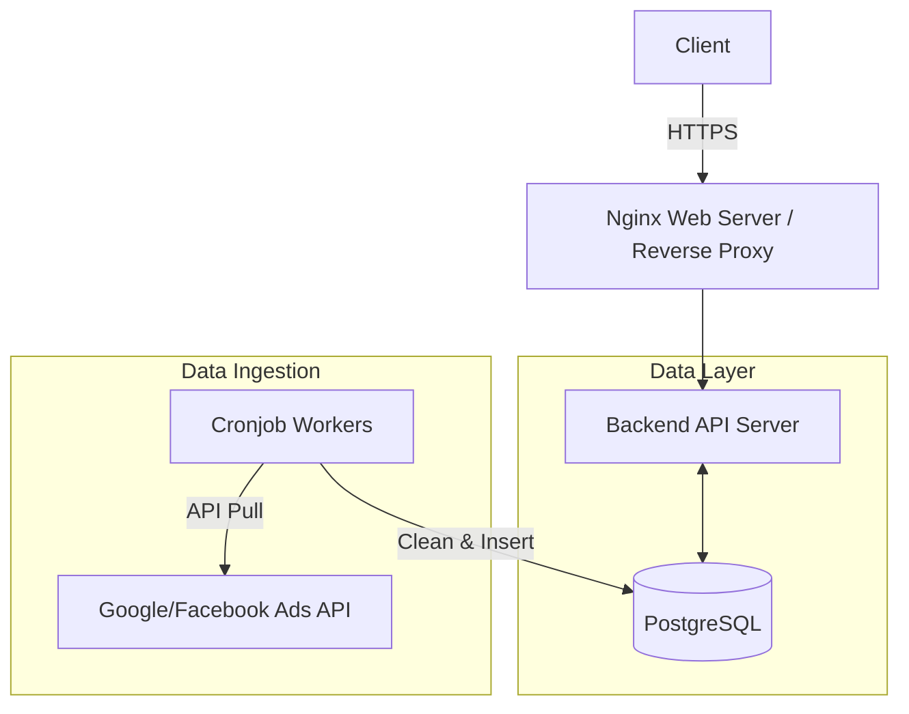

## Context & The Problem

A digital agency has just launched a client portal allowing users to log in and track the daily performance of their advertising campaigns (Google Ads, Facebook Ads). The initial demand is moderate, with the system expected to serve around 100 concurrent users (CCU) during peak hours (early morning or the beginning of the month). The core challenge is to build a system that is sufficiently fast, low-cost to operate, and has the shortest possible time-to-market.

## System Requirements

- **Performance:** Report dashboards must load in under 2 seconds.
- **Scalability:** 100 CCU, with an average of 3-5 API requests per user to load various charts.
- **Data:** Real-time data is not required. A data delay of 1 to 24 hours is acceptable (batch updates).
- **Availability:** 99%, tolerating short downtime windows at night for maintenance or heavy batch jobs.

## Architecture Design

At a 100 CCU scale, a Monolithic architecture combined with a traditional relational database is the optimal choice.

- **Web Server / Proxy:** Nginx handles HTTPS termination and serves the frontend's static assets.
- **Backend API:** A single instance running a familiar backend framework handles authentication, authorization, and report data queries.
- **Database:** PostgreSQL is used as the sole database (both OLTP and lightweight OLAP). Advertising data is extracted and stored in normalized tables.
- **Data Ingestion:** Scripts running via Cronjobs on a scheduled basis (e.g., every 4 hours) fetch data from ad network APIs, process it, and write it into PostgreSQL.

## Trade-off Analysis

- **Cost vs. Scalability:** This architecture is extremely cost-effective and can run entirely on 1 or 2 small VPS instances. However, as historical data swells to tens of millions of rows, querying directly using standard SQL will start to overwhelm the database's CPU.
- **Simplicity vs. Single Point of Failure (SPOF):** The system bundles everything (API, Database, Workers) together, introducing risk. If a worker script crashes, causes a memory leak, or fills the disk, the entire API will go down with it.

## Practical Lessons & Best Practices

1.  **Use Materialized Views:** Do not directly run `SUM()` or `COUNT()` queries on the raw data tables when a user opens the dashboard. Create Materialized Views that pre-aggregate data by day/campaign and refresh them in the background.
2.  **Proper Indexing:** Map the dashboard's query patterns to create Composite Indexes. For example, an index on `(client_id, campaign_id, date)` will save the system from devastating Full Table Scans.
3.  **Isolate Workers:** Even in a small system, the process that calls ad APIs (Cronjob) should be resource-isolated so it doesn't compete for CPU with the process serving the end-user API.
